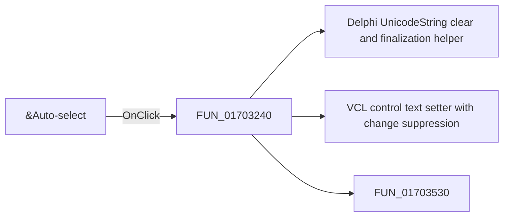

# &Auto-select

> Analysis status: Pending individual source review.

## Control

| Property | Recovered value |
| --- | --- |
| Form | MacroPicker |
| Component path | MacroPicker.pnlControls.chkAutoShape |
| Control class | TCheckBox |
| Caption | &Auto-select |
| Hint | Not present in the recovered resource. |
| Text | Not present in the recovered resource. |
| Handler name | chkAutoShapeClick |
| Handler address | 01703240 |
| Graph node | `resource:dfm:MacroPicker/MacroPicker.pnlControls.chkAutoShape` |
| Handler node | `function:01703240` |
| Graph layer | UI |

## What happens when clicked

Pending individual analysis. An agent must read the recovered handler source and its relevant callees before it replaces this text.

## Click flow

## Handler evidence

- Source: [DecompiledSources/Tina16/functions/0000000001703240__FUN_01703240.c](../../../DecompiledSources/Tina16/functions/0000000001703240__FUN_01703240.c)
- Recovered role: Not present in the recovered resource.
- Current graph summary: Handles 1 Delphi UI event: MacroPicker.pnlControls.chkAutoShape.OnClick.
- Current graph behavior: Not present in the recovered resource.
- Current graph evidence: Not present in the recovered resource.
- Complexity: complex
- Distinct outgoing calls: 3

## Direct calls

- `function:00414480` — Delphi UnicodeString clear and finalization helper
- `function:0064de00` — VCL control text setter with change suppression
- `function:01703530` — FUN_01703530

## Resource evidence

- Kind: Not present in the recovered resource.
- Modal result: Not present in the recovered resource.
- Checked state: true
- List items: Not present in the recovered resource.
- Image reference: Not present in the recovered resource.
- Extracted glyph: None.

## Nearby label candidates

Nearby labels are layout candidates only. They are not proof of behavior.

- Rank 1: 0000/0000 at distance 48.
- Rank 2: &Shape: at distance 236.
- Rank 3: &Manufacturer: at distance 262.

## Analysis limits

- Do not infer behavior from the control class, caption, hint, glyph, or nearby label alone.
- Do not replace the pending status until the handler source and relevant call path provide enough evidence.
