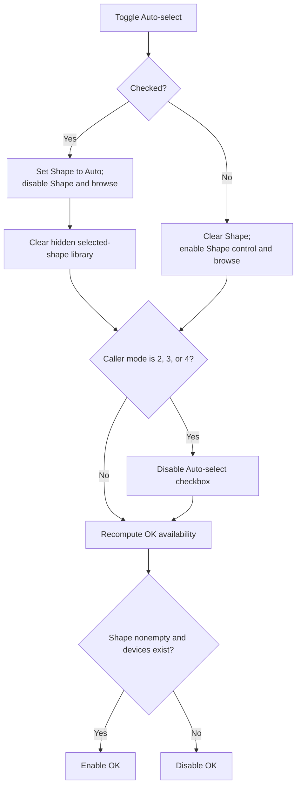

# &Auto-select

> Analysis status: Source reviewed. The automatic and manual branches, shape-control state, hidden library reset, mode restriction, and OK-enable rule are supported by recovered code.

## Control

| Property | Recovered value |
| --- | --- |
| Form | MacroPicker |
| Component path | MacroPicker.pnlControls.chkAutoShape |
| Control class | TCheckBox |
| Caption | &Auto-select |
| Hint | Not present in the recovered resource. |
| Text | Not present in the recovered resource. |
| Handler name | chkAutoShapeClick |
| Handler address | 01703240 |
| Graph node | `resource:dfm:MacroPicker/MacroPicker.pnlControls.chkAutoShape` |
| Handler node | `function:01703240` |
| Graph layer | UI |

## What happens when clicked

`FUN_01703240` reads the live checked state of **Auto-select** and updates the form's staged Shape controls.

When Auto-select is checked, the handler:

- writes `<Auto>` to the read-only Shape edit;
- disables the Shape edit and its ellipsis browse button; and
- clears the hidden selected-shape library string at form offset `+0x770`.

When Auto-select is unchecked, it clears the Shape edit and enables the Shape edit control and browse button. The edit remains read-only because that property is set in the recovered DFM; the enabled state does not make it user-editable. The user must use the browse button to stage a manual shape.

For recovered caller modes `2`, `3`, and `4`, the handler disables the Auto-select checkbox itself after it applies the current branch. The original business names of these mode values are not recovered.

Finally, it calls `FUN_01703530` to recompute OK availability. OK is enabled only when Shape text is nonempty and the visible list or tree contains at least one device. Therefore, changing from automatic to manual selection clears Shape and disables OK until a browse selection succeeds. Changing to automatic selection can enable OK when devices exist.

The click changes form-local staging only. It does not select a device, open the shape selector, create a component, or persist a preference. There is no local catch or rollback. A later exception can leave some control states changed.

## Click flow

## Handler evidence

- [Auto-select handler `FUN_01703240`](../../../DecompiledSources/Tina16/functions/0000000001703240__FUN_01703240.c) proves the checked-state branch, `<Auto>` and empty text assignments, control-enabled updates, hidden-library clear, mode mask, and OK refresh.
- [OK-enable coordinator `FUN_01703530`](../../../DecompiledSources/Tina16/functions/0000000001703530__FUN_01703530.c) proves the nonempty Shape and nonempty device-collection rule.
- [Form show handler `FUN_017024f0`](../../../DecompiledSources/Tina16/functions/00000000017024F0__FUN_017024f0.c) invokes this same handler before it populates the device views.
- [Mode-specific callers](../../../DecompiledSources/Tina16/functions/00000000017084A0__FUN_017084a0.c) set the recovered form mode before `ShowModal`; other callers set values `0`, `3`, and `4` through parallel paths.
- Recovered role: Toggle automatic shape selection and update Shape controls and OK availability.
- Current graph summary: Handles 1 Delphi UI event: MacroPicker.pnlControls.chkAutoShape.OnClick.
- Current graph behavior: Use `<Auto>` and disabled shape controls when checked; clear Shape and enable browsing when unchecked; then apply mode restrictions and recompute OK availability.
- Current graph evidence: The DFM binds `chkAutoShapeClick` to `01703240`; the source branches on the checkbox, updates the Shape edit and browse button, clears `+0x770` in the checked branch, applies a mode bit mask, and calls `FUN_01703530`.
- Complexity: complex
- Distinct outgoing calls: 3

## Direct calls

- `function:00414480` — Delphi UnicodeString clear and finalization helper
- `function:0064de00` — VCL control text setter with change suppression
- `function:01703530` — Enable OK only for nonempty Shape text and a nonempty device view.

## Resource evidence

- Kind: Not present in the recovered resource.
- Modal result: Not present in the recovered resource.
- Checked state: true
- List items: Not present in the recovered resource.
- Image reference: Not present in the recovered resource.
- Extracted glyph: None.

## Nearby label candidates

Nearby labels are layout candidates only. They are not proof of behavior.

- Rank 1: 0000/0000 at distance 48.
- Rank 2: &Shape: at distance 236.
- Rank 3: &Manufacturer: at distance 262.

## Analysis limits

- The Shape edit remains read-only in manual mode. The handler changes Enabled, not ReadOnly.
- Caller mode values `2`, `3`, and `4` disable Auto-select, but their original Delphi enum names are not recovered.
- The handler tests device count, not a selected row or node. The modal caller still rejects an empty selected device name.
