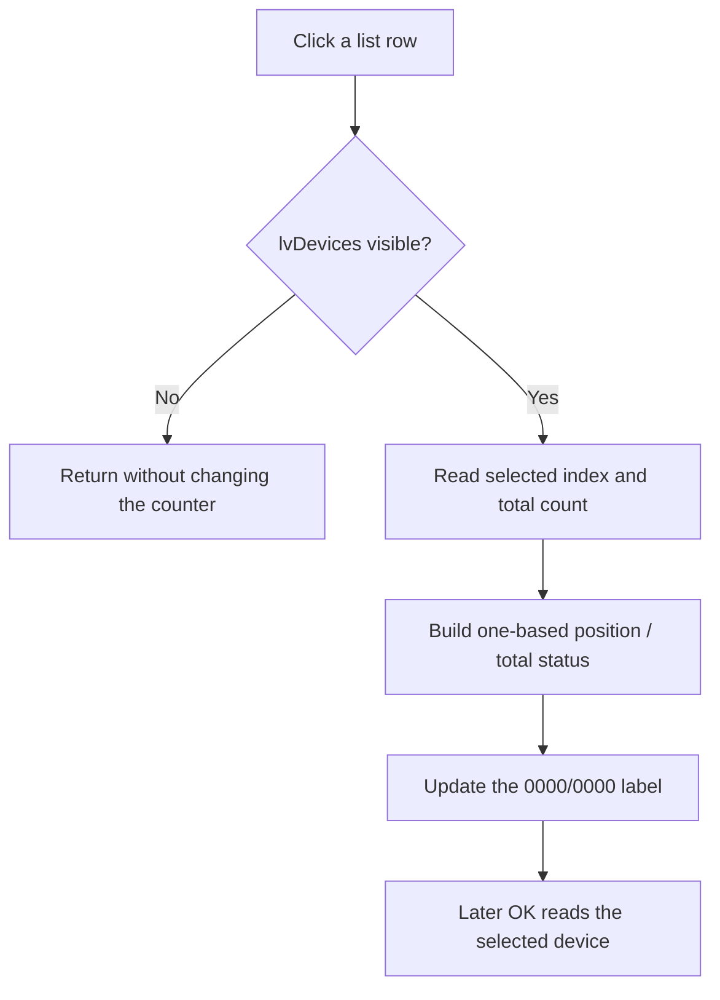

# lvDevices

> Analysis status: Source reviewed. The visible-list guard, one-based position counter, later OK use, and no-op boundary are supported by recovered code.

## Control

| Property | Recovered value |
| --- | --- |
| Form | MacroPicker |
| Component path | MacroPicker.lvDevices |
| Control class | TListView |
| Caption | Not present in the recovered resource. |
| Hint | Not present in the recovered resource. |
| Text | Not present in the recovered resource. |
| Handler name | lvDevicesClick |
| Handler address | 017025f0 |
| Graph node | `resource:dfm:MacroPicker/MacroPicker.lvDevices` |
| Handler node | `function:017025f0` |
| Graph layer | UI |

## What happens when clicked

`FUN_017025f0` runs after the list view changes its current row. It first checks whether `lvDevices` is visible. If the list is hidden, the handler returns without changing another control.

For a visible list, it reads the current item index and the total item count. It adds one to the zero-based index, converts both values to text, combines them as the current-position and total-count status, and writes the result to the form's `0000/0000` label at field `+0x6e8`. The list population code selects row 0 when it adds at least one item, so the normal first status is one-based.

The handler does not filter, add, remove, or activate a device. It does not close the dialog or copy a result to the caller. On later OK, the caller reads the selected row's device name and backing device object through separate MacroPicker result helpers. Double-click has a separate handler that invokes the OK-result path; this article covers only `OnClick`.

There is no local exception handler. A VCL item-query, string-format, allocation, or label-update exception can propagate. The label update is the only application-level write in this handler.

## Click flow

## Handler evidence

- [List click handler `FUN_017025f0`](../../../DecompiledSources/Tina16/functions/00000000017025F0__FUN_017025f0.c) proves the visibility guard, selected-index query, item-count query, one-based conversion, and label update.
- [List item-count helper `FUN_006efc30`](../../../DecompiledSources/Tina16/functions/00000000006EFC30__FUN_006efc30.c) returns the native list-view item count.
- [MacroPicker device result helper `FUN_01703ac0`](../../../DecompiledSources/Tina16/functions/0000000001703AC0__FUN_01703ac0.c) later returns the selected list row's device name.
- [MacroPicker backing-object helper `FUN_01703c50`](../../../DecompiledSources/Tina16/functions/0000000001703C50__FUN_01703c50.c) later returns the selected row's stored device object.
- Recovered role: Update the MacroPicker position counter for the current list-view row.
- Current graph summary: Handles 1 Delphi UI event: MacroPicker.lvDevices.OnClick.
- Current graph behavior: When the list view is visible, show its one-based current position and total item count in the form status label.
- Current graph evidence: The DFM binds `lvDevicesClick` to `017025f0`; the source reads the current index and native item count only inside the visible-list branch and writes their formatted values to field `+0x6e8`.
- Complexity: complex
- Distinct outgoing calls: 5

## Direct calls

- `function:00414560` — Delphi UnicodeString array finalization helper
- `function:00416cd0` — Combine the position and count strings.
- `function:0043f750` — Convert the index and count integers to Unicode text.
- `function:0064de00` — Update the status label when its text differs.
- `function:006efc30` — Read the list-view item count.

## Resource evidence

- Kind: Not present in the recovered resource.
- Modal result: Not present in the recovered resource.
- Checked state: Not present in the recovered resource.
- List items: Not present in the recovered resource.
- Image reference: Not present in the recovered resource.
- Extracted glyph: None.

## Nearby label candidates

Nearby labels are layout candidates only. They are not proof of behavior.

- No same-parent label candidate is available.

## Analysis limits

- The recovered static separator is not named. The `0000/0000` resource text and the two-value formatter establish the position-and-total role.
- The click handler does not validate that a selection exists before it reads the index. Normal population selects the first row when the list is nonempty.
- Device result transfer belongs to the later modal caller, not this handler.
