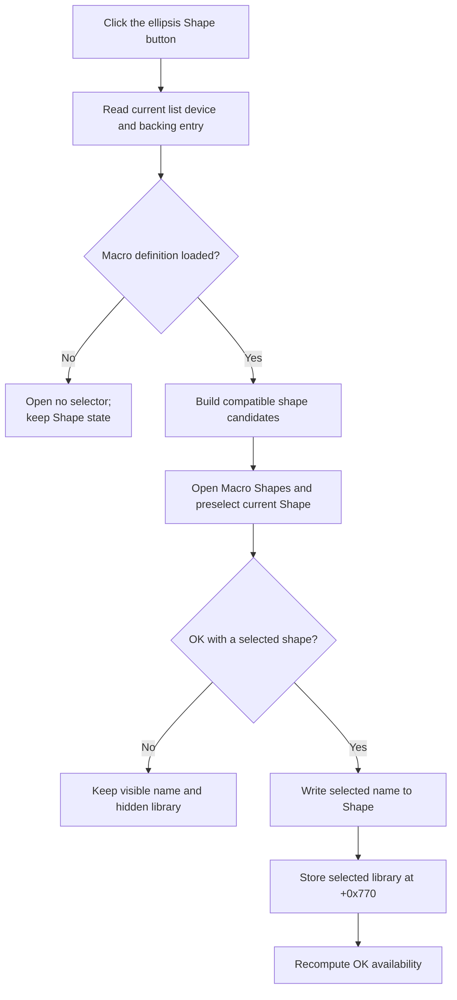

# sbBrowseShape

> Analysis status: Source reviewed. The selected-device input, macro-shape candidate build, modal selector, accepted updates, cancel no-op, and staging limits are supported by recovered code.

## Control

| Property | Recovered value |
| --- | --- |
| Form | MacroPicker |
| Component path | MacroPicker.pnlControls.sbBrowseShape |
| Control class | TSpeedButton |
| Caption | Not present in the recovered resource. |
| Hint | Not present in the recovered resource. |
| Text | Not present in the recovered resource. |
| Handler name | sbBrowseShapeClick |
| Handler address | 01702e50 |
| Graph node | `resource:dfm:MacroPicker/MacroPicker.pnlControls.sbBrowseShape` |
| Handler node | `function:01702e50` |
| Graph layer | UI |

## What happens when clicked

This ellipsis button opens the custom **Macro Shapes** selector. It does not open a file browser.

`FUN_01702e50` uses the current `lvDevices` row index to read the corresponding device name and backing catalog entry from the form's filtered collection. It passes those values to the recovered macro-definition loader and parser. If that operation returns no macro definition, the handler opens no selector and changes no Shape state.

For a recovered definition, the handler builds the candidate shape data and constructs the Macro Shapes dialog. It reads the current Shape edit and uses it to preselect a matching selector item when one exists. It then waits for the modal result.

- Cancel, a non-OK result, or OK with no selected shape leaves the visible Shape text and hidden library string unchanged.
- OK with a selected shape writes the selected display name to the read-only Shape edit, copies the selected entry's library string to form field `+0x770`, and recomputes OK availability.

The visible text is assigned before the hidden library string. There is no transaction or rollback. A later assignment or control-update exception can leave a new visible name with the old hidden library. The handler also has no explicit guard for list index `-1`; normal UI state relies on list population selecting row 0 before manual shape browsing is enabled.

The accepted selection is form-local. The later MacroPicker caller composes the hidden library and visible shape name, then copies that shape identifier with the selected device result. This click does not create or modify a schematic component, write a settings store, or persist a library selection.

## Click flow

## Handler evidence

- [Shape browse handler `FUN_01702e50`](../../../DecompiledSources/Tina16/functions/0000000001702E50__FUN_01702e50.c) proves the current-list input, definition-load branch, selector construction and preselection, modal checks, accepted visible and hidden assignments, and OK refresh.
- [Macro-definition loader `FUN_016fec20`](../../../DecompiledSources/Tina16/functions/00000000016FEC20__FUN_016fec20.c) resolves the selected catalog entry and returns the recovered definition object or null.
- [Macro parser `FUN_00ee5950`](../../../DecompiledSources/Tina16/functions/0000000000EE5950__FUN_00ee5950.c) builds the parsed data supplied to the shape selector.
- [Macro Shapes selector constructor `FUN_00c86a90`](../../../DecompiledSources/Tina16/functions/0000000000C86A90__FUN_00c86a90.c) creates the modal selector with the candidate data.
- [OK-enable coordinator `FUN_01703530`](../../../DecompiledSources/Tina16/functions/0000000001703530__FUN_01703530.c) applies the nonempty Shape and device-count rule after acceptance.
- [MacroPicker caller `FUN_01708040`](../../../DecompiledSources/Tina16/functions/0000000001708040__FUN_01708040.c) later combines the hidden library and visible Shape text during accepted result copy-back.
- Recovered role: Open the compatible Macro Shapes selector for the current device and stage the accepted shape.
- Current graph summary: Handles 1 Delphi UI event: MacroPicker.pnlControls.sbBrowseShape.OnClick.
- Current graph behavior: Load shape candidates for the current list device, preselect the current Shape in a modal selector, and stage the accepted display name and library string.
- Current graph evidence: The DFM binds `sbBrowseShapeClick` to `01702e50`; the source reads the current list index and backing entry, branches on the definition result, shows the selector, and updates Shape and `+0x770` only for modal result `1` with a selected row.
- Complexity: complex
- Distinct outgoing calls: 11

## Direct calls

- `function:00410f20` — Nil-safe Delphi object destruction helper
- `function:00414480` — Delphi UnicodeString clear and finalization helper
- `function:00414560` — Delphi UnicodeString array finalization helper
- `function:00414ad0` — Delphi UnicodeString assignment helper
- `function:00418590` — FUN_00418590
- `function:0064dd90` — VCL control Unicode text reader
- `function:0064de00` — VCL control text setter with change suppression
- `function:00c86a90` — Construct the Macro Shapes selector.
- `function:00ee5950` — Parse the selected macro definition for shape candidates.
- `function:016fec20` — Resolve and load the selected device's macro definition.
- `function:01703530` — Recompute OK availability after acceptance.

## Resource evidence

- Kind: Not present in the recovered resource.
- Modal result: Not present in the recovered resource.
- Checked state: Not present in the recovered resource.
- List items: Not present in the recovered resource.
- Image reference: Not present in the recovered resource.
- Extracted glyph: [`0255_MacroPicker_MacroPicker_pnlControls_sbBrowseShape_Glyph_Data.png`](../../../glyph/0255_MacroPicker_MacroPicker_pnlControls_sbBrowseShape_Glyph_Data.png)

## Nearby label candidates

Nearby labels are layout candidates only. They are not proof of behavior.

- Rank 1: 0000/0000 at distance 103.
- Rank 2: &Shape: at distance 187.
- Rank 3: &Manufacturer: at distance 215.

## Analysis limits

- The 9 x 3 extracted ellipsis glyph supports a browse action, while the handler proves that the target is Macro Shapes rather than the file system.
- The handler reads `lvDevices` directly. Recovered modes that show the tree normally keep automatic selection active and the browse button disabled.
- The original class and field names for the parsed candidate data and hidden library string are not recovered.
