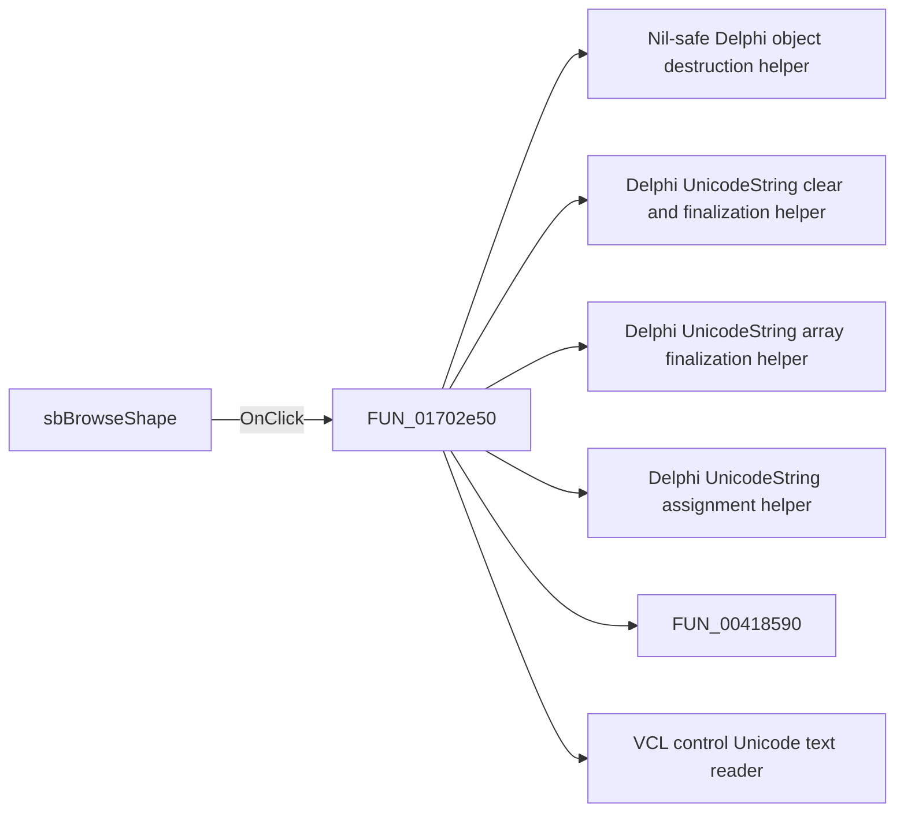

# sbBrowseShape

> Analysis status: Pending individual source review.

## Control

| Property | Recovered value |
| --- | --- |
| Form | MacroPicker |
| Component path | MacroPicker.pnlControls.sbBrowseShape |
| Control class | TSpeedButton |
| Caption | Not present in the recovered resource. |
| Hint | Not present in the recovered resource. |
| Text | Not present in the recovered resource. |
| Handler name | sbBrowseShapeClick |
| Handler address | 01702e50 |
| Graph node | `resource:dfm:MacroPicker/MacroPicker.pnlControls.sbBrowseShape` |
| Handler node | `function:01702e50` |
| Graph layer | UI |

## What happens when clicked

Pending individual analysis. An agent must read the recovered handler source and its relevant callees before it replaces this text.

## Click flow

## Handler evidence

- Source: [DecompiledSources/Tina16/functions/0000000001702E50__FUN_01702e50.c](../../../DecompiledSources/Tina16/functions/0000000001702E50__FUN_01702e50.c)
- Recovered role: Not present in the recovered resource.
- Current graph summary: Handles 1 Delphi UI event: MacroPicker.pnlControls.sbBrowseShape.OnClick.
- Current graph behavior: Not present in the recovered resource.
- Current graph evidence: Not present in the recovered resource.
- Complexity: complex
- Distinct outgoing calls: 11

## Direct calls

- `function:00410f20` — Nil-safe Delphi object destruction helper
- `function:00414480` — Delphi UnicodeString clear and finalization helper
- `function:00414560` — Delphi UnicodeString array finalization helper
- `function:00414ad0` — Delphi UnicodeString assignment helper
- `function:00418590` — FUN_00418590
- `function:0064dd90` — VCL control Unicode text reader
- `function:0064de00` — VCL control text setter with change suppression
- `function:00c86a90` — FUN_00c86a90
- `function:00ee5950` — FUN_00ee5950
- `function:016fec20` — FUN_016fec20
- `function:01703530` — FUN_01703530

## Resource evidence

- Kind: Not present in the recovered resource.
- Modal result: Not present in the recovered resource.
- Checked state: Not present in the recovered resource.
- List items: Not present in the recovered resource.
- Image reference: Not present in the recovered resource.
- Extracted glyph: [`0255_MacroPicker_MacroPicker_pnlControls_sbBrowseShape_Glyph_Data.png`](../../../glyph/0255_MacroPicker_MacroPicker_pnlControls_sbBrowseShape_Glyph_Data.png)

## Nearby label candidates

Nearby labels are layout candidates only. They are not proof of behavior.

- Rank 1: 0000/0000 at distance 103.
- Rank 2: &Shape: at distance 187.
- Rank 3: &Manufacturer: at distance 215.

## Analysis limits

- Do not infer behavior from the control class, caption, hint, glyph, or nearby label alone.
- Do not replace the pending status until the handler source and relevant call path provide enough evidence.
