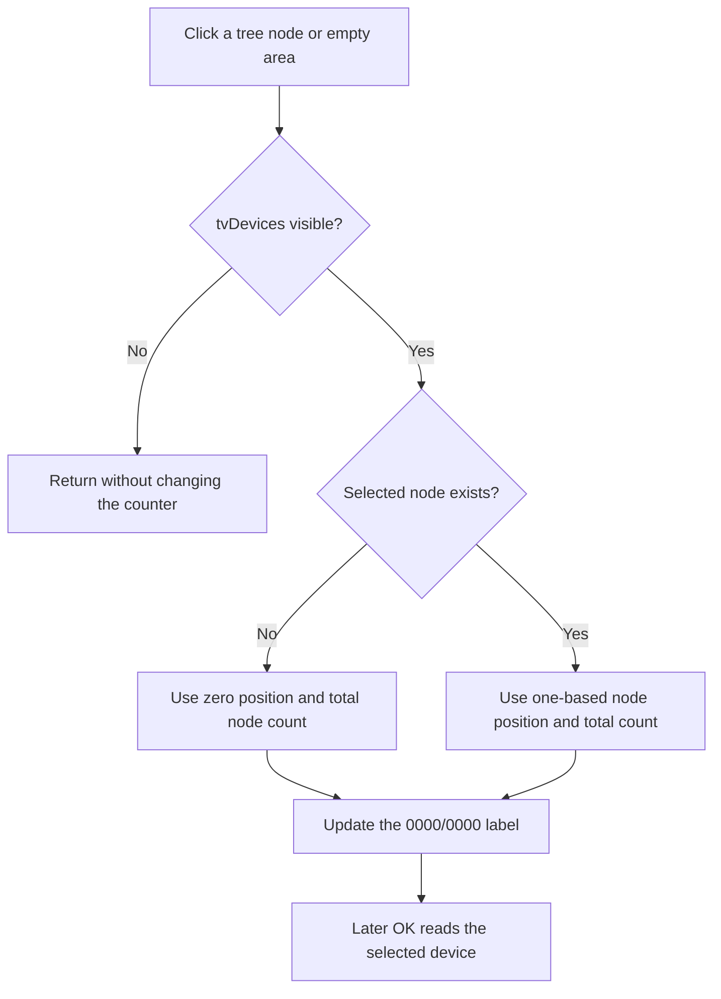

# tvDevices

> Analysis status: Source reviewed. The visible-tree guard, selected and empty-selection counters, later OK use, and no-op boundary are supported by recovered code.

## Control

| Property | Recovered value |
| --- | --- |
| Form | MacroPicker |
| Component path | MacroPicker.tvDevices |
| Control class | TTreeView |
| Caption | Not present in the recovered resource. |
| Hint | Not present in the recovered resource. |
| Text | Not present in the recovered resource. |
| Handler name | tvDevicesClick |
| Handler address | 01702a20 |
| Graph node | `resource:dfm:MacroPicker/MacroPicker.tvDevices` |
| Handler node | `function:01702a20` |
| Graph layer | UI |

## What happens when clicked

`FUN_01702a20` runs after the tree view changes its current node. It first checks whether `tvDevices` is visible. If the tree is hidden, the handler returns without changing the status label.

When the tree is visible, the handler reads the tree's selected node and total node count:

- If a node is selected, it derives that node's recovered positional index, adds one, and combines it with the total count.
- If no node is selected, it combines the recovered zero-position prefix with the total count.

Both branches write the position-and-total status to the form's `0000/0000` label at field `+0x6e8`. The handler does not expand or collapse nodes, change the selection, rebuild the tree, or close the dialog.

On later OK, separate MacroPicker result helpers walk the selected tree node and return its device name and backing device object. A double-click has a separate handler that invokes the OK-result path; this article covers only `OnClick`.

There is no local exception handler. A tree query, string allocation, format, or label-update exception can propagate. The label text is the only application-level write in this handler.

## Click flow

## Handler evidence

- [Tree click handler `FUN_01702a20`](../../../DecompiledSources/Tina16/functions/0000000001702A20__FUN_01702a20.c) proves the visibility guard, selected-node branch, positional index conversion, total node-count query, and label update.
- [Selected-node getter `FUN_006e2530`](../../../DecompiledSources/Tina16/functions/00000000006E2530__FUN_006e2530.c) returns the tree's selected node or null.
- [Tree node-count helper `FUN_006decb0`](../../../DecompiledSources/Tina16/functions/00000000006DECB0__FUN_006decb0.c) returns the native tree-view node count.
- [Tree node-position helper `FUN_006dd6f0`](../../../DecompiledSources/Tina16/functions/00000000006DD6F0__FUN_006dd6f0.c) derives the selected node's recovered positional index.
- [MacroPicker device result helper `FUN_01703ac0`](../../../DecompiledSources/Tina16/functions/0000000001703AC0__FUN_01703ac0.c) later returns the selected tree node's device name.
- [MacroPicker backing-object helper `FUN_01703c50`](../../../DecompiledSources/Tina16/functions/0000000001703C50__FUN_01703c50.c) later returns the selected node's stored device object.
- Recovered role: Update the MacroPicker position counter for the current tree selection.
- Current graph summary: Handles 1 Delphi UI event: MacroPicker.tvDevices.OnClick.
- Current graph behavior: When the tree view is visible, show the selected node's one-based position, or zero for no selection, together with the total node count.
- Current graph evidence: The DFM binds `tvDevicesClick` to `01702a20`; the handler branches on the selected-node getter and formats either a one-based node position or a zero prefix with the native node count before it updates field `+0x6e8`.
- Complexity: complex
- Distinct outgoing calls: 8

## Direct calls

- `function:00414560` — Delphi UnicodeString array finalization helper
- `function:00416ba0` — Combine the zero-position prefix and total count.
- `function:00416cd0` — Combine the selected position and total count.
- `function:0043f750` — Convert the position and count integers to Unicode text.
- `function:0064de00` — Update the status label when its text differs.
- `function:006dd6f0` — Derive the selected node's recovered position.
- `function:006decb0` — Read the tree-view node count.
- `function:006e2530` — Read the selected tree node.

## Resource evidence

- Kind: Not present in the recovered resource.
- Modal result: Not present in the recovered resource.
- Checked state: Not present in the recovered resource.
- List items: Not present in the recovered resource.
- Image reference: Not present in the recovered resource.
- Extracted glyph: None.

## Nearby label candidates

Nearby labels are layout candidates only. They are not proof of behavior.

- No same-parent label candidate is available.

## Analysis limits

- The recovered static separators are not named. The `0000/0000` resource text and the two-value formatters establish the position-and-total role.
- The node-position helper's original Delphi name is not recovered. This article does not call the value an absolute, sibling, or visible-row index.
- Device result transfer belongs to the later modal caller, not this handler.
