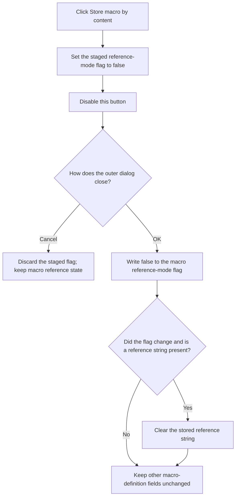

# Store the Macro by Content

> Analysis status: Recovered handler, initialization gate, accepted OK consumer, and macro reference-mode setter reviewed.

## Control

| Property | Recovered value |
| --- | --- |
| Form | MacroPropertiesForm |
| Component path | MacroPropertiesForm.btnChangeStorageMode |
| Control class | TButton |
| Caption | Store macro by content |
| Handler name | btnChangeStorageModeClick |
| Handler address | 01b92440 |
| Graph node | `resource:dfm:MacroPropertiesForm/MacroPropertiesForm.btnChangeStorageMode` |
| Handler node | `function:01b92440` |
| Graph layer | UI |

## What happens when clicked

Form creation copies macro-definition flag `+0x62` to staged form field
`+0x759` and uses the same value as this button's enabled state. Other
recovered code distinguishes a true flag as a referenced macro and uses the
message key `Msg_RefMacroModified` for it.

The click performs two operations:

1. It sets staged field `+0x759` to false.
2. It disables `btnChangeStorageMode` through its virtual enabled-state setter.

The handler does not change the macro definition or clear the read-only
`EContent` display. It only stages the change. If the user accepts the outer
dialog, `OKBtnClick` passes false to `FUN_01768ff0`. That function changes the
definition's reference-mode flag to false. If the value changed and reference
string `+0x48` is not empty, it clears that string. This is the model change
that stores the macro by content instead of by reference.

If the user cancels the outer dialog, the staged false value is not passed to
the model and the prior reference state remains. When the macro is already in
content mode, form creation disables the button, so the normal UI cannot
repeat the command.

## Click flow

## State, output, and error behavior

- The immediate output is staged form state and a disabled button.
- The accepted output is reference-mode flag `false` and an empty prior
  reference string when one existed.
- The click does not regenerate the macro shape, change name or defaults,
  refresh the schematic, or write a file.
- A programmatic repeat only writes false again and requests the disabled
  state again. It has no additional model effect before OK.
- The handler has no condition, error message, retry, or exception recovery.

## Handler evidence

- Storage-mode handler: [FUN_01b92440](../../../DecompiledSources/Tina16/functions/0000000001B92440__FUN_01b92440.c)
- Form initialization: [FUN_01b925f0](../../../DecompiledSources/Tina16/functions/0000000001B925F0__FUN_01b925f0.c)
- Outer OK consumer: [FUN_01b92970](../../../DecompiledSources/Tina16/functions/0000000001B92970__FUN_01b92970.c)
- Macro reference-mode setter: [FUN_01768ff0](../../../DecompiledSources/Tina16/functions/0000000001768FF0__FUN_01768ff0.c)
- Independent referenced-macro consumer: [FUN_01c8ab30](../../../DecompiledSources/Tina16/functions/0000000001C8AB30__FUN_01c8ab30.c)
- Recovered form evidence: [ui-evidence.json](../../../DecompiledSources/Tina16/resources/dfm/ui-evidence.json)
- Complexity: simple
- Distinct outgoing graph calls: 0; the enabled-state change is an indirect
  virtual call.

## Resource evidence

- The button caption is `Store macro by content`.
- `EContent` is disabled and read-only. The click does not change its visible
  text.
- No hint, action, image reference, or custom glyph is present.
- Shape, Content, and Name are same-parent layout candidates. The handler and
  accepted model setter, not label proximity, establish the behavior.

## Analysis limits

- Original Delphi names for reference-mode flag `+0x62`, staged flag `+0x759`,
  and reference string `+0x48` are not recovered.
- The recovered code establishes the switch from referenced mode and the
  reference-string clear. It does not expose the later circuit-file serializer
  used when the modified circuit is saved.
