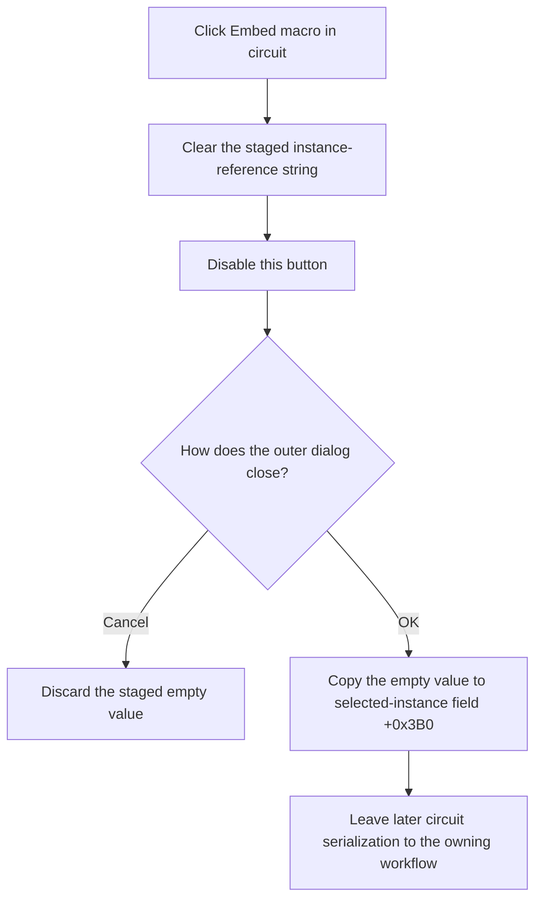

# Stage the Macro for Embedding in the Circuit

> Analysis status: Recovered handler, initialization gate, selected-instance staging field, and accepted OK consumer reviewed.

## Control

| Property | Recovered value |
| --- | --- |
| Form | MacroPropertiesForm |
| Component path | MacroPropertiesForm.btnEmbedMacro |
| Control class | TButton |
| Caption | Embed macro in circuit |
| Handler name | btnEmbedMacroClick |
| Handler address | 01b92470 |
| Graph node | `resource:dfm:MacroPropertiesForm/MacroPropertiesForm.btnEmbedMacro` |
| Handler node | `function:01b92470` |
| Graph layer | UI |

## What happens when clicked

Form creation copies selected macro-instance field `+0x3B0` to staged
UnicodeString field `+0x768`. It enables `btnEmbedMacro` only when the original
instance field is not empty.

The click clears staged string `+0x768` and disables the button. It does not
change the selected macro instance or copy macro content at this point.

If the user later accepts Macro Properties, `OKBtnClick` copies the empty
staged string back to instance field `+0x3B0`. The button caption and this
clear-on-accept path establish that the command removes the instance's stored
macro reference so the macro can be embedded in the circuit. The handler does
not perform the later circuit serialization itself.

If the user cancels the outer dialog, `OKBtnClick` does not run. The original
instance field remains unchanged. Form destruction finalizes temporary form
state but does not copy the staged empty string to the selected instance.

## Click flow

## State, output, and error behavior

- The immediate output is an empty staged string and a disabled button.
- The selected macro instance changes only after outer OK.
- The handler does not regenerate a shape, change macro-definition text,
  refresh the schematic, or write the circuit file.
- If the staged value is already empty, clearing it again has no additional
  effect.
- The handler has no condition, error message, retry, or exception recovery.

## Handler evidence

- Embed handler: [FUN_01b92470](../../../DecompiledSources/Tina16/functions/0000000001B92470__FUN_01b92470.c)
- Form initialization: [FUN_01b925f0](../../../DecompiledSources/Tina16/functions/0000000001B925F0__FUN_01b925f0.c)
- Outer OK consumer: [FUN_01b92970](../../../DecompiledSources/Tina16/functions/0000000001B92970__FUN_01b92970.c)
- Modal Schematic Editor caller: [FUN_01c89d40](../../../DecompiledSources/Tina16/functions/0000000001C89D40__FUN_01c89d40.c)
- Recovered form evidence: [ui-evidence.json](../../../DecompiledSources/Tina16/resources/dfm/ui-evidence.json)
- Complexity: simple
- Distinct outgoing graph calls: 1, the Delphi UnicodeString clear helper. The
  button enabled-state change is an indirect virtual call.

## Resource evidence

- The button caption is `Embed macro in circuit`.
- No hint, action, image reference, or custom glyph is present.
- The button is part of the Macro Properties form, but nearby Shape, Content,
  and Name labels do not prove the embed implementation.

## Analysis limits

- The original Delphi name and serialized format of instance field `+0x3B0`
  are not recovered.
- The source proves that acceptance clears this instance string. It does not
  show a content-copy call in the click handler, so this article does not claim
  when or how a circuit file writes the embedded macro data.
