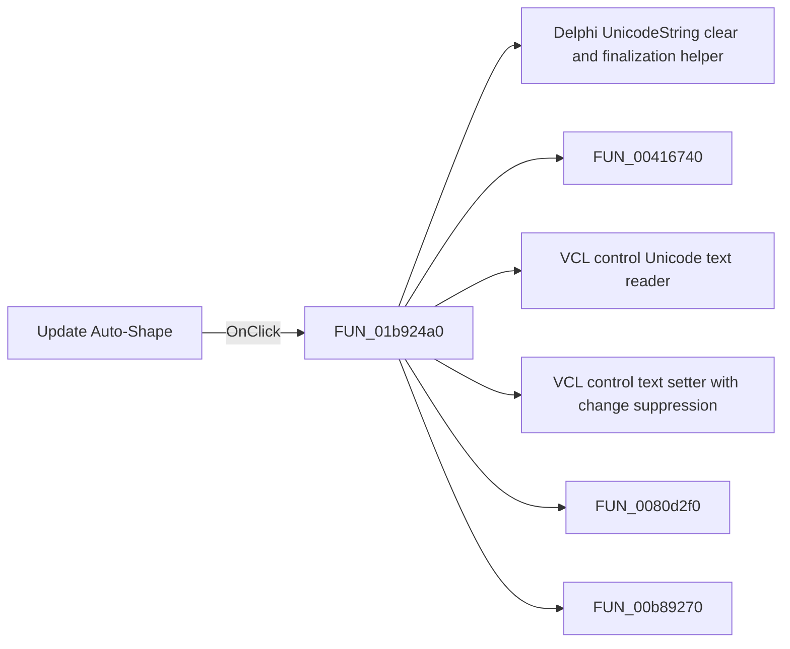

# Update Auto-Shape

> Analysis status: Pending individual source review.

## Control

| Property | Recovered value |
| --- | --- |
| Form | MacroPropertiesForm |
| Component path | MacroPropertiesForm.btnUpdateShape |
| Control class | TButton |
| Caption | Update Auto-Shape |
| Hint | Not present in the recovered resource. |
| Text | Not present in the recovered resource. |
| Handler name | btnUpdateShapeClick |
| Handler address | 01b924a0 |
| Graph node | `resource:dfm:MacroPropertiesForm/MacroPropertiesForm.btnUpdateShape` |
| Handler node | `function:01b924a0` |
| Graph layer | UI |

## What happens when clicked

Pending individual analysis. An agent must read the recovered handler source and its relevant callees before it replaces this text.

## Click flow

## Handler evidence

- Source: [DecompiledSources/Tina16/functions/0000000001B924A0__FUN_01b924a0.c](../../../DecompiledSources/Tina16/functions/0000000001B924A0__FUN_01b924a0.c)
- Recovered role: Not present in the recovered resource.
- Current graph summary: Handles 1 Delphi UI event: MacroPropertiesForm.btnUpdateShape.OnClick.
- Current graph behavior: Not present in the recovered resource.
- Current graph evidence: Not present in the recovered resource.
- Complexity: complex
- Distinct outgoing calls: 9

## Direct calls

- `function:00414480` — Delphi UnicodeString clear and finalization helper
- `function:00416740` — FUN_00416740
- `function:0064dd90` — VCL control Unicode text reader
- `function:0064de00` — VCL control text setter with change suppression
- `function:0080d2f0` — FUN_0080d2f0
- `function:00b89270` — FUN_00b89270
- `function:00b8e520` — FUN_00b8e520
- `function:01768da0` — FUN_01768da0
- `function:019a26a0` — FUN_019a26a0

## Resource evidence

- Kind: Not present in the recovered resource.
- Modal result: Not present in the recovered resource.
- Checked state: Not present in the recovered resource.
- List items: Not present in the recovered resource.
- Image reference: Not present in the recovered resource.
- Extracted glyph: None.

## Nearby label candidates

Nearby labels are layout candidates only. They are not proof of behavior.

- Rank 1: &Shape: at distance 205.
- Rank 2: C&ontent: at distance 224.
- Rank 3: &Name: at distance 255.

## Analysis limits

- Do not infer behavior from the control class, caption, hint, glyph, or nearby label alone.
- Do not replace the pending status until the handler source and relevant call path provide enough evidence.
