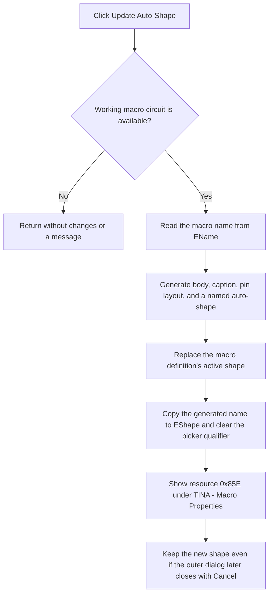

# Regenerate the Macro Auto-Shape

> Analysis status: Recovered handler, working-circuit gate, auto-shape generator, macro-shape assignment, form updates, and notification path reviewed.

## Control

| Property | Recovered value |
| --- | --- |
| Form | MacroPropertiesForm |
| Component path | MacroPropertiesForm.btnUpdateShape |
| Control class | TButton |
| Caption | Update Auto-Shape |
| Handler name | btnUpdateShapeClick |
| Handler address | 01b924a0 |
| Graph node | `resource:dfm:MacroPropertiesForm/MacroPropertiesForm.btnUpdateShape` |
| Handler node | `function:01b924a0` |
| Graph layer | UI |

## What happens when clicked

The handler reads form field `+0x750`, which FormCreate prepares as a working
macro circuit when the macro storage type supports it. If this field is null,
the click returns. It does not change controls, update the macro definition, or
show a message.

When a working circuit is available, the handler reads `EName` and passes the
circuit and name to `FUN_019a26a0`. This function builds an auto-shape from the
macro circuit. It groups terminal objects by side, measures their labels,
calculates aligned body dimensions, creates the body and caption drawing
records, lays out the pins, and returns a named shape object.

The handler passes this shape to `FUN_01768da0`. That function immediately
updates the macro definition:

- it stores the generated shape name at definition field `+0x40`;
- it replaces the prior shape object at `+0x68` with a clone of the generated
  object; and
- when the macro has a live graphic object, it updates that object's shape
  data and geometry.

The handler then copies the generated shape name to the read-only `EShape`
edit and clears the picker qualifier at form field `+0x760`. Finally, it loads
localized string resource `0x85E` and displays it in a message box titled
`TINA - Macro Properties`. The recovered binary string set contains the
matching text `Macro shape updated.`; the generated graph does not export a
direct resource-ID-to-text index.

This model change occurs before the user accepts the outer Macro Properties
dialog. Canceling the outer dialog does not restore the prior shape. The outer
modal caller refreshes the schematic only after OK, but the shape assignment
itself already updates the live macro graphic when one is attached.

## Click flow

## State, output, and error behavior

- The macro definition and its live graphic can change immediately.
- `EShape` changes to the generated shape name. The staged library qualifier is
  cleared because the generated object is now the active shape source.
- The click does not change macro name, default label, default parameters,
  reference-storage mode, or the staged embed field.
- A null working circuit is the explicit no-op branch.
- The handler has no local catch, rollback, retry, or generator-failure result
  check. A failure that raises an exception is not handled here.

## Handler evidence

- Auto-Shape handler: [FUN_01b924a0](../../../DecompiledSources/Tina16/functions/0000000001B924A0__FUN_01b924a0.c)
- Form initialization: [FUN_01b925f0](../../../DecompiledSources/Tina16/functions/0000000001B925F0__FUN_01b925f0.c)
- Auto-shape generator: [FUN_019a26a0](../../../DecompiledSources/Tina16/functions/00000000019A26A0__FUN_019a26a0.c)
- Prepared-shape assignment: [FUN_01768da0](../../../DecompiledSources/Tina16/functions/0000000001768DA0__FUN_01768da0.c)
- Localized string loader: [FUN_00b8e520](../../../DecompiledSources/Tina16/functions/0000000000B8E520__FUN_00b8e520.c)
- Application message-box wrapper: [FUN_0080d2f0](../../../DecompiledSources/Tina16/functions/000000000080D2F0__FUN_0080d2f0.c)
- Recovered form evidence: [ui-evidence.json](../../../DecompiledSources/Tina16/resources/dfm/ui-evidence.json)
- Complexity: complex
- Distinct outgoing calls: 9

## Resource evidence

- The button caption is `Update Auto-Shape`.
- `EShape` is read-only. The handler is a proven writer of this field.
- No hint, action, image reference, or custom glyph is present.
- The nearby Shape label is consistent with the updated edit, but the handler
  and model call path establish the behavior.

## Analysis limits

- The working-circuit field can be null for unsupported macro storage types.
  The original Delphi enum and field names are not recovered.
- The exact localized text for resource `0x85E` is not indexed in the graph.
  The binary contains `Macro shape updated.`, but this article keeps the
  resource ID as the direct call-site evidence.
- The source proves immediate model mutation and no local rollback. It does not
  prove when a later circuit save persists the new shape.
