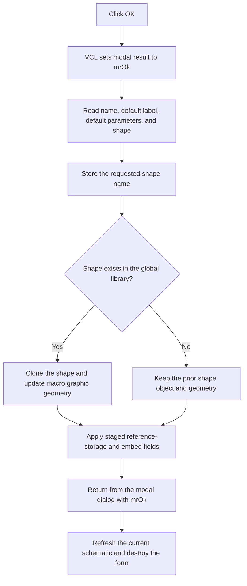

# Apply Macro Properties

> Analysis status: Recovered handler, form initialization, macro-model setters, modal caller, and refresh path reviewed.

## Control

| Property | Recovered value |
| --- | --- |
| Form | MacroPropertiesForm |
| Form caption | Macro Properties |
| Component path | MacroPropertiesForm.OKBtn |
| Control class | TBitBtn |
| Caption | OK |
| Modal result | 1 (`mrOk`) |
| Default button | true |
| Handler name | OKBtnClick |
| Handler address | 01b92970 |
| Graph node | `resource:dfm:MacroPropertiesForm/MacroPropertiesForm.OKBtn` |
| Handler node | `function:01b92970` |
| Graph layer | UI |

## What happens when clicked

The Schematic Editor opens this modal form only for a selected object that has
a macro-definition object at offset `+0x1A8`. The form keeps the selected
instance at `+0x770` and its macro definition at `+0x778`.

The VCL button path writes modal result `1` before it dispatches
`OKBtnClick`. The handler then applies the dialog fields in this order:

1. It reads `EName` and calls the macro definition's name setter. The
   recovered setter stores the string at definition field `+0x38`.
2. It reads `EDefLabel` and assigns it to definition field `+0x50`.
3. It reads `EDefParams` and calls the definition's default-parameter setter,
   which stores the string at `+0x58`.
4. It reads the read-only `EShape` text. If the shape picker did not stage a
   library qualifier, it uses this text directly. Otherwise it builds a
   library-qualified shape name from the staged qualifier and the displayed
   text. It passes that name to the macro shape setter.
5. It applies the staged macro-reference flag. Switching this flag to false
   also clears the definition's prior reference string at `+0x48`.
6. It copies the staged instance-reference string to selected-instance field
   `+0x3B0`. The Embed button stages an empty value for this field.

The named-shape setter first stores the requested name at definition field
`+0x40`. It then searches the global shape library. When it finds the name, it
replaces the prior shape object with a clone and updates the live macro graphic
size and geometry. If it does not find the name, it leaves the prior shape
object and geometry in place, but the stored name has already changed. The OK
handler has no separate error message for this partial-update branch.

After the handler returns, the button's modal result ends `ShowModal` with
result `1`. The Schematic Editor then refreshes the current schematic and
destroys the temporary properties form. Other modal results skip this caller
refresh.

## Click flow

## State, output, and error behavior

- The handler mutates the selected macro definition. It also writes one
  staged string back to the selected macro instance.
- Name, label, and parameter text have no local empty-text or syntax check.
- `EShape` is read-only in the DFM. The shape picker and Auto-Shape command
  supply its normal values.
- The handler does not save a circuit file or macro library file. The caller
  performs an in-memory schematic refresh after acceptance.
- A failed shape-library lookup is the proven partial-update branch. The
  shape-name field changes, but the old shape object remains active.
- The handler has no local catch, retry, rollback, or error-reporting branch.

## Handler evidence

- OK handler: [FUN_01b92970](../../../DecompiledSources/Tina16/functions/0000000001B92970__FUN_01b92970.c)
- Form initialization: [FUN_01b925f0](../../../DecompiledSources/Tina16/functions/0000000001B925F0__FUN_01b925f0.c)
- Named macro-shape setter: [FUN_01768c30](../../../DecompiledSources/Tina16/functions/0000000001768C30__FUN_01768c30.c)
- Macro reference-mode setter: [FUN_01768ff0](../../../DecompiledSources/Tina16/functions/0000000001768FF0__FUN_01768ff0.c)
- Modal Schematic Editor caller: [FUN_01c89d40](../../../DecompiledSources/Tina16/functions/0000000001C89D40__FUN_01c89d40.c)
- Accepted-result schematic refresh: [FUN_0199e310](../../../DecompiledSources/Tina16/functions/000000000199E310__FUN_0199e310.c)
- Recovered form evidence: [ui-evidence.json](../../../DecompiledSources/Tina16/resources/dfm/ui-evidence.json)
- Extracted two-state OK glyph: [0258_MacroPropertiesForm_MacroPropertiesForm_OKBtn_Glyph_Data.png](../../../glyph/0258_MacroPropertiesForm_MacroPropertiesForm_OKBtn_Glyph_Data.png)
- Complexity: complex
- Distinct outgoing calls: 7

## Direct calls

- `function:01768c30` - Stores a named shape and updates macro graphics when
  the shape exists.
- `function:01768ff0` - Applies the macro reference-storage flag and clears its
  reference string when switching the flag off.
- The remaining direct calls read control text, assign or concatenate Delphi
  strings, and finalize temporary strings.

## Resource evidence

- `EName`, `EDefLabel`, and `EDefParams` are editable fields. `EShape` and
  `EContent` are read-only.
- `OKBtn` has caption `OK`, explicit `ModalResult = 1`, `Default = true`, and
  two glyph states.
- The extracted glyph contains green and yellow check-mark states. The caption,
  modal result, handler, and caller establish acceptance; the glyph alone does
  not.
- The nearby Shape, Content, and Name labels identify form fields. Their
  distance from OK is not behavior evidence.

## Analysis limits

- Original Delphi names for model fields `+0x38`, `+0x40`, `+0x48`, `+0x50`,
  `+0x58`, `+0x62`, and instance field `+0x3B0` are not recovered.
- The separator in the library-qualified shape string is not rendered as a
  recovered string literal. The picker, list item data, and shape-library
  lookup establish the qualification behavior.
- The caller refreshes only after modal result `1`. The Auto-Shape button can
  mutate the definition before OK; that separate behavior is documented in
  [Update Auto-Shape](btnupdateshape-a330692cd2.md).
