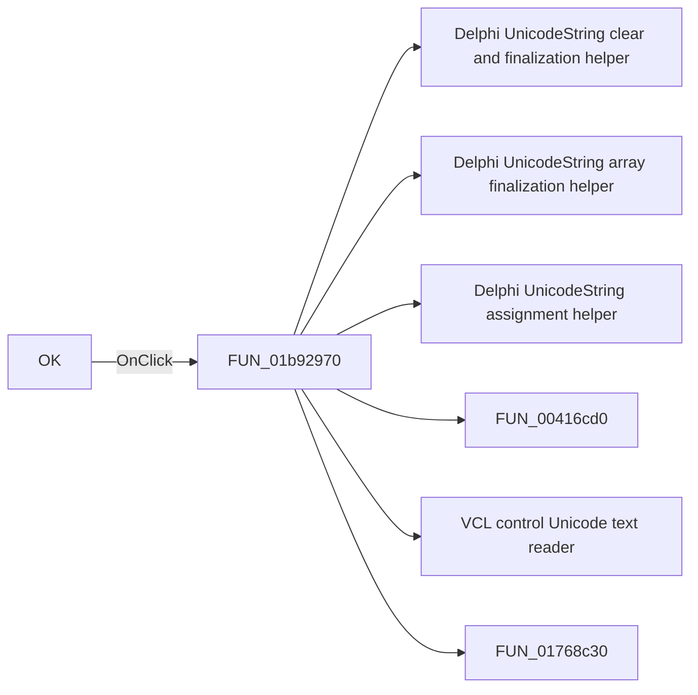

# OK

> Analysis status: Pending individual source review.

## Control

| Property | Recovered value |
| --- | --- |
| Form | MacroPropertiesForm |
| Component path | MacroPropertiesForm.OKBtn |
| Control class | TBitBtn |
| Caption | OK |
| Hint | Not present in the recovered resource. |
| Text | Not present in the recovered resource. |
| Handler name | OKBtnClick |
| Handler address | 01b92970 |
| Graph node | `resource:dfm:MacroPropertiesForm/MacroPropertiesForm.OKBtn` |
| Handler node | `function:01b92970` |
| Graph layer | UI |

## What happens when clicked

Pending individual analysis. An agent must read the recovered handler source and its relevant callees before it replaces this text.

## Click flow

## Handler evidence

- Source: [DecompiledSources/Tina16/functions/0000000001B92970__FUN_01b92970.c](../../../DecompiledSources/Tina16/functions/0000000001B92970__FUN_01b92970.c)
- Recovered role: Not present in the recovered resource.
- Current graph summary: Handles 1 Delphi UI event: MacroPropertiesForm.OKBtn.OnClick.
- Current graph behavior: Not present in the recovered resource.
- Current graph evidence: Not present in the recovered resource.
- Complexity: complex
- Distinct outgoing calls: 7

## Direct calls

- `function:00414480` — Delphi UnicodeString clear and finalization helper
- `function:00414560` — Delphi UnicodeString array finalization helper
- `function:00414ad0` — Delphi UnicodeString assignment helper
- `function:00416cd0` — FUN_00416cd0
- `function:0064dd90` — VCL control Unicode text reader
- `function:01768c30` — FUN_01768c30
- `function:01768ff0` — FUN_01768ff0

## Resource evidence

- Kind: Not present in the recovered resource.
- Modal result: 1
- Checked state: Not present in the recovered resource.
- List items: Not present in the recovered resource.
- Image reference: Not present in the recovered resource.
- Extracted glyph: [`0258_MacroPropertiesForm_MacroPropertiesForm_OKBtn_Glyph_Data.png`](../../../glyph/0258_MacroPropertiesForm_MacroPropertiesForm_OKBtn_Glyph_Data.png)

## Nearby label candidates

Nearby labels are layout candidates only. They are not proof of behavior.

- Rank 1: &Shape: at distance 152.
- Rank 2: C&ontent: at distance 183.
- Rank 3: &Name: at distance 214.

## Analysis limits

- Do not infer behavior from the control class, caption, hint, glyph, or nearby label alone.
- Do not replace the pending status until the handler source and relevant call path provide enough evidence.
