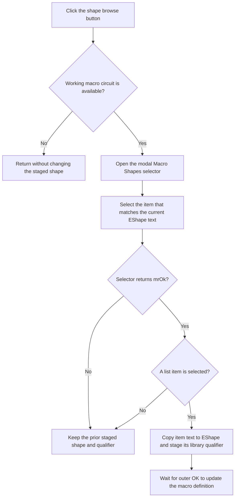

# Select a Macro Shape

> Analysis status: Recovered handler, Macro Shapes selector resource, accepted selection path, and staged OK consumer reviewed.

## Control

| Property | Recovered value |
| --- | --- |
| Form | MacroPropertiesForm |
| Form caption | Macro Properties |
| Component path | MacroPropertiesForm.SpeedButton1 |
| Control class | TSpeedButton |
| Caption | Not present in the recovered resource. |
| Handler name | SpeedButton1Click |
| Handler address | 01b92290 |
| Graph node | `resource:dfm:MacroPropertiesForm/MacroPropertiesForm.SpeedButton1` |
| Handler node | `function:01b92290` |
| Graph layer | UI |

## What happens when clicked

The handler first checks form field `+0x750`, which holds the working macro
circuit used to find compatible shapes. If this field is null, the click
returns without opening a selector or changing the staged shape.

When the field is available, the handler creates `frmDeviceList`. Its recovered
form caption is `Macro Shapes`, and it contains a searchable, library-filtered
list with OK and Cancel buttons. The handler passes the working macro circuit
and a form-initialization flag to this selector.

Before `ShowModal`, the handler reads the current `EShape` text, finds the same
text in the selector list, and sets that item as the initial selection. After
the modal selector returns:

- any result other than `1` leaves `EShape` and the staged library qualifier
  unchanged;
- result `1` with no selected item also leaves them unchanged; and
- result `1` with a selected item copies the selected list text to `EShape`
  and copies the selected item's library value at `+0x20` to form field
  `+0x760`.

This click does not change the macro definition. [Apply Macro Properties](okbtn-0ca3ca2851.md)
later combines the staged qualifier and `EShape` text and passes the result to
the macro shape setter. Canceling the outer Macro Properties dialog discards
this staged selection.

## Click flow

## State, output, and error behavior

- The output is staged form state: visible `EShape` text and hidden qualifier
  field `+0x760`.
- The click does not update the macro shape object, circuit file, or library.
- Selector Cancel and accepted selection index `-1` are explicit no-change
  branches.
- A null working macro circuit is an explicit no-op branch.
- The handler has no local error message, retry, or exception recovery.

## Handler evidence

- Shape browse handler: [FUN_01b92290](../../../DecompiledSources/Tina16/functions/0000000001B92290__FUN_01b92290.c)
- Macro Shapes selector constructor: [FUN_00c86a90](../../../DecompiledSources/Tina16/functions/0000000000C86A90__FUN_00c86a90.c)
- Form initialization: [FUN_01b925f0](../../../DecompiledSources/Tina16/functions/0000000001B925F0__FUN_01b925f0.c)
- Outer OK consumer: [FUN_01b92970](../../../DecompiledSources/Tina16/functions/0000000001B92970__FUN_01b92970.c)
- Recovered form evidence: [ui-evidence.json](../../../DecompiledSources/Tina16/resources/dfm/ui-evidence.json)
- Extracted glyph: [0256_MacroPropertiesForm_MacroPropertiesForm_SpeedButton1_Glyph_Data.png](../../../glyph/0256_MacroPropertiesForm_MacroPropertiesForm_SpeedButton1_Glyph_Data.png)
- Complexity: complex
- Distinct outgoing calls: 5

## Resource evidence

- `SpeedButton1` is next to the read-only `EShape` edit.
- Its 9 by 9 extracted glyph is an ellipsis. The handler confirms that the
  button opens a selector; the glyph alone is not proof.
- `frmDeviceList` is captioned `Macro Shapes`. It has a library combo box, a
  search edit, an owner-drawn list, and built-in OK and Cancel buttons.
- The nearby Shape label matches the field consumed by the handler. The more
  distant Content and Name labels are layout candidates only.

## Analysis limits

- The original Delphi name for staged qualifier field `+0x760` is not
  recovered.
- The handler copies selected-item field `+0x20` as the qualifier. The source
  does not expose a more specific Delphi field name for this value.
- The selector constructor is recovered, but this article does not assign
  undocumented meaning to its two Boolean initialization flags.
