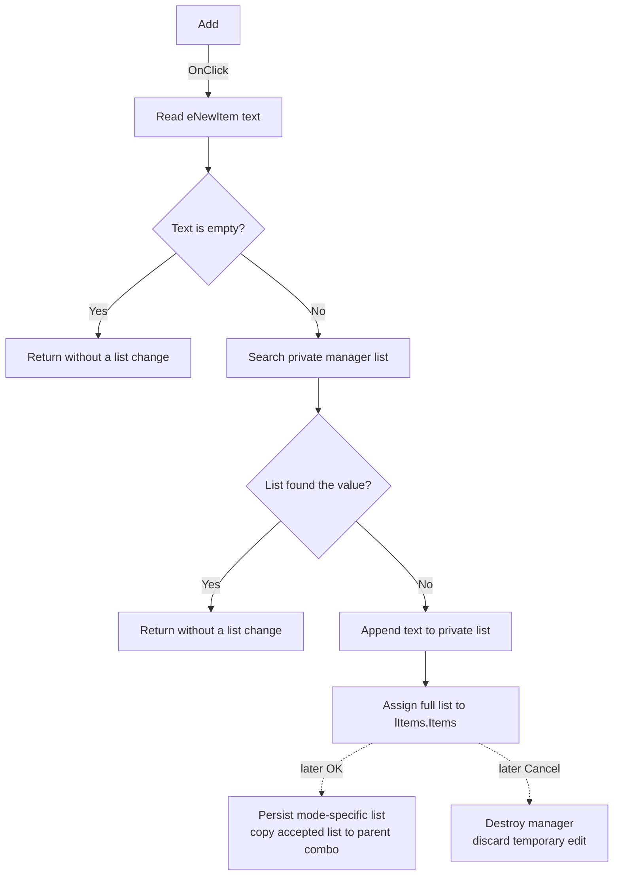

# Add an item to the project or workspace list

> Analysis status: Recovered control, handler, manager modes, list loading, modal callers, and persistence boundary reviewed.

## Control

| Property | Recovered value |
| --- | --- |
| Form | ManageElfProjects (`Manage Projects`) |
| Component path | ManageElfProjects.bAdd |
| Control class | TButton |
| Caption | Add |
| Handler name | bAddClick |
| Handler address | `015e5310` |
| Graph node | `resource:dfm:ManageElfProjects/ManageElfProjects.bAdd` |
| Handler node | `function:015e5310` |
| Handler graph layer | UI |

## What happens when clicked

`TManageElfProjects.bAddClick` reads the Unicode text from `eNewItem`. It
returns without a list change when the text is empty. For nonempty text, it
asks the manager's private string list at form offset `+0x6F8` for the item
index. It appends the text only when that search returns `-1`, which means that
the list did not find the value.

After an append, the handler assigns the full private string list to
`lItems.Items`. This refreshes the visible ListBox. It does not clear
`eNewItem`, select the new row, sort the list, or report that the value was
already present.

The search follows the string list's comparison rules. The recovered handler
does not set or inspect case-sensitivity or locale options. This article does
not claim which differently cased values compare as duplicates.

## Temporary edit and persistence boundary

The same manager form serves two modal workflows. Before `ShowModal`, its
caller sets mode `0` for project names or mode `1` for workspace names. On
show, the form loads `DAVE_TEST_PRJ` for mode `0` or `DAVE_TEST_REPO` for mode
`1`, splits the stored text on commas, and stores the temporary list at
`+0x6F8`.

Add changes only this temporary list and its visible ListBox. It does not write
the registry and does not update the Project or Workspace combo in the parent
`ElfMCUSelect` form.

- Manager OK serializes the whole temporary list, writes the mode-specific
  registry value, and returns modal result `1`. The caller then copies the
  accepted list into the matching parent combo.
- Manager Cancel does not call the OK handler. The caller skips the parent
  combo copy and destroys the temporary manager. Normal Add changes are then
  discarded.

Opening the manager can still create missing registry values through its
loader. That initialization is separate from this Add handler.

## Input and validation limits

The handler accepts the edit text as one list value. It does not trim spaces,
verify a directory, check an Eclipse project, reject path characters, or limit
the text length in recovered application code.

It also does not reject commas or double quotes. The later OK path serializes
with comma as delimiter and double quote as quote character. The registry
writer then removes all double quotes. A value that needs delimiter quoting
therefore has no proven round trip after save and reload.

## No-op and error boundaries

- Empty edit text is a no-op.
- A value that the private list already finds is a no-op.
- Add with a new value changes only the temporary manager list until OK.
- The handler has no confirmation, retry, status result, error message,
  rollback, or local exception handler.
- If text access, list search, append, or ListBox assignment raises an
  exception, the recovered handler has no local recovery.

## Click flow

## Recovered evidence

- Add handler: [FUN_015e5310](../../../DecompiledSources/Tina16/functions/00000000015E5310__FUN_015e5310.c)
- Mode-specific manager setup: [FUN_015e5710](../../../DecompiledSources/Tina16/functions/00000000015E5710__FUN_015e5710.c)
- Manager `OnShow` list load: [FUN_015e55a0](../../../DecompiledSources/Tina16/functions/00000000015E55A0__FUN_015e55a0.c)
- OK serialization and persistence request: [FUN_015e5420](../../../DecompiledSources/Tina16/functions/00000000015E5420__FUN_015e5420.c)
- Project-mode modal caller: [FUN_015e5f30](../../../DecompiledSources/Tina16/functions/00000000015E5F30__FUN_015e5f30.c)
- Workspace-mode modal caller: [FUN_015e5fa0](../../../DecompiledSources/Tina16/functions/00000000015E5FA0__FUN_015e5fa0.c)
- Registry list reader: [FUN_01604ed0](../../../DecompiledSources/Tina16/functions/0000000001604ED0__FUN_01604ed0.c)
- Registry list writer: [FUN_016056c0](../../../DecompiledSources/Tina16/functions/00000000016056C0__FUN_016056c0.c)
- Recovered form evidence: [ui-evidence.json](../../../DecompiledSources/Tina16/resources/dfm/ui-evidence.json)

## Direct calls

- `FUN_0064dd90` - Reads Unicode text from `eNewItem`.
- `FUN_00414560` - Finalizes temporary UnicodeString values.

## Resource evidence and annotation scope

- `bAdd` has caption `Add` and is beside `eNewItem` in the recovered form.
- The control has no hint, action, image reference, or extracted glyph.
- No same-parent label candidate is available.
- The source identifies `eNewItem` by the DFM field layout and proves the list
  operation. The caption and layout are supporting evidence only.
- This Bead annotates only `FUN_015e5310`. Shared manager setup, loading, OK,
  registry, and modal-caller functions remain evidence only.
