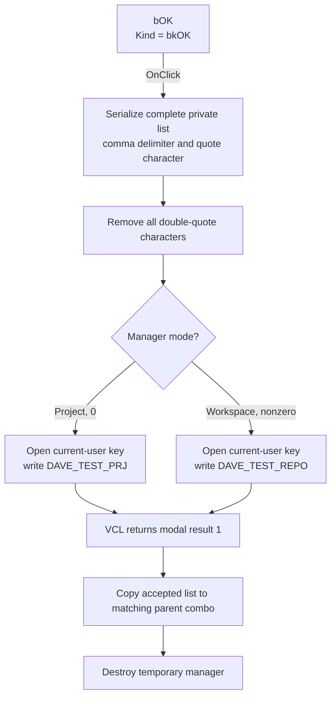

# Save the managed project or workspace list

> Analysis status: Recovered control, handler, serialization, registry writer, modal callers, and accepted-result copy reviewed.

## Control

| Property | Recovered value |
| --- | --- |
| Form | ManageElfProjects (`Manage Projects`) |
| Component path | ManageElfProjects.bOK |
| Control class | TBitBtn |
| Button kind | bkOK |
| Explicit DFM caption | Not present |
| Explicit DFM `ModalResult` | Not present |
| Handler name | bOKClick |
| Handler address | `015e5420` |
| Graph node | `resource:dfm:ManageElfProjects/ManageElfProjects.bOK` |
| Handler node | `function:015e5420` |
| Handler graph layer | UI |

## What happens when clicked

`TManageElfProjects.bOKClick` serializes the form's private string list at
offset `+0x6F8`. The serializer temporarily sets comma as the delimiter and
double quote as the quote character. It produces the complete delimited list
and then restores the string list's previous delimiter and quote settings.

The handler passes the serialized text and manager mode at `+0x6E8` to the
registry-list writer:

| Manager mode | Registry value |
| --- | --- |
| `0` | `DAVE_TEST_PRJ` |
| Nonzero | `DAVE_TEST_REPO` |

The writer removes every double-quote character from the serialized text. It
then opens the application's configured subkey under `HKEY_CURRENT_USER` and
writes the selected value. The full application subkey text is held in shared
state and is not present in these function bodies.

## Modal acceptance and parent update

The handler does not assign `ModalResult` or call a close routine. The DFM sets
`Kind = bkOK`. The built-in VCL button behavior supplies accepted modal result
`1` after the click handling completes.

Both recovered callers create a temporary manager and use `ShowModal`. The
project caller selects mode `0`; the workspace caller selects mode `1`. When
`ShowModal` returns `1`, the caller assigns the manager's private list to the
matching parent combo:

- project mode updates `ElfMCUSelect.cbProject.Items`;
- workspace mode updates `ElfMCUSelect.cbRepo.Items`.

The caller then destroys the temporary manager. It does not select an item,
refresh the other combo, start an ELF search, or save the selected index.

The registry write occurs before the parent combo copy. A later Cancel in the
outer `ElfMCUSelect` dialog does not undo this list write.

## Commit and data limits

Add and Remove edit only the manager's temporary list. OK is the commit point
for the complete list. It does not validate individual entries, verify project
or workspace directories, check for a `Debug` output, confirm the change, or
compare the new list with the stored list.

The serializer can quote values that contain commas. The writer then removes
all double quotes. The loader later splits the stored text on commas. An entry
that contains a comma therefore has no proven round trip as one item. The OK
handler does not reject such an entry.

## No-op and error boundaries

- Clicking OK with an unchanged list serializes and writes the same list
  again, then refreshes the matching parent combo after modal return.
- If the configured registry subkey cannot be opened for writing, the writer
  skips the value write and returns no success result. The button can still
  return modal result `1`, and the caller can still update the in-memory parent
  combo with the edited list.
- The handler has no transaction, confirmation, retry, error message, success
  check, rollback, or local exception handler.
- A failure after the registry write but before the parent item copy can leave
  saved settings changed while the visible parent combo is stale.

## Click flow

## Recovered evidence

- OK handler: [FUN_015e5420](../../../DecompiledSources/Tina16/functions/00000000015E5420__FUN_015e5420.c)
- Delimited-list serializer: [FUN_004b37d0](../../../DecompiledSources/Tina16/functions/00000000004B37D0__FUN_004b37d0.c)
- Mode-based registry writer: [FUN_016056c0](../../../DecompiledSources/Tina16/functions/00000000016056C0__FUN_016056c0.c)
- Mode-specific manager setup: [FUN_015e5710](../../../DecompiledSources/Tina16/functions/00000000015E5710__FUN_015e5710.c)
- Manager `OnShow` list load: [FUN_015e55a0](../../../DecompiledSources/Tina16/functions/00000000015E55A0__FUN_015e55a0.c)
- Project-mode modal caller and accepted copy: [FUN_015e5f30](../../../DecompiledSources/Tina16/functions/00000000015E5F30__FUN_015e5f30.c)
- Workspace-mode modal caller and accepted copy: [FUN_015e5fa0](../../../DecompiledSources/Tina16/functions/00000000015E5FA0__FUN_015e5fa0.c)
- Recovered form evidence: [ui-evidence.json](../../../DecompiledSources/Tina16/resources/dfm/ui-evidence.json)

## Direct calls

- `FUN_004b37d0` - Serializes the private string list as delimited text.
- `FUN_016056c0` - Writes the mode-specific list to the current-user registry.
- `FUN_00414480` - Clears the temporary serialized UnicodeString.

## Resource evidence and annotation scope

- `bOK` is a `TBitBtn` with `Kind = bkOK`, `NumGlyphs = 2`, and
  `TabOrder = 0`.
- The control has no explicit caption, hint, action, `ModalResult`, image
  reference, or extracted custom glyph.
- No same-parent label candidate is available.
- Existing Bead `.464` has a compatible canonical annotation for
  `FUN_015e5420`. This Bead's fragment repeats the same scalar fields for its
  directly owned control handler and does not duplicate registry-writer or
  caller annotations.
