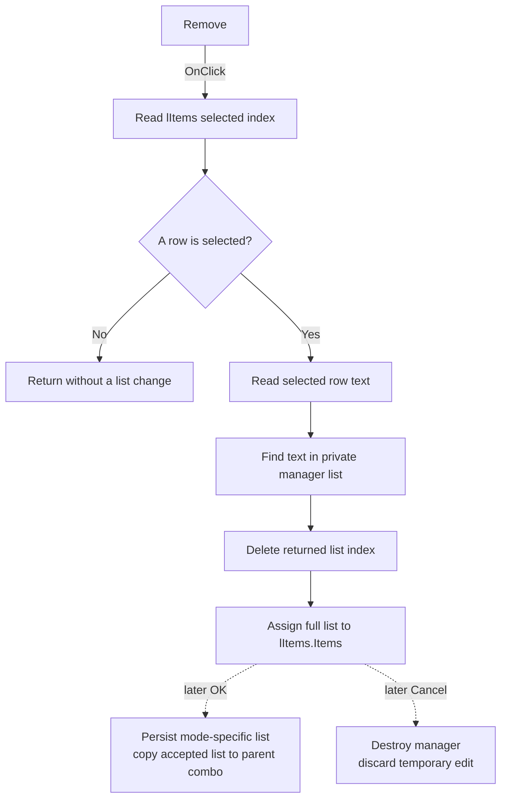

# Remove an item from the project or workspace list

> Analysis status: Recovered control, handler, manager modes, list loading, modal callers, and persistence boundary reviewed.

## Control

| Property | Recovered value |
| --- | --- |
| Form | ManageElfProjects (`Manage Projects`) |
| Component path | ManageElfProjects.bRemove |
| Control class | TButton |
| Caption | Remove |
| Handler name | bRemoveClick |
| Handler address | `015e5490` |
| Graph node | `resource:dfm:ManageElfProjects/ManageElfProjects.bRemove` |
| Handler node | `function:015e5490` |
| Handler graph layer | UI |

## What happens when clicked

`TManageElfProjects.bRemoveClick` reads the selected index from `lItems`. It
returns without a change when the index is negative, which means that no row
is selected.

For a selected row, the handler reads its text from `lItems.Items`. It searches
the manager's private string list at form offset `+0x6F8` for that text and
passes the returned index to the list delete operation. It then assigns the
full private list back to `lItems.Items` to refresh the visible ListBox.

The handler does not select a neighboring row, clear `eNewItem`, ask for
confirmation, or report which item was removed.

## Temporary edit and persistence boundary

The same manager form serves project and workspace modes. Its modal caller
sets mode `0` for project names or mode `1` for workspace names. On show, the
form loads the matching registry value into the private list and assigns that
list to `lItems`.

Remove changes only the temporary list and ListBox. It does not delete a
project or workspace directory. It does not write the registry and does not
update the parent `ElfMCUSelect` combo.

- Manager OK writes the complete modified list and returns modal result `1`.
  The caller then copies the accepted list into the matching parent combo.
- Manager Cancel skips the OK handler and the parent combo copy. The caller
  destroys the temporary manager, so the normal Remove change is discarded.

Opening the manager can still initialize missing registry values through its
loader. That behavior is separate from Remove.

## List synchronization assumption

The handler checks only the visible ListBox selection. It does not check the
index returned when it searches the private list for the selected text. The
normal path keeps the ListBox synchronized by assigning the private list after
load, Add, and Remove. In that normal state, the selected text is present.

If the two lists become inconsistent and the search returns `-1`, the handler
passes `-1` to the private list's delete operation. The exact VCL failure is
not recovered here. The handler has no local guard or recovery for that case.

## No-op and error boundaries

- No selected ListBox row is a no-op.
- A selected row removes one matching entry from the temporary private list.
- The handler has no directory operation, registry write, confirmation, retry,
  status result, rollback, or local exception handler.
- If selected-text access, list search, delete, or ListBox assignment raises an
  exception, the recovered handler has no local recovery.

## Click flow

## Recovered evidence

- Remove handler: [FUN_015e5490](../../../DecompiledSources/Tina16/functions/00000000015E5490__FUN_015e5490.c)
- Mode-specific manager setup: [FUN_015e5710](../../../DecompiledSources/Tina16/functions/00000000015E5710__FUN_015e5710.c)
- Manager `OnShow` list load: [FUN_015e55a0](../../../DecompiledSources/Tina16/functions/00000000015E55A0__FUN_015e55a0.c)
- OK serialization and persistence request: [FUN_015e5420](../../../DecompiledSources/Tina16/functions/00000000015E5420__FUN_015e5420.c)
- Project-mode modal caller: [FUN_015e5f30](../../../DecompiledSources/Tina16/functions/00000000015E5F30__FUN_015e5f30.c)
- Workspace-mode modal caller: [FUN_015e5fa0](../../../DecompiledSources/Tina16/functions/00000000015E5FA0__FUN_015e5fa0.c)
- Registry list reader: [FUN_01604ed0](../../../DecompiledSources/Tina16/functions/0000000001604ED0__FUN_01604ed0.c)
- Registry list writer: [FUN_016056c0](../../../DecompiledSources/Tina16/functions/00000000016056C0__FUN_016056c0.c)
- Recovered form evidence: [ui-evidence.json](../../../DecompiledSources/Tina16/resources/dfm/ui-evidence.json)

## Direct calls

- `FUN_00414480` - Clears the temporary selected-row UnicodeString.

## Resource evidence and annotation scope

- `bRemove` has caption `Remove` and is beside `lItems` in the recovered form.
- The control has no hint, action, image reference, or extracted glyph.
- No same-parent label candidate is available.
- The source identifies `lItems` by the DFM field layout and proves the list
  operation. The caption and layout are supporting evidence only.
- This Bead annotates only `FUN_015e5490`. Shared manager setup, loading, OK,
  registry, and modal-caller functions remain evidence only.
