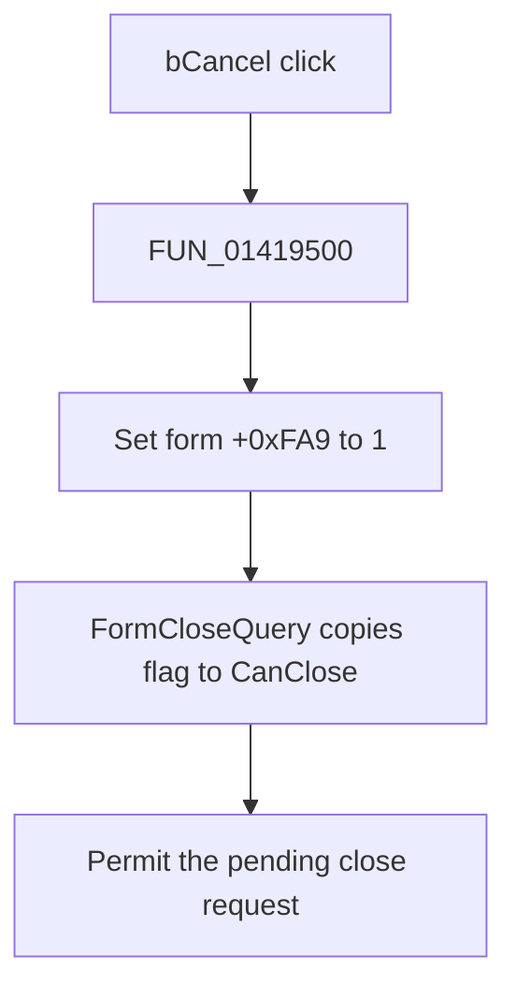

# bCancel

## Control

| Property | Recovered value |
| --- | --- |
| Form | MCUAsmSelector |
| Component path | MCUAsmSelector.bCancel |
| Control class | TBitBtn |
| Caption | Not present in the recovered resource. |
| Hint | Not present in the recovered resource. |
| Text | Not present in the recovered resource. |
| Handler name | bCancelClick |
| Handler address | 01419500 |
| Graph node | `resource:dfm:MCUAsmSelector/MCUAsmSelector.bCancel` |
| Handler node | `function:01419500` |
| Graph layer | UI |

## What happens when clicked

The handler sets the form byte at `+0xFA9` to `1`. `FormCloseQuery` copies this byte to its `CanClose` output. The click therefore removes the form's validation block and permits the pending close request.

The handler does not inspect the selected input mode, file names, or file lists. It does not clear staged data. It has no branch and no direct call. Repeating the click writes the same value.

The resource identifies this control as `bkCancel`, but the recovered handler proves only the close-permission write. The normal VCL button behavior supplies the close request outside this handler.

## Click flow

## Handler evidence

- Source: [DecompiledSources/Tina16/functions/0000000001419500__FUN_01419500.c](../../../DecompiledSources/Tina16/functions/0000000001419500__FUN_01419500.c)
- Recovered role: Permit MCU input selector closure after Cancel.
- Current graph summary: Handles 1 Delphi UI event: MCUAsmSelector.bCancel.OnClick.
- Current graph behavior: Sets the form close-permission flag. The form close-query handler returns this flag unchanged.
- Current graph evidence: `FUN_01419500` writes byte `1` at form offset `+0xFA9`; `FUN_014194f0` copies that byte to `CanClose`.
- Complexity: simple
- Distinct outgoing calls: 0

## Direct calls

- No direct call edge is present in the recovered graph.

## Resource evidence

- Kind: bkCancel
- Modal result: Not present in the recovered resource.
- Checked state: Not present in the recovered resource.
- List items: Not present in the recovered resource.
- Image reference: Not present in the recovered resource.
- Extracted glyph: None.

## Nearby label candidates

Nearby labels are layout candidates only. They are not proof of behavior.

- No same-parent label candidate is available.

## Analysis limits

- [Cancel handler `FUN_01419500`](../../../DecompiledSources/Tina16/functions/0000000001419500__FUN_01419500.c) proves the single close-permission write.
- [Form close-query handler `FUN_014194f0`](../../../DecompiledSources/Tina16/functions/00000000014194F0__FUN_014194f0.c) proves how the flag controls closure.
- The recovered code does not show a rollback operation. Do not treat this click as an undo of file or mode changes.
