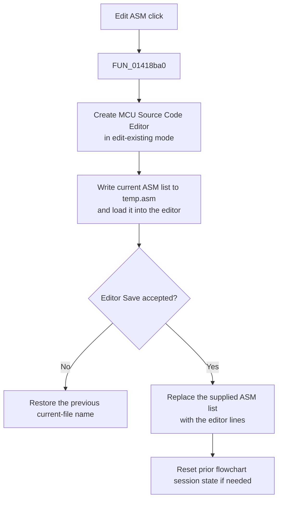

# &Edit ASM...

## Control

| Property | Recovered value |
| --- | --- |
| Form | MCUAsmSelector |
| Component path | MCUAsmSelector.bEditASM |
| Control class | TButton |
| Caption | &Edit ASM... |
| Hint | Not present in the recovered resource. |
| Text | Not present in the recovered resource. |
| Handler name | bEditASMClick |
| Handler address | 01418ba0 |
| Graph node | `resource:dfm:MCUAsmSelector/MCUAsmSelector.bEditASM` |
| Handler node | `function:01418ba0` |
| Graph layer | UI |

## What happens when clicked

The handler opens the **MCU Source Code Editor** for the current ASM source list. It passes `0` to the shared editor launcher, which selects edit-existing mode.

The launcher creates `TEditMCUInput`, gives it the current ASM list, writes that list to `temp.asm`, and loads the temporary file into the editor. It also passes the current MCU type and name before it shows the form modally.

The editor's Save command clears the supplied ASM list, copies all editor lines into that same list, sets its accepted flag, and closes the editor. If the editor closes without this accepted flag, the launcher restores the selector's previous current-file name. On acceptance, it keeps the edited list and clears an active flowchart session when the previous mode requires that cleanup.

This click does not compile the ASM source. Compilation is a separate command in the editor. The launcher has no local exception handler, so an allocation, file, or editor error propagates.

## Click flow

## Handler evidence

- Source: [DecompiledSources/Tina16/functions/0000000001418BA0__FUN_01418ba0.c](../../../DecompiledSources/Tina16/functions/0000000001418BA0__FUN_01418ba0.c)
- Recovered role: Edit the current MCU ASM source list in the modal source editor.
- Current graph summary: Handles 1 Delphi UI event: MCUAsmSelector.bEditASM.OnClick.
- Current graph behavior: Launches the MCU source editor with the existing ASM list and keeps changes only through the editor's Save path.
- Current graph evidence: The handler calls `FUN_01418a70` with mode `0`. `FUN_01412dd0` attaches the current list and loads `temp.asm`. `FUN_014131e0` replaces the attached list, sets the accepted byte, and closes the editor.
- Complexity: simple
- Distinct outgoing calls: 1

## Direct calls

- `function:01418a70` — FUN_01418a70

## Resource evidence

- Kind: Not present in the recovered resource.
- Modal result: Not present in the recovered resource.
- Checked state: Not present in the recovered resource.
- List items: Not present in the recovered resource.
- Image reference: Not present in the recovered resource.
- Extracted glyph: None.

## Nearby label candidates

Nearby labels are layout candidates only. They are not proof of behavior.

- No same-parent label candidate is available.

## Analysis limits

- [Click handler `FUN_01418ba0`](../../../DecompiledSources/Tina16/functions/0000000001418BA0__FUN_01418ba0.c) selects edit-existing mode.
- [Shared editor launcher `FUN_01418a70`](../../../DecompiledSources/Tina16/functions/0000000001418A70__FUN_01418a70.c) proves modal setup and the accepted or canceled branches.
- [Existing-list setup `FUN_01412dd0`](../../../DecompiledSources/Tina16/functions/0000000001412DD0__FUN_01412dd0.c) proves the `temp.asm` load.
- [Editor Save handler `FUN_014131e0`](../../../DecompiledSources/Tina16/functions/00000000014131E0__FUN_014131e0.c) proves the list replacement and accepted flag.
- The recovered path does not promise rollback after an exception during the Save copy.
