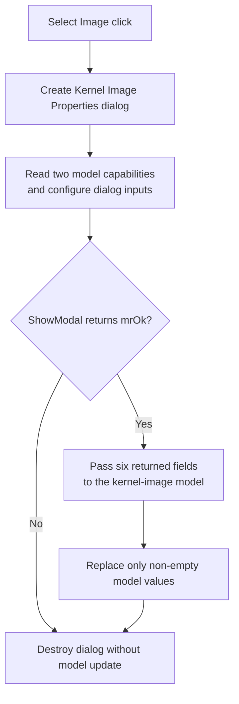

# Select Image...

## Control

| Property | Recovered value |
| --- | --- |
| Form | MCUAsmSelector |
| Component path | MCUAsmSelector.bKernelImage |
| Control class | TButton |
| Caption | Select Image... |
| Hint | Not present in the recovered resource. |
| Text | Not present in the recovered resource. |
| Handler name | bKernelImageClick |
| Handler address | 01419c00 |
| Graph node | `resource:dfm:MCUAsmSelector/MCUAsmSelector.bKernelImage` |
| Handler node | `function:01419c00` |
| Graph layer | UI |

## What happens when clicked

The DFM stores this button as hidden and disabled. `FormCreate` adds the **Kernel Image** selection row and shows this button only when the MCU type is `0x100`. The mode-state helper enables it only for internal mode `4`.

The handler creates `TMCUKernelImageProperties` and reads two boolean capabilities from the current kernel-image model. It applies those booleans to groups of fields in the dialog, which controls which image-property inputs are available.

It then shows the **Kernel Image Properties** dialog modally. When `ShowModal` returns `1` (`mrOk`), the handler passes six returned string fields to the kernel-image model. The model replaces only values that are non-empty. This covers three list-like fields, two single file-name fields, and one additional list-like field in the recovered setter.

When the modal result is not `mrOk`, the handler does not call the model setter. It then destroys the temporary dialog in both normal branches. The click does not build a kernel image. It only edits and applies image-property inputs.

## Click flow

## Handler evidence

- Source: [DecompiledSources/Tina16/functions/0000000001419C00__FUN_01419c00.c](../../../DecompiledSources/Tina16/functions/0000000001419C00__FUN_01419c00.c)
- Recovered role: Edit and apply MCU kernel-image input properties.
- Current graph summary: Handles 1 Delphi UI event: MCUAsmSelector.bKernelImage.OnClick.
- Current graph behavior: Configures and shows the Kernel Image Properties dialog, then applies six returned fields only for `mrOk`.
- Current graph evidence: The handler tests modal result `1` before calling `FUN_010b41b0`. The setter checks each supplied string for nonzero before it replaces the matching model list or file-name field.
- Complexity: complex
- Distinct outgoing calls: 4

## Direct calls

- `function:00410f20` — Nil-safe Delphi object destruction helper
- `function:007fc180` — FUN_007fc180
- `function:010b41b0` — FUN_010b41b0
- `function:014155c0` — FUN_014155c0

## Resource evidence

- Kind: Not present in the recovered resource.
- Modal result: Not present in the recovered resource.
- Checked state: Not present in the recovered resource.
- List items: Not present in the recovered resource.
- Image reference: Not present in the recovered resource.
- Extracted glyph: None.

## Nearby label candidates

Nearby labels are layout candidates only. They are not proof of behavior.

- No same-parent label candidate is available.

## Analysis limits

- [Click handler `FUN_01419c00`](../../../DecompiledSources/Tina16/functions/0000000001419C00__FUN_01419c00.c) proves dialog setup, the `mrOk` guard, six-field copy, and cleanup.
- [Form creation `FUN_01419180`](../../../DecompiledSources/Tina16/functions/0000000001419180__FUN_01419180.c), [mode-state helper `FUN_01417bc0`](../../../DecompiledSources/Tina16/functions/0000000001417BC0__FUN_01417bc0.c), and [resource evidence](../../../DecompiledSources/Tina16/resources/dfm/ui-evidence.json) prove the type-`0x100` availability and mode-4 enable rule.
- [Capability mapper `FUN_014155c0`](../../../DecompiledSources/Tina16/functions/00000000014155C0__FUN_014155c0.c) proves how the two model booleans control dialog fields.
- [Kernel-image setter `FUN_010b41b0`](../../../DecompiledSources/Tina16/functions/00000000010B41B0__FUN_010b41b0.c) proves the non-empty replacement rules.
- [Recovered resource evidence](../../../DecompiledSources/Tina16/resources/dfm/ui-evidence.json) identifies the dialog as `TMCUKernelImageProperties` and lists its file-selection controls.
- The original model field names are not recovered. The handler does not verify the selected files or create an output image.
