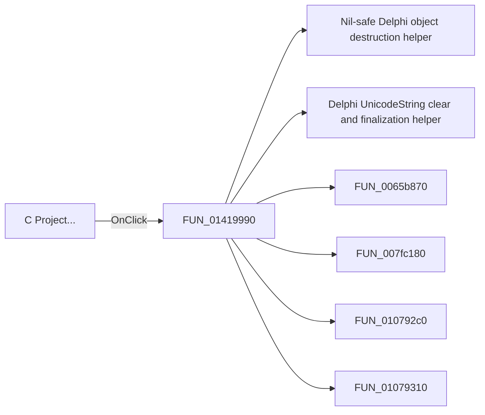

# C Project...

> Analysis status: Pending individual source review.

## Control

| Property | Recovered value |
| --- | --- |
| Form | MCUAsmSelector |
| Component path | MCUAsmSelector.bMakeCCode |
| Control class | TButton |
| Caption | C Project... |
| Hint | Not present in the recovered resource. |
| Text | Not present in the recovered resource. |
| Handler name | bMakeCCodeClick |
| Handler address | 01419990 |
| Graph node | `resource:dfm:MCUAsmSelector/MCUAsmSelector.bMakeCCode` |
| Handler node | `function:01419990` |
| Graph layer | UI |

## What happens when clicked

Pending individual analysis. An agent must read the recovered handler source and its relevant callees before it replaces this text.

## Click flow

## Handler evidence

- Source: [DecompiledSources/Tina16/functions/0000000001419990__FUN_01419990.c](../../../DecompiledSources/Tina16/functions/0000000001419990__FUN_01419990.c)
- Recovered role: Not present in the recovered resource.
- Current graph summary: Handles 1 Delphi UI event: MCUAsmSelector.bMakeCCode.OnClick.
- Current graph behavior: Not present in the recovered resource.
- Current graph evidence: Not present in the recovered resource.
- Complexity: complex
- Distinct outgoing calls: 12

## Direct calls

- `function:00410f20` — Nil-safe Delphi object destruction helper
- `function:00414480` — Delphi UnicodeString clear and finalization helper
- `function:0065b870` — FUN_0065b870
- `function:007fc180` — FUN_007fc180
- `function:010792c0` — FUN_010792c0
- `function:01079310` — FUN_01079310
- `function:0107b2f0` — FUN_0107b2f0
- `function:01081a90` — FUN_01081a90
- `function:01081d80` — FUN_01081d80
- `function:01417bc0` — FUN_01417bc0
- `function:01417f80` — FUN_01417f80
- `function:01419960` — FUN_01419960

## Resource evidence

- Kind: Not present in the recovered resource.
- Modal result: Not present in the recovered resource.
- Checked state: Not present in the recovered resource.
- List items: Not present in the recovered resource.
- Image reference: Not present in the recovered resource.
- Extracted glyph: None.

## Nearby label candidates

Nearby labels are layout candidates only. They are not proof of behavior.

- No same-parent label candidate is available.

## Analysis limits

- Do not infer behavior from the control class, caption, hint, glyph, or nearby label alone.
- Do not replace the pending status until the handler source and relevant call path provide enough evidence.
