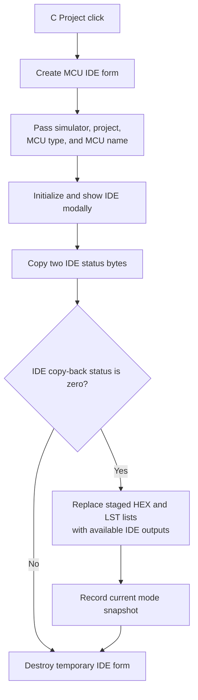

# C Project...

## Control

| Property | Recovered value |
| --- | --- |
| Form | MCUAsmSelector |
| Component path | MCUAsmSelector.bMakeCCode |
| Control class | TButton |
| Caption | C Project... |
| Hint | Not present in the recovered resource. |
| Text | Not present in the recovered resource. |
| Handler name | bMakeCCodeClick |
| Handler address | 01419990 |
| Graph node | `resource:dfm:MCUAsmSelector/MCUAsmSelector.bMakeCCode` |
| Handler node | `function:01419990` |
| Graph layer | UI |

## What happens when clicked

The DFM stores this button as hidden and disabled. `FormCreate` shows it during form setup, and the mode-state helper enables it only for internal mode `3`.

The handler creates `TMCUProjectForm`, the **MCU IDE**, and assigns it to a global temporary form pointer. It passes the current simulator/model object, project context, MCU type, and MCU name. It then initializes the IDE project view and shows the form modally.

After the IDE closes, the handler copies two IDE status bytes to selector fields `+0x769` and `+0x76A`. It reads a separate IDE status byte through `FUN_0107b2f0`:

- When that byte is nonzero, it skips the list copy-back.
- When that byte is zero, it refreshes the selector's mode controls, clears the staged HEX and LST lists, and copies non-empty IDE output lists into them. It also copies a HEX output when the second copied status byte requires it. It then records the current mode snapshot.

The handler destroys the temporary IDE form and clears the global pointer in both normal branches. It does not itself invoke an IDE build command. Build, save, and debugging actions belong to `TMCUProjectForm`.

The exact original names of the three IDE status bytes are not recovered. Their roles are stated only from the tested branches and list copy-back.

## Click flow

## Handler evidence

- Source: [DecompiledSources/Tina16/functions/0000000001419990__FUN_01419990.c](../../../DecompiledSources/Tina16/functions/0000000001419990__FUN_01419990.c)
- Recovered role: Open the MCU C-project IDE and retain available generated outputs.
- Current graph summary: Handles 1 Delphi UI event: MCUAsmSelector.bMakeCCode.OnClick.
- Current graph behavior: Initializes `TMCUProjectForm` from current MCU state, shows it modally, and copies generated result lists only when the IDE status permits copy-back.
- Current graph evidence: The handler creates the form from `PTR_FUN_010739f8`, passes form and MCU state through three setup helpers, tests `FUN_0107b2f0`, and copies IDE lists at `+0x4D38` and `+0x4D40` into selector lists.
- Complexity: complex
- Distinct outgoing calls: 12

## Direct calls

- `function:00410f20` — Nil-safe Delphi object destruction helper
- `function:00414480` — Delphi UnicodeString clear and finalization helper
- `function:0065b870` — FUN_0065b870
- `function:007fc180` — FUN_007fc180
- `function:010792c0` — FUN_010792c0
- `function:01079310` — FUN_01079310
- `function:0107b2f0` — FUN_0107b2f0
- `function:01081a90` — FUN_01081a90
- `function:01081d80` — FUN_01081d80
- `function:01417bc0` — FUN_01417bc0
- `function:01417f80` — FUN_01417f80
- `function:01419960` — FUN_01419960

## Resource evidence

- Kind: Not present in the recovered resource.
- Modal result: Not present in the recovered resource.
- Checked state: Not present in the recovered resource.
- List items: Not present in the recovered resource.
- Image reference: Not present in the recovered resource.
- Extracted glyph: None.

## Nearby label candidates

Nearby labels are layout candidates only. They are not proof of behavior.

- No same-parent label candidate is available.

## Analysis limits

- [Click handler `FUN_01419990`](../../../DecompiledSources/Tina16/functions/0000000001419990__FUN_01419990.c) proves the IDE lifetime, modal call, status tests, and list copy-back.
- [Form creation `FUN_01419180`](../../../DecompiledSources/Tina16/functions/0000000001419180__FUN_01419180.c), [mode-state helper `FUN_01417bc0`](../../../DecompiledSources/Tina16/functions/0000000001417BC0__FUN_01417bc0.c), and [resource evidence](../../../DecompiledSources/Tina16/resources/dfm/ui-evidence.json) prove the initial state and mode-3 enable rule.
- [Model setup `FUN_010792c0`](../../../DecompiledSources/Tina16/functions/00000000010792C0__FUN_010792c0.c), [project-context setup `FUN_01079310`](../../../DecompiledSources/Tina16/functions/0000000001079310__FUN_01079310.c), and [MCU setup `FUN_01081a90`](../../../DecompiledSources/Tina16/functions/0000000001081A90__FUN_01081a90.c) prove the supplied inputs.
- [IDE initialization `FUN_01081d80`](../../../DecompiledSources/Tina16/functions/0000000001081D80__FUN_01081d80.c) proves project and simulator initialization.
- [IDE status getter `FUN_0107b2f0`](../../../DecompiledSources/Tina16/functions/000000000107B2F0__FUN_0107b2f0.c) proves the tested byte, but not its original Delphi field name.
- The click does not prove that output files remain present after the IDE closes.
