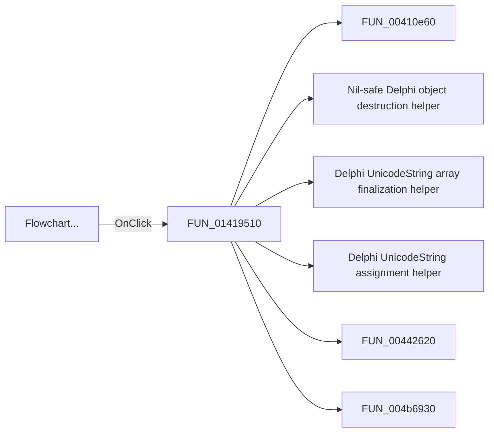

# Flowchart...

> Analysis status: Pending individual source review.

## Control

| Property | Recovered value |
| --- | --- |
| Form | MCUAsmSelector |
| Component path | MCUAsmSelector.bMakeFlowChart |
| Control class | TButton |
| Caption | Flowchart... |
| Hint | Not present in the recovered resource. |
| Text | Not present in the recovered resource. |
| Handler name | bMakeFlowChartClick |
| Handler address | 01419510 |
| Graph node | `resource:dfm:MCUAsmSelector/MCUAsmSelector.bMakeFlowChart` |
| Handler node | `function:01419510` |
| Graph layer | UI |

## What happens when clicked

Pending individual analysis. An agent must read the recovered handler source and its relevant callees before it replaces this text.

## Click flow

## Handler evidence

- Source: [DecompiledSources/Tina16/functions/0000000001419510__FUN_01419510.c](../../../DecompiledSources/Tina16/functions/0000000001419510__FUN_01419510.c)
- Recovered role: Not present in the recovered resource.
- Current graph summary: Handles 1 Delphi UI event: MCUAsmSelector.bMakeFlowChart.OnClick.
- Current graph behavior: Not present in the recovered resource.
- Current graph evidence: Not present in the recovered resource.
- Complexity: complex
- Distinct outgoing calls: 19

## Direct calls

- `function:00410e60` — FUN_00410e60
- `function:00410f20` — Nil-safe Delphi object destruction helper
- `function:00414560` — Delphi UnicodeString array finalization helper
- `function:00414ad0` — Delphi UnicodeString assignment helper
- `function:00442620` — FUN_00442620
- `function:004b6930` — FUN_004b6930
- `function:007fc180` — FUN_007fc180
- `function:00806b40` — FUN_00806b40
- `function:01050730` — FUN_01050730
- `function:010514c0` — FUN_010514c0
- `function:01051510` — FUN_01051510
- `function:010515b0` — FUN_010515b0
- `function:010515c0` — FUN_010515c0
- `function:01051710` — FUN_01051710
- `function:01418bb0` — FUN_01418bb0
- `function:015fcb30` — FUN_015fcb30
- `function:015fcbd0` — FUN_015fcbd0
- `function:015fcc20` — FUN_015fcc20
- `function:015fcd60` — FUN_015fcd60

## Resource evidence

- Kind: Not present in the recovered resource.
- Modal result: Not present in the recovered resource.
- Checked state: Not present in the recovered resource.
- List items: Not present in the recovered resource.
- Image reference: Not present in the recovered resource.
- Extracted glyph: None.

## Nearby label candidates

Nearby labels are layout candidates only. They are not proof of behavior.

- No same-parent label candidate is available.

## Analysis limits

- Do not infer behavior from the control class, caption, hint, glyph, or nearby label alone.
- Do not replace the pending status until the handler source and relevant call path provide enough evidence.
