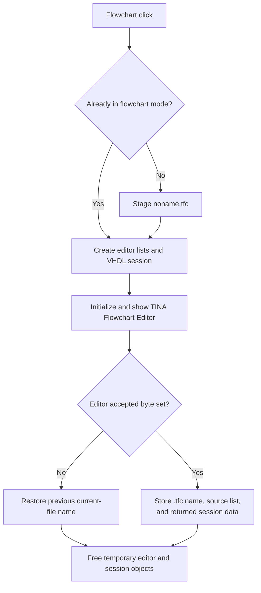

# Flowchart...

## Control

| Property | Recovered value |
| --- | --- |
| Form | MCUAsmSelector |
| Component path | MCUAsmSelector.bMakeFlowChart |
| Control class | TButton |
| Caption | Flowchart... |
| Hint | Not present in the recovered resource. |
| Text | Not present in the recovered resource. |
| Handler name | bMakeFlowChartClick |
| Handler address | 01419510 |
| Graph node | `resource:dfm:MCUAsmSelector/MCUAsmSelector.bMakeFlowChart` |
| Handler node | `function:01419510` |
| Graph layer | UI |

## What happens when clicked

The DFM stores this button as hidden and disabled. `FormCreate` shows and enables the flowchart action only when the MCU name contains `PIC16`, the MCU type is `2`, `4`, or `8`, or the current internal mode is already flowchart. The mode selector then enables the button only for mode `2`.

The handler opens `TFlowChartMainForm`, the **TINA Flowchart Editor**, for the current MCU context. If the selector is not already in flowchart mode, it first stages the default file name `noname.tfc`.

It creates temporary string-list and VHDL-session objects. It passes the MCU name, MCU type, working directory, current staged source list, current session data, and simulator context into the editor. It initializes the editor and shows it modally.

The editor has an accepted byte at `+0x9D0`. Its save path sets this byte only after it has copied the current editor text to the supplied output list. When the byte remains clear, the selector restores its previous current-file name. When the byte is set, the selector:

1. records the current mode as the mode snapshot;
2. obtains the editor's `.tfc` file name and makes it current;
3. copies the returned source list to the selector's staged list; and
4. replaces the retained VHDL session data with the editor result.

The handler destroys its temporary objects and releases the temporary VHDL session after the modal call. It has no local error dialog or catch path.

## Click flow

## Handler evidence

- Source: [DecompiledSources/Tina16/functions/0000000001419510__FUN_01419510.c](../../../DecompiledSources/Tina16/functions/0000000001419510__FUN_01419510.c)
- Recovered role: Edit or create the staged MCU flowchart and retain accepted editor state.
- Current graph summary: Handles 1 Delphi UI event: MCUAsmSelector.bMakeFlowChart.OnClick.
- Current graph behavior: Initializes the Flowchart Editor from current MCU state, restores the old file name on cancel, and copies the accepted `.tfc`, list, and session outputs back to the selector.
- Current graph evidence: `FUN_01419510` checks editor byte `+0x9D0` after the modal call. `FUN_0104e230` initializes it to zero. `FUN_0104fb30` sets it after copying editor text to the output list.
- Complexity: complex
- Distinct outgoing calls: 19

## Direct calls

- `function:00410e60` — FUN_00410e60
- `function:00410f20` — Nil-safe Delphi object destruction helper
- `function:00414560` — Delphi UnicodeString array finalization helper
- `function:00414ad0` — Delphi UnicodeString assignment helper
- `function:00442620` — FUN_00442620
- `function:004b6930` — FUN_004b6930
- `function:007fc180` — FUN_007fc180
- `function:00806b40` — FUN_00806b40
- `function:01050730` — FUN_01050730
- `function:010514c0` — FUN_010514c0
- `function:01051510` — FUN_01051510
- `function:010515b0` — FUN_010515b0
- `function:010515c0` — FUN_010515c0
- `function:01051710` — FUN_01051710
- `function:01418bb0` — FUN_01418bb0
- `function:015fcb30` — FUN_015fcb30
- `function:015fcbd0` — FUN_015fcbd0
- `function:015fcc20` — FUN_015fcc20
- `function:015fcd60` — FUN_015fcd60

## Resource evidence

- Kind: Not present in the recovered resource.
- Modal result: Not present in the recovered resource.
- Checked state: Not present in the recovered resource.
- List items: Not present in the recovered resource.
- Image reference: Not present in the recovered resource.
- Extracted glyph: None.

## Nearby label candidates

Nearby labels are layout candidates only. They are not proof of behavior.

- No same-parent label candidate is available.

## Analysis limits

- [Click handler `FUN_01419510`](../../../DecompiledSources/Tina16/functions/0000000001419510__FUN_01419510.c) proves the modal setup, cancel restoration, accepted copy-back, and cleanup sequence.
- [Availability check `FUN_01419110`](../../../DecompiledSources/Tina16/functions/0000000001419110__FUN_01419110.c), [form creation `FUN_01419180`](../../../DecompiledSources/Tina16/functions/0000000001419180__FUN_01419180.c), and [resource evidence](../../../DecompiledSources/Tina16/resources/dfm/ui-evidence.json) prove the initial hidden state and run-time availability guard.
- [Flowchart form creation `FUN_0104e230`](../../../DecompiledSources/Tina16/functions/000000000104E230__FUN_0104e230.c) proves the initial clear accepted byte.
- [Flowchart accept helper `FUN_0104fb30`](../../../DecompiledSources/Tina16/functions/000000000104FB30__FUN_0104fb30.c) proves the editor-text copy and accepted-byte write.
- [Flowchart file-name getter `FUN_010514c0`](../../../DecompiledSources/Tina16/functions/00000000010514C0__FUN_010514c0.c) proves the `.tfc` result.
- [VHDL session creation `FUN_015fcc20`](../../../DecompiledSources/Tina16/functions/00000000015FCC20__FUN_015fcc20.c) and [release `FUN_015fcd60`](../../../DecompiledSources/Tina16/functions/00000000015FCD60__FUN_015fcd60.c) prove the external session boundary.
- An exception can interrupt the recovered straight-line cleanup. The source has no visible local recovery path.
