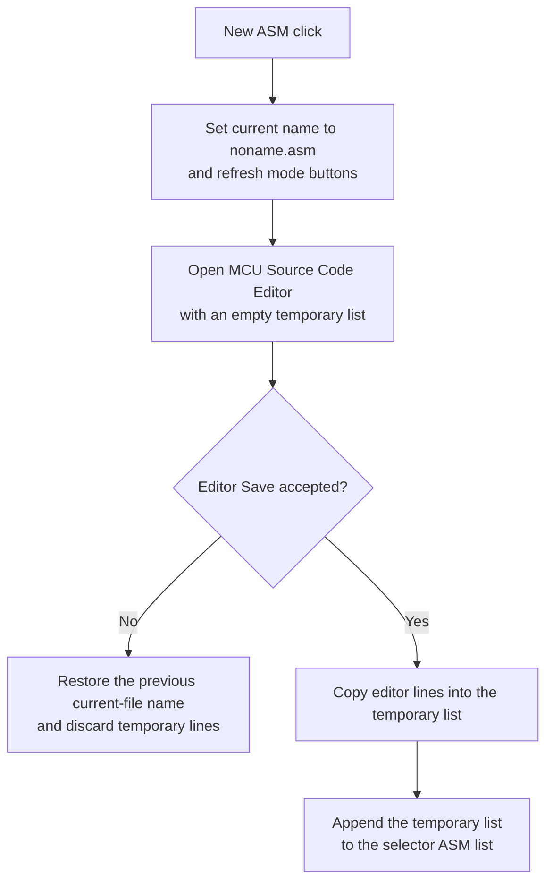

# &New ASM...

## Control

| Property | Recovered value |
| --- | --- |
| Form | MCUAsmSelector |
| Component path | MCUAsmSelector.bNewASM |
| Control class | TButton |
| Caption | &New ASM... |
| Hint | Not present in the recovered resource. |
| Text | Not present in the recovered resource. |
| Handler name | bNewASMClick |
| Handler address | 01418c30 |
| Graph node | `resource:dfm:MCUAsmSelector/MCUAsmSelector.bNewASM` |
| Handler node | `function:01418c30` |
| Graph layer | UI |

## What happens when clicked

The handler changes the selector's current file name to `noname.asm`, sets byte `+0xFA8`, updates the mode-dependent buttons, and opens the **MCU Source Code Editor** in new-source mode.

New-source mode creates an empty temporary string list and attaches it to the editor. If the user uses the editor's Save command, that command copies the editor lines into the temporary list and sets the accepted flag. The launcher then appends those lines to the selector's ASM list and keeps the new selection.

If the editor closes without the accepted flag, the launcher restores the previous current-file name and does not append the temporary list. The earlier byte `+0xFA8` write and button refresh are not rolled back in this recovered handler. The exact wider meaning of `+0xFA8` is not recovered.

This click does not compile the new source. The editor has a separate compile command.

## Click flow

## Handler evidence

- Source: [DecompiledSources/Tina16/functions/0000000001418C30__FUN_01418c30.c](../../../DecompiledSources/Tina16/functions/0000000001418C30__FUN_01418c30.c)
- Recovered role: Start a new MCU ASM source and accept it through the source editor.
- Current graph summary: Handles 1 Delphi UI event: MCUAsmSelector.bNewASM.OnClick.
- Current graph behavior: Sets `noname.asm`, opens an empty source editor, and adds editor lines only on the editor's accepted Save path.
- Current graph evidence: `FUN_01418c30` sets the name and calls `FUN_01418a70` with mode `1`. `FUN_01412ed0` attaches an empty list. `FUN_014131e0` fills the list and sets the accepted byte.
- Complexity: complex
- Distinct outgoing calls: 3

## Direct calls

- `function:01417bc0` — FUN_01417bc0
- `function:01418a70` — FUN_01418a70
- `function:01418bb0` — FUN_01418bb0

## Resource evidence

- Kind: Not present in the recovered resource.
- Modal result: Not present in the recovered resource.
- Checked state: Not present in the recovered resource.
- List items: Not present in the recovered resource.
- Image reference: Not present in the recovered resource.
- Extracted glyph: None.

## Nearby label candidates

Nearby labels are layout candidates only. They are not proof of behavior.

- No same-parent label candidate is available.

## Analysis limits

- [Click handler `FUN_01418c30`](../../../DecompiledSources/Tina16/functions/0000000001418C30__FUN_01418c30.c) proves the initial name, flag, and new-editor mode.
- [Shared editor launcher `FUN_01418a70`](../../../DecompiledSources/Tina16/functions/0000000001418A70__FUN_01418a70.c) proves the accepted or canceled branches and temporary-list ownership.
- [New-list setup `FUN_01412ed0`](../../../DecompiledSources/Tina16/functions/0000000001412ED0__FUN_01412ed0.c) proves that the editor starts from an empty list.
- [Editor Save handler `FUN_014131e0`](../../../DecompiledSources/Tina16/functions/00000000014131E0__FUN_014131e0.c) proves how lines reach the attached list.
- The wider role of byte `+0xFA8` remains unknown.
