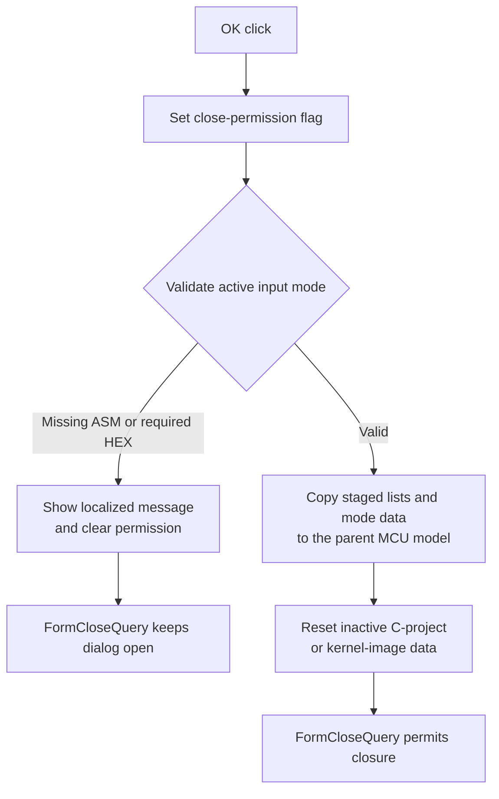

# bOK

## Control

| Property | Recovered value |
| --- | --- |
| Form | MCUAsmSelector |
| Component path | MCUAsmSelector.bOK |
| Control class | TBitBtn |
| Caption | Not present in the recovered resource. |
| Hint | Not present in the recovered resource. |
| Text | Not present in the recovered resource. |
| Handler name | bOKClick |
| Handler address | 01418c90 |
| Graph node | `resource:dfm:MCUAsmSelector/MCUAsmSelector.bOK` |
| Handler node | `function:01418c90` |
| Graph layer | UI |

## What happens when clicked

The handler first sets the form close-permission byte `+0xFA9` to `1`. It then validates the staged input for the active mode.

### Validation

- In ASM mode (`0`), an empty current ASM file-name field shows localized message `0x89F` and clears the close-permission byte.
- In HEX/LST mode (`1`), empty HEX and LST lists show `HDLStrings.Msg_Vhdl_MCU_NoHexLstFile` and block closure.
- If only the HEX list is empty, it shows `HDLStrings.Msg_Vhdl_MCU_NoHexFile` and blocks closure.
- If the HEX list has data and the LST list is empty, it inserts an empty LST entry. This path remains valid.

The handler performs no extra file-presence or content check in the other modes.

### Accepted copy-back

When validation keeps `+0xFA9` set, the handler copies staged state into the parent MCU model:

- In the normal copy branch, it clears the destination ASM, HEX, and LST lists and copies the selector's three lists.
- When both C-project status bytes `+0x769` and `+0x76A` are set, it refreshes the destination HEX list from the selector's HEX output list.
- In flowchart mode (`2`), it copies the retained flowchart session/list state into the model's flowchart container.
- Outside C-project mode (`3`), it resets the model's C-project data.
- Outside kernel-image mode (`4`), it resets the model's kernel-image data.

`FormCloseQuery` returns byte `+0xFA9` as `CanClose`. Thus, a validation failure keeps the dialog open. The handler shows messages for the recovered validation failures but has no local exception rollback for list-copy or model-call failures.

## Click flow

## Handler evidence

- Source: [DecompiledSources/Tina16/functions/0000000001418C90__FUN_01418c90.c](../../../DecompiledSources/Tina16/functions/0000000001418C90__FUN_01418c90.c)
- Recovered role: Validate staged MCU input and commit it to the parent model.
- Current graph summary: Handles 1 Delphi UI event: MCUAsmSelector.bOK.OnClick.
- Current graph behavior: Blocks closure for missing required ASM or HEX input. Otherwise it copies staged lists and active-mode state to the parent MCU model and clears inactive mode data.
- Current graph evidence: `FUN_01418c90` controls byte `+0xFA9`, contains the mode-specific list-count tests, calls the localized message functions on failure, and performs all model copy-back only while the byte remains set.
- Complexity: complex
- Distinct outgoing calls: 8

## Direct calls

- `function:00414560` — Delphi UnicodeString array finalization helper
- `function:0041ddd0` — FUN_0041ddd0
- `function:00b89270` — FUN_00b89270
- `function:00b8e520` — FUN_00b8e520
- `function:00b8e650` — FUN_00b8e650
- `function:010afec0` — FUN_010afec0
- `function:010b4300` — FUN_010b4300
- `function:016fd940` — FUN_016fd940

## Resource evidence

- Kind: bkOK
- Modal result: Not present in the recovered resource.
- Checked state: Not present in the recovered resource.
- List items: Not present in the recovered resource.
- Image reference: Not present in the recovered resource.
- Extracted glyph: None.

## Nearby label candidates

Nearby labels are layout candidates only. They are not proof of behavior.

- No same-parent label candidate is available.

## Analysis limits

- [OK handler `FUN_01418c90`](../../../DecompiledSources/Tina16/functions/0000000001418C90__FUN_01418c90.c) proves the validation, close-permission, list copy, flowchart copy, and inactive-mode reset branches.
- [Form close-query handler `FUN_014194f0`](../../../DecompiledSources/Tina16/functions/00000000014194F0__FUN_014194f0.c) proves that byte `+0xFA9` controls closure.
- [C-project reset `FUN_010afec0`](../../../DecompiledSources/Tina16/functions/00000000010AFEC0__FUN_010afec0.c) and [kernel-image reset `FUN_010b4300`](../../../DecompiledSources/Tina16/functions/00000000010B4300__FUN_010b4300.c) prove the inactive-data cleanup.
- The string behind message identifier `0x89F` is not recovered here. Its ASM requirement follows from the exact mode-and-empty-name guard.
- The handler has no local transaction. An exception during copy-back can leave a partial model update.
