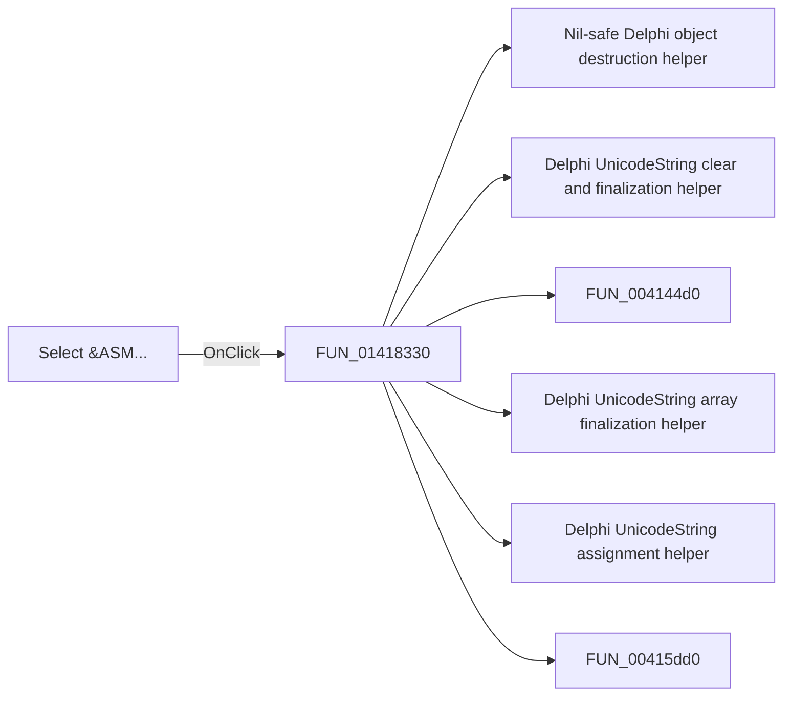

# Select &ASM...

> Analysis status: Pending individual source review.

## Control

| Property | Recovered value |
| --- | --- |
| Form | MCUAsmSelector |
| Component path | MCUAsmSelector.bSelectASM |
| Control class | TButton |
| Caption | Select &ASM... |
| Hint | Not present in the recovered resource. |
| Text | Not present in the recovered resource. |
| Handler name | bSelectASMClick |
| Handler address | 01418330 |
| Graph node | `resource:dfm:MCUAsmSelector/MCUAsmSelector.bSelectASM` |
| Handler node | `function:01418330` |
| Graph layer | UI |

## What happens when clicked

Pending individual analysis. An agent must read the recovered handler source and its relevant callees before it replaces this text.

## Click flow

## Handler evidence

- Source: [DecompiledSources/Tina16/functions/0000000001418330__FUN_01418330.c](../../../DecompiledSources/Tina16/functions/0000000001418330__FUN_01418330.c)
- Recovered role: Not present in the recovered resource.
- Current graph summary: Handles 1 Delphi UI event: MCUAsmSelector.bSelectASM.OnClick.
- Current graph behavior: Not present in the recovered resource.
- Current graph evidence: Not present in the recovered resource.
- Complexity: complex
- Distinct outgoing calls: 19

## Direct calls

- `function:00410f20` — Nil-safe Delphi object destruction helper
- `function:00414480` — Delphi UnicodeString clear and finalization helper
- `function:004144d0` — FUN_004144d0
- `function:00414560` — Delphi UnicodeString array finalization helper
- `function:00414ad0` — Delphi UnicodeString assignment helper
- `function:00415dd0` — FUN_00415dd0
- `function:00416800` — FUN_00416800
- `function:00416cd0` — FUN_00416cd0
- `function:004425e0` — FUN_004425e0
- `function:00442620` — FUN_00442620
- `function:004b6930` — FUN_004b6930
- `function:00724270` — FUN_00724270
- `function:00e02960` — Calls the VHDL_DLL2.DLL export _compile_asm.
- `function:01417bc0` — FUN_01417bc0
- `function:01417f80` — FUN_01417f80
- `function:01419960` — FUN_01419960
- `function:015ff5b0` — FUN_015ff5b0
- `function:016fd940` — FUN_016fd940
- `function:01d43440` — FUN_01d43440

## Resource evidence

- Kind: Not present in the recovered resource.
- Modal result: Not present in the recovered resource.
- Checked state: Not present in the recovered resource.
- List items: Not present in the recovered resource.
- Image reference: Not present in the recovered resource.
- Extracted glyph: None.

## Nearby label candidates

Nearby labels are layout candidates only. They are not proof of behavior.

- No same-parent label candidate is available.

## Analysis limits

- Do not infer behavior from the control class, caption, hint, glyph, or nearby label alone.
- Do not replace the pending status until the handler source and relevant call path provide enough evidence.
