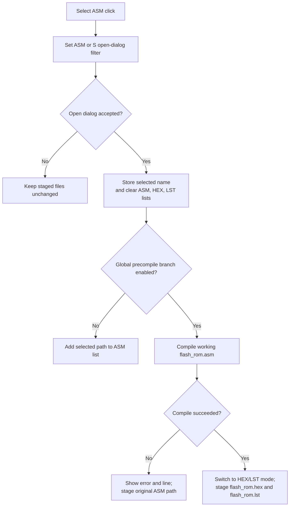

# Select &ASM...

## Control

| Property | Recovered value |
| --- | --- |
| Form | MCUAsmSelector |
| Component path | MCUAsmSelector.bSelectASM |
| Control class | TButton |
| Caption | Select &ASM... |
| Hint | Not present in the recovered resource. |
| Text | Not present in the recovered resource. |
| Handler name | bSelectASMClick |
| Handler address | 01418330 |
| Graph node | `resource:dfm:MCUAsmSelector/MCUAsmSelector.bSelectASM` |
| Handler node | `function:01418330` |
| Graph layer | UI |

## What happens when clicked

The handler configures the shared open dialog for `*.asm` and `*.s` files. It shows the dialog and makes no file-list change when the user cancels.

After acceptance, it stores the selected file name, sets form byte `+0xFA8`, refreshes the mode-dependent buttons, and clears the staged ASM, HEX, and LST lists.

The next path depends on global compiler option byte `PTR_DAT_020030c0[0x0C]`:

- When the byte is clear, the handler adds the selected source path to the ASM list. It keeps the current ASM-input mode.
- When the byte is set, the handler copies the source to the working `flash_rom.asm` path and calls `VHDL_DLL2.DLL::_compile_asm`. The compiler mode comes from the MPLAB-selection helper.
- If compilation fails, it shows the recovered compiler text and line number. It then adds the original selected file to the ASM list.
- If compilation succeeds, it changes the internal mode to HEX/LST, stages `flash_rom.hex` and `flash_rom.lst`, and stores both generated file names.

The handler then clears an old flowchart session when required and records the resulting mode as the current snapshot. The exact user-facing name of global option byte `0x0C` is not recovered.

## Click flow

## Handler evidence

- Source: [DecompiledSources/Tina16/functions/0000000001418330__FUN_01418330.c](../../../DecompiledSources/Tina16/functions/0000000001418330__FUN_01418330.c)
- Recovered role: Select an MCU ASM source and optionally precompile it to HEX/LST outputs.
- Current graph summary: Handles 1 Delphi UI event: MCUAsmSelector.bSelectASM.OnClick.
- Current graph behavior: Runs the ASM file dialog, resets staged inputs after acceptance, and either stages the source or calls the external assembler and stages its outputs.
- Current graph evidence: The handler guards changes with the dialog result, calls `_compile_asm` only in the global-option branch, tests the returned success byte, and assigns `flash_rom.hex` and `flash_rom.lst` only on success.
- Complexity: complex
- Distinct outgoing calls: 19

## Direct calls

- `function:00410f20` — Nil-safe Delphi object destruction helper
- `function:00414480` — Delphi UnicodeString clear and finalization helper
- `function:004144d0` — FUN_004144d0
- `function:00414560` — Delphi UnicodeString array finalization helper
- `function:00414ad0` — Delphi UnicodeString assignment helper
- `function:00415dd0` — FUN_00415dd0
- `function:00416800` — FUN_00416800
- `function:00416cd0` — FUN_00416cd0
- `function:004425e0` — FUN_004425e0
- `function:00442620` — FUN_00442620
- `function:004b6930` — FUN_004b6930
- `function:00724270` — FUN_00724270
- `function:00e02960` — Calls the VHDL_DLL2.DLL export _compile_asm.
- `function:01417bc0` — FUN_01417bc0
- `function:01417f80` — FUN_01417f80
- `function:01419960` — FUN_01419960
- `function:015ff5b0` — FUN_015ff5b0
- `function:016fd940` — FUN_016fd940
- `function:01d43440` — FUN_01d43440

## Resource evidence

- Kind: Not present in the recovered resource.
- Modal result: Not present in the recovered resource.
- Checked state: Not present in the recovered resource.
- List items: Not present in the recovered resource.
- Image reference: Not present in the recovered resource.
- Extracted glyph: None.

## Nearby label candidates

Nearby labels are layout candidates only. They are not proof of behavior.

- No same-parent label candidate is available.

## Analysis limits

- [Click handler `FUN_01418330`](../../../DecompiledSources/Tina16/functions/0000000001418330__FUN_01418330.c) proves the dialog guard, staging reset, external compile branch, and success or failure results.
- [Dialog-filter helper `FUN_01417f80`](../../../DecompiledSources/Tina16/functions/0000000001417F80__FUN_01417f80.c) proves the `*.asm` and `*.s` filters.
- [Compiler-mode helper `FUN_015ff5b0`](../../../DecompiledSources/Tina16/functions/00000000015FF5B0__FUN_015ff5b0.c) proves that the first assembler argument selects MPLAB-backed mode only when configured and installed.
- [External `_compile_asm` import](../../../DecompiledSources/Tina16/functions/0000000000E02960__VHDL_DLL2.DLL___compile_asm.c) proves the external-library boundary.
- The recovered path does not define the broader settings name for option byte `0x0C`. It also does not validate generated output contents after the assembler reports success.
