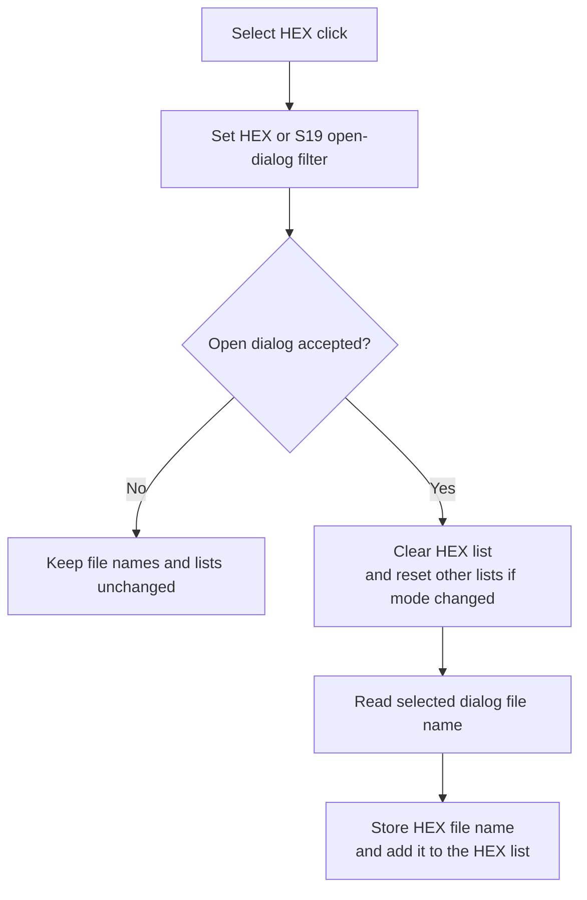

# Select &HEX...

## Control

| Property | Recovered value |
| --- | --- |
| Form | MCUAsmSelector |
| Component path | MCUAsmSelector.bSelectHEX |
| Control class | TButton |
| Caption | Select &HEX... |
| Hint | Not present in the recovered resource. |
| Text | Not present in the recovered resource. |
| Handler name | bSelectHEXClick |
| Handler address | 014187d0 |
| Graph node | `resource:dfm:MCUAsmSelector/MCUAsmSelector.bSelectHEX` |
| Handler node | `function:014187d0` |
| Graph layer | UI |

## What happens when clicked

The handler configures the shared open dialog for `*.hex` and `*.s19` files and shows it. If the user cancels, it returns without changing the selector's file names or lists.

After an accepted selection, it clears the current HEX list. If the input mode changed since the last accepted file operation, it also clears the ASM and LST lists, clears both stored HEX/LST file-name fields, and updates the mode snapshot. It then reads the dialog file name, stores it as the HEX file name, and adds it to the HEX list.

The handler also clears the retained flowchart session when the previous mode was flowchart. It does not read or validate the selected file contents. A dialog or string-list exception propagates without a local rollback.

## Click flow

## Handler evidence

- Source: [DecompiledSources/Tina16/functions/00000000014187D0__FUN_014187d0.c](../../../DecompiledSources/Tina16/functions/00000000014187D0__FUN_014187d0.c)
- Recovered role: Select and stage the HEX or S19 input file.
- Current graph summary: Handles 1 Delphi UI event: MCUAsmSelector.bSelectHEX.OnClick.
- Current graph behavior: Runs the shared open dialog with the HEX/S19 filter and replaces the staged HEX list only after acceptance.
- Current graph evidence: `FUN_01417f80` sets the filter. The handler guards all list and file-name writes with the dialog result and stores the selected file in form field `+0xF90` and the HEX list.
- Complexity: complex
- Distinct outgoing calls: 5

## Direct calls

- `function:00414480` — Delphi UnicodeString clear and finalization helper
- `function:00414ad0` — Delphi UnicodeString assignment helper
- `function:00724270` — FUN_00724270
- `function:01417f80` — FUN_01417f80
- `function:01419960` — FUN_01419960

## Resource evidence

- Kind: Not present in the recovered resource.
- Modal result: Not present in the recovered resource.
- Checked state: Not present in the recovered resource.
- List items: Not present in the recovered resource.
- Image reference: Not present in the recovered resource.
- Extracted glyph: None.

## Nearby label candidates

Nearby labels are layout candidates only. They are not proof of behavior.

- No same-parent label candidate is available.

## Analysis limits

- [Click handler `FUN_014187d0`](../../../DecompiledSources/Tina16/functions/00000000014187D0__FUN_014187d0.c) proves the dialog guard, list clears, file-name assignment, and HEX-list update.
- [Dialog-filter helper `FUN_01417f80`](../../../DecompiledSources/Tina16/functions/0000000001417F80__FUN_01417f80.c) proves the `*.hex` and `*.s19` filters.
- [Dialog file-name getter `FUN_00724270`](../../../DecompiledSources/Tina16/functions/0000000000724270__FUN_00724270.c) proves where the accepted path is read.
- The recovered handler does not prove that the selected file exists after the dialog closes or that its contents are valid.
