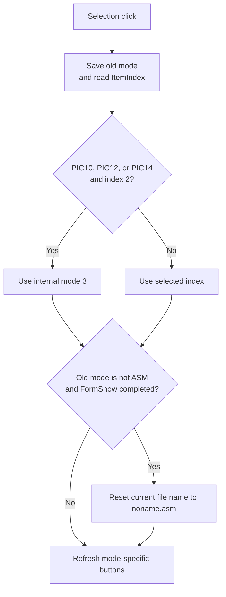

# Selection

## Control

| Property | Recovered value |
| --- | --- |
| Form | MCUAsmSelector |
| Component path | MCUAsmSelector.rgSelection |
| Control class | TRadioGroup |
| Caption | Selection |
| Hint | Not present in the recovered resource. |
| Text | Not present in the recovered resource. |
| Handler name | rgSelectionClick |
| Handler address | 01418290 |
| Graph node | `resource:dfm:MCUAsmSelector/MCUAsmSelector.rgSelection` |
| Handler node | `function:01418290` |
| Graph layer | UI |

## What happens when clicked

The handler saves the old internal input mode, reads `rgSelection.ItemIndex`, and stores the selected index as the new mode. The form constructor fills the radio group from a hidden list with **ASM file**, **HEX/LST file**, **Flowchart**, and **C Code**. It adds **Kernel Image** only for MCU type `0x100`.

For MCU names that contain `PIC10`, `PIC12`, or `PIC14`, selected index `2` is remapped to internal mode `3`. Thus, this branch does not retain mode `2`. The exact run-time caption adjustment for that special case is not present in this handler.

If the previous mode was not ASM and the form has completed `FormShow`, the handler resets the current file name to `noname.asm`. It then updates which mode-specific buttons are enabled:

| Internal mode | Enabled action group |
| ---: | --- |
| 0 | Select ASM, Edit ASM, and New ASM |
| 1 | Select HEX and Select LST |
| 2 | Flowchart |
| 3 | C Project |
| 4 | Kernel Image |

The click does not open a dialog, select a file, or validate existing staged input. For modes other than C Project, the button refresh also clears two C-project state flags.

## Click flow

## Handler evidence

- Source: [DecompiledSources/Tina16/functions/0000000001418290__FUN_01418290.c](../../../DecompiledSources/Tina16/functions/0000000001418290__FUN_01418290.c)
- Recovered role: Select the MCU input mode and refresh mode-specific actions.
- Current graph summary: Handles 1 Delphi UI event: MCUAsmSelector.rgSelection.OnClick.
- Current graph behavior: Maps the selected radio index to the internal mode, applies the PIC10/12/14 mode-2 remap, and enables only the action group for the resulting mode.
- Current graph evidence: The handler reads the radio-group item index at form component `+0x6B0`. `FUN_014181d0` detects the three PIC families. `FUN_01417bc0` contains the five mode branches and control enable writes.
- Complexity: complex
- Distinct outgoing calls: 3

## Direct calls

- `function:01417bc0` — FUN_01417bc0
- `function:014181d0` — FUN_014181d0
- `function:01418bb0` — FUN_01418bb0

## Resource evidence

- Kind: Not present in the recovered resource.
- Modal result: Not present in the recovered resource.
- Checked state: Not present in the recovered resource.
- List items: Not present in the recovered resource.
- Image reference: Not present in the recovered resource.
- Extracted glyph: None.

## Nearby label candidates

Nearby labels are layout candidates only. They are not proof of behavior.

- No same-parent label candidate is available.

## Analysis limits

- [Click handler `FUN_01418290`](../../../DecompiledSources/Tina16/functions/0000000001418290__FUN_01418290.c) proves the old-mode snapshot, item-index read, remap, and button refresh.
- [PIC-family check `FUN_014181d0`](../../../DecompiledSources/Tina16/functions/00000000014181D0__FUN_014181d0.c) proves the `PIC10`, `PIC12`, and `PIC14` condition.
- [Button-state helper `FUN_01417bc0`](../../../DecompiledSources/Tina16/functions/0000000001417BC0__FUN_01417bc0.c) proves which action group each internal mode enables.
- [Form constructor `FUN_01419180`](../../../DecompiledSources/Tina16/functions/0000000001419180__FUN_01419180.c) and [resource evidence](../../../DecompiledSources/Tina16/resources/dfm/ui-evidence.json) prove the source item order and conditional Kernel Image row.
- The code does not prove a user-visible caption replacement for the PIC remap. The article states only the recovered internal-mode change.
