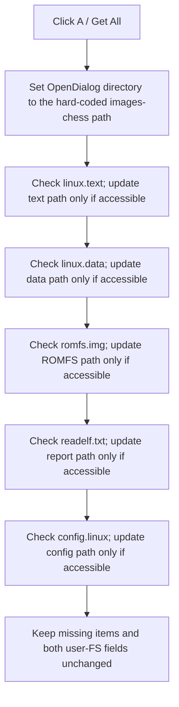

# Find the standard kernel image files

> Analysis status: Reviewed from the recovered handler, standard-file resolver, file-access check, dialog-directory helpers, form resource, and OK validation path.

## Control

| Property | Recovered value |
| --- | --- |
| Form | MCUKernelImageProperties |
| Component path | MCUKernelImageProperties.bAll |
| Control class | TBitBtn |
| Caption | A |
| Hint | Get All |
| Handler name | bAllClick |
| Handler address | 01416740 |
| Graph node | `resource:dfm:MCUKernelImageProperties/MCUKernelImageProperties.bAll` |
| Handler node | `function:01416740` |
| Graph layer | UI |

## What happens when clicked

`TMCUKernelImageProperties.bAllClick` sets the form's `TOpenDialog` directory to the hard-coded path `d:\Attila\Devel Files\Other\Store\images-chess`. It then checks five fixed file names under that directory:

| Requested item | File name | Stored path | Selection flag | Display edit |
| --- | --- | --- | --- | --- |
| Text segment | `linux.text` | `+0x790` | `+0x7c8` | `eTextName` |
| Data segment | `linux.data` | `+0x798` | `+0x7c9` | `eDataName` |
| ROM file system | `romfs.img` | `+0x7a0` | `+0x7ca` | `eRomfsName` |
| readelf report | `readelf.txt` | `+0x7a8` | `+0x7cb` | `eConfigName` |
| Linux configuration | `config.linux` | `+0x7b0` | `+0x7cc` | `eConfigLinux` |

For each accessible file, the resolver sets the matching selection flag and updates the matching edit. It performs the five checks independently. A missing file does not stop later checks.

The resolver does not clear a prior path or flag when a standard file is missing. A click can therefore leave a mix of newly found files and earlier values. It does not check or fill the optional user-FS executable and user-FS configuration fields.

No file chooser appears in this path. The handler sets the dialog directory and derives fixed paths from it. It shows no message when a file is absent and has no rollback or local exception handler.

## Click flow

## Handler evidence

- [FUN_01416740](../../../DecompiledSources/Tina16/functions/0000000001416740__FUN_01416740.c) sets the hard-coded directory and calls the resolver with the five item keys.
- [FUN_00724420](../../../DecompiledSources/Tina16/functions/0000000000724420__FUN_00724420.c) normalizes and stores the dialog directory.
- [FUN_014162e0](../../../DecompiledSources/Tina16/functions/00000000014162E0__FUN_014162e0.c) maps each key to a fixed file name, field, flag, and edit.
- [FUN_00724350](../../../DecompiledSources/Tina16/functions/0000000000724350__FUN_00724350.c) returns the stored dialog directory used as the path base.
- [FUN_00440a20](../../../DecompiledSources/Tina16/functions/0000000000440A20__FUN_00440a20.c) performs the file-access check that gates each state update.
- [FUN_0064de00](../../../DecompiledSources/Tina16/functions/000000000064DE00__FUN_0064de00.c) suppresses unchanged edit-text writes.

## Resource evidence

- The form has one `TOpenDialog`, five matching required-file edits, and two separate optional user-FS edits.
- The short caption `A` does not explain the operation. The `Get All` hint agrees with the recovered five-file resolver.
- The button has no image or extracted glyph.

## Analysis limits

- The source does not explain why a developer-specific absolute directory is used.
- `FUN_00440a20` proves a successful access check. It does not parse or validate any file contents.
- Missing standard files produce no direct status, so the user sees only the edits that changed or retained prior text.

