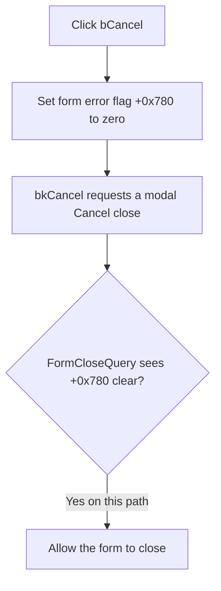

# Clear the validation blocker and cancel

> Analysis status: Reviewed from the recovered handler, built-in button kind, OK error flag, and form close-query handler.

## Control

| Property | Recovered value |
| --- | --- |
| Form | MCUKernelImageProperties |
| Component path | MCUKernelImageProperties.bCancel |
| Control class | TBitBtn |
| Kind | bkCancel |
| Handler name | bCancelClick |
| Handler address | 014155b0 |
| Graph node | `resource:dfm:MCUKernelImageProperties/MCUKernelImageProperties.bCancel` |
| Handler node | `function:014155b0` |
| Graph layer | UI |

## What happens when clicked

`TMCUKernelImageProperties.bCancelClick` has one operation: it clears form byte `+0x780`. The OK handler uses this byte as its validation and processing error flag. `FormCloseQuery` permits the form to close only when this byte is clear.

The button's built-in `bkCancel` kind then requests the standard Cancel modal close. Because the custom click handler clears the blocker first, the close query accepts this request on the recovered path.

The handler does not clear selected file names, selection flags, frame-buffer text, or the check-box state. It does not delete a generated file or undo work that a prior OK attempt completed. The caller's behavior after the Cancel modal result is not recovered in this article, so persistence outside this form remains unknown.

## Click flow

## Handler evidence

- [FUN_014155b0](../../../DecompiledSources/Tina16/functions/00000000014155B0__FUN_014155b0.c) contains only the write of zero to `+0x780`.
- [FUN_01415220](../../../DecompiledSources/Tina16/functions/0000000001415220__FUN_01415220.c) sets `+0x780` when required inputs are missing, the optional pair is inconsistent, or processing reports an error.
- [FUN_014155a0](../../../DecompiledSources/Tina16/functions/00000000014155A0__FUN_014155a0.c) sets `CanClose` to the inverse of `+0x780`.
- The DuckDB graph reports no outgoing calls from the Cancel handler.

## Resource evidence

- `bCancel` is a `TBitBtn` with kind `bkCancel` and no recovered caption, hint, image, or glyph.
- Nearby frame-buffer and optional labels do not supply the handler's behavior. The error-flag data flow does.

## Analysis limits

- No recovered modal caller was established for this form. The effect of the Cancel result on caller-owned data is unknown.
- Clearing the blocker is not a rollback. The handler does not restore any form field.

