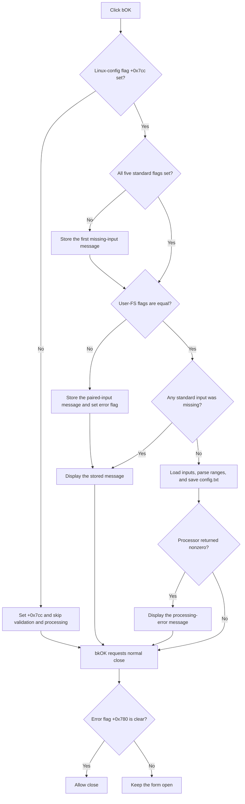

# Validate kernel image inputs and create config.txt

> Analysis status: Reviewed from the recovered OK handler, input selectors, configuration processor, parsers, message path, form initialization, and close query.

## Control

| Property | Recovered value |
| --- | --- |
| Form | MCUKernelImageProperties |
| Component path | MCUKernelImageProperties.bOK |
| Control class | TBitBtn |
| Kind | bkOK |
| Handler name | bOKClick |
| Handler address | 01415220 |
| Graph node | `resource:dfm:MCUKernelImageProperties/MCUKernelImageProperties.bOK` |
| Handler node | `function:01415220` |
| Graph layer | UI |

## What happens when clicked

`TMCUKernelImageProperties.bOKClick` has two distinct paths. It first checks Linux-configuration flag `+0x7cc`.

- If `+0x7cc` is clear, the handler sets it and returns. It does not validate the other selections or create `config.txt` on this path. The source does not explain this shortcut.
- If `+0x7cc` is already set, the handler validates the selected-input flags. When they are valid, it calls the configuration processor. When they are invalid, it stores an error message and displays it.

Because `bOK` has kind `bkOK`, the VCL requests a normal OK close after the click handler. `FormCloseQuery` allows the close only while form error flag `+0x780` is clear.

## Input decisions

The validated path requires all five standard flags:

| Flag | Required input | Missing-input message |
| --- | --- | --- |
| `+0x7c8` | Text segment | `Text segment file not selected!` |
| `+0x7c9` | Data segment | `Data segment not selected!` |
| `+0x7ca` | ROM file system | `Romfs not selected!` |
| `+0x7cb` | readelf section report | `Readelf -S output not selected!` |
| `+0x7cc` | Linux configuration | `Config.linux not selected!` |

The handler also requires user-FS executable flag `+0x7cd` and user-FS configuration flag `+0x7ce` to be equal. Both can be clear or both can be set. If only one is set, the handler reports `Userfs or userfs config not selected!`. This message replaces any previously selected standard-file message in the same attempt.

The handler writes the combined result to error flag `+0x780`. An invalid result goes to the message wrapper and does not call the processor. The close query then rejects the OK close because the flag is set.

## Configuration-processing path

With valid flags, [FUN_01415c80](../../../DecompiledSources/Tina16/functions/0000000001415C80__FUN_01415c80.c) performs these operations:

1. Load the readelf report path from `+0x7a8` and the Linux configuration path from `+0x7b0` into temporary line-list objects.
2. Find `FLASH_MEM_BASE` and `FLASH_SIZE` in the Linux configuration.
3. Find `.text`, `.init`, and `.data` rows in the readelf report and parse their recovered address and size columns.
4. Build output ranges for the code sections, data section, flash memory, and frame buffer.
5. If `cbUseFb` is clear, use zero for both frame-buffer range values. If it is set, parse the current `eFbStart` and `eFbEnd` text.
6. Replace form string field `+0x7a8` with an application-directory path ending in `config.txt`, and save the four formatted output lines there.

The processor does not update `eConfigName` after it replaces `+0x7a8`. The displayed readelf path can therefore differ from the stored field after processing.

The recovered normal return from the processor is zero. The OK handler stores that return in `+0x780`. If a nonzero value returns, it displays `Error during processing the config file`, and the close query rejects the close. Missing keys or section rows take localized exception paths inside the parsers; the OK handler has no local exception handler or rollback.

## Click flow

## Handler and call-path evidence

- [FUN_01415220](../../../DecompiledSources/Tina16/functions/0000000001415220__FUN_01415220.c) contains the shortcut, flag validation, message selection, processor call, and error-flag writes.
- [FUN_01415c80](../../../DecompiledSources/Tina16/functions/0000000001415C80__FUN_01415c80.c) loads the two input files, obtains section and flash data, reads optional frame-buffer values, and saves `config.txt`.
- [FUN_01415920](../../../DecompiledSources/Tina16/functions/0000000001415920__FUN_01415920.c) finds and parses configuration values.
- [FUN_01415600](../../../DecompiledSources/Tina16/functions/0000000001415600__FUN_01415600.c) finds and parses readelf section rows.
- [FUN_016fd940](../../../DecompiledSources/Tina16/functions/00000000016FD940__FUN_016fd940.c) routes a nonempty Unicode message to the common dialog path.
- [FUN_014155a0](../../../DecompiledSources/Tina16/functions/00000000014155A0__FUN_014155a0.c) permits close only when `+0x780` is clear.
- [FUN_01414fc0](../../../DecompiledSources/Tina16/functions/0000000001414FC0__FUN_01414fc0.c) initializes the error flag, checkbox, edits, and initial frame-buffer text when the form is shown.

## Resource evidence

- `bOK` has kind `bkOK`, no recovered caption or hint, and no image or extracted glyph.
- The form contains edits for all five standard inputs, both optional user-FS inputs, and the two frame-buffer values.
- Nearby labels identify only the optional and frame-buffer sections. The validation and processing claims come from source data flow.

## Error and partial-state behavior

- Invalid selection flags set `+0x780`, show one message, and prevent the close. No processor state changes occur.
- A paired user-FS error can replace a standard missing-input message before display.
- The clear Linux-config shortcut changes flag `+0x7cc` but performs no other validation or output write.
- The processor changes `+0x7a8` to the output path before it saves the file. There is no recovered rollback if the save raises an exception.
- The processor creates temporary objects and releases them on its recovered normal path. Exception cleanup and caller handling are not explicit in the decompiled function.

## Analysis limits

- The reason and intended product meaning of the clear-flag shortcut are unknown.
- The exact localized text for missing configuration keys or section rows is not in this control article.
- No recovered modal caller was established. This article does not claim how the caller uses the accepted form fields or output file.

