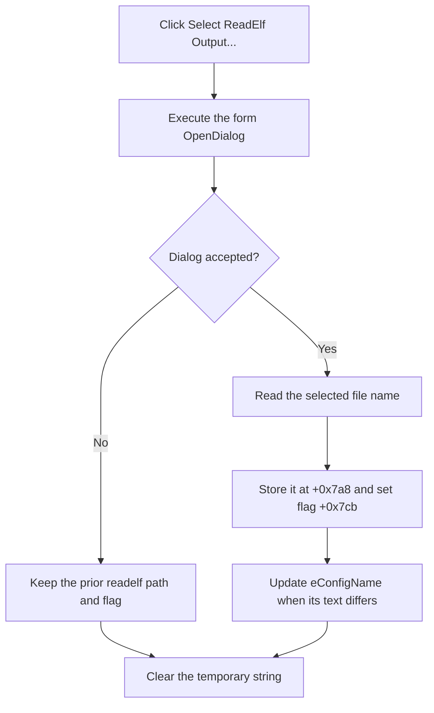

# Select the readelf section report

> Analysis status: Reviewed from the recovered handler, file-dialog helper, edit setter, form resource, and configuration-processing path.

## Control

| Property | Recovered value |
| --- | --- |
| Form | MCUKernelImageProperties |
| Component path | MCUKernelImageProperties.bSelectConfig |
| Control class | TButton |
| Caption | Select ReadElf Output... |
| Hint | readelf -S |
| Handler name | bSelectConfigClick |
| Handler address | 01414e50 |
| Graph node | `resource:dfm:MCUKernelImageProperties/MCUKernelImageProperties.bSelectConfig` |
| Handler node | `function:01414e50` |
| Graph layer | UI |

## What happens when clicked

Despite the component name, `TMCUKernelImageProperties.bSelectConfigClick` selects the `readelf -S` output. It executes the form's `TOpenDialog`. If accepted, it stores the selected name at `+0x7a8`, sets readelf-selection flag `+0x7cb`, and displays the name in `eConfigName` at `+0x708`.

The accepted click does not parse the report. The later processing helper loads this file, finds `.text`, `.init`, and `.data` rows, and extracts address and size fields. The click itself only stages the path.

Canceling the open dialog preserves all prior state. The temporary Unicode string is cleared on both paths. There is no message, rollback, or local exception handler.

## Click flow

## Handler evidence

- [FUN_01414e50](../../../DecompiledSources/Tina16/functions/0000000001414E50__FUN_01414e50.c) contains the dialog decision and accepted-path writes.
- [FUN_00724270](../../../DecompiledSources/Tina16/functions/0000000000724270__FUN_00724270.c) reads the selected name.
- [FUN_0064de00](../../../DecompiledSources/Tina16/functions/000000000064DE00__FUN_0064de00.c) performs the change-suppressed edit update.
- [FUN_01415600](../../../DecompiledSources/Tina16/functions/0000000001415600__FUN_01415600.c) is the later section-row parser.
- [FUN_01415220](../../../DecompiledSources/Tina16/functions/0000000001415220__FUN_01415220.c) reports `Readelf -S output not selected!` when flag `+0x7cb` is clear during the validated OK path.

## Resource evidence

- The caption and hint identify the selected artifact as `readelf -S` output. The handler data flow confirms that meaning.
- The button has no action, image, or extracted glyph.
- The matching edit is named `eConfigName`; this article uses the actual downstream parser to avoid treating that older name as proof of a different file type.

## Analysis limits

- This click does not prove that the selected report has the expected rows or columns.
- The recovered graph fields do not include the dialog filter or file-validation options.
