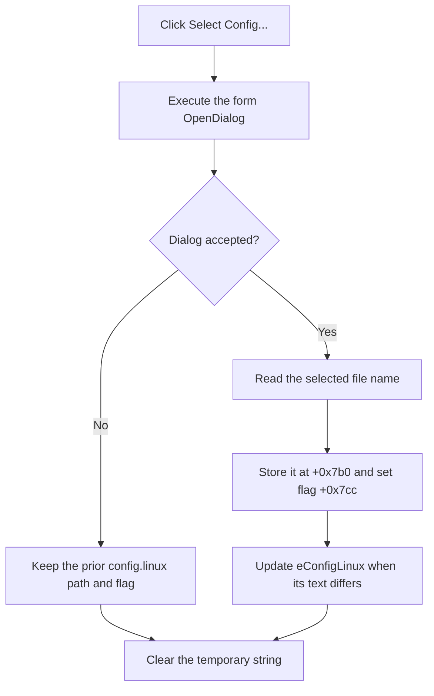

# Select the Linux configuration file

> Analysis status: Reviewed from the recovered handler, file-dialog helper, edit setter, form resource, and configuration-processing path.

## Control

| Property | Recovered value |
| --- | --- |
| Form | MCUKernelImageProperties |
| Component path | MCUKernelImageProperties.bSelectConfigLinux |
| Control class | TButton |
| Caption | Select Config... |
| Handler name | bSelectConfigLinuxClick |
| Handler address | 01414f00 |
| Graph node | `resource:dfm:MCUKernelImageProperties/MCUKernelImageProperties.bSelectConfigLinux` |
| Handler node | `function:01414f00` |
| Graph layer | UI |

## What happens when clicked

`TMCUKernelImageProperties.bSelectConfigLinuxClick` executes the form's `TOpenDialog`. If the user accepts, it copies the selected name to string field `+0x7b0`, sets Linux-configuration flag `+0x7cc`, and displays the name in `eConfigLinux` at `+0x740`.

The click does not parse the file. When flag `+0x7cc` is already set, the OK handler can load the selected file and look up `FLASH_MEM_BASE` and `FLASH_SIZE`. If the flag is clear when OK is clicked, the recovered OK handler sets it and takes no processing path for that attempt.

Canceling the open dialog preserves the prior string, flag, and edit text. The handler only clears its temporary Unicode string before return. It does not show a message or perform local recovery.

## Click flow

## Handler evidence

- [FUN_01414f00](../../../DecompiledSources/Tina16/functions/0000000001414F00__FUN_01414f00.c) contains the dialog decision and accepted-path writes.
- [FUN_00724270](../../../DecompiledSources/Tina16/functions/0000000000724270__FUN_00724270.c) reads the selected name.
- [FUN_0064de00](../../../DecompiledSources/Tina16/functions/000000000064DE00__FUN_0064de00.c) performs the change-suppressed edit update.
- [FUN_01415920](../../../DecompiledSources/Tina16/functions/0000000001415920__FUN_01415920.c) is the later key-value parser for `FLASH_MEM_BASE` and `FLASH_SIZE`.
- [FUN_01415220](../../../DecompiledSources/Tina16/functions/0000000001415220__FUN_01415220.c) contains the special clear-flag and validated paths.

## Resource evidence

- `bSelectConfigLinux` is paired with `eConfigLinux` in the recovered form.
- The button has no hint, action, image, or extracted glyph.
- The component names and the processing data flow agree on the Linux configuration role.

## Analysis limits

- The reason for the OK handler's clear-flag shortcut is not recovered. This article records the observed branch without assigning a product rule to it.
- This click does not validate that the required keys exist.

