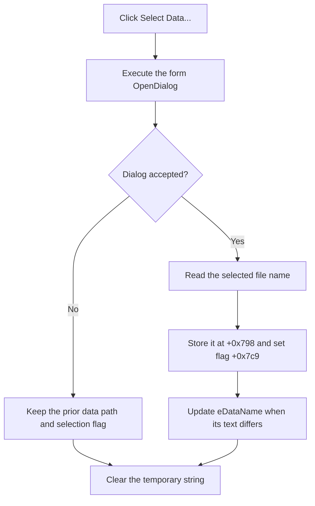

# Select the data-segment file

> Analysis status: Reviewed from the recovered handler, file-dialog helper, edit setter, form resource, and OK validation path.

## Control

| Property | Recovered value |
| --- | --- |
| Form | MCUKernelImageProperties |
| Component path | MCUKernelImageProperties.bSelectData |
| Control class | TButton |
| Caption | Select Data... |
| Handler name | bSelectDataClick |
| Handler address | 01414b90 |
| Graph node | `resource:dfm:MCUKernelImageProperties/MCUKernelImageProperties.bSelectData` |
| Handler node | `function:01414b90` |
| Graph layer | UI |

## What happens when clicked

`TMCUKernelImageProperties.bSelectDataClick` executes the form's `TOpenDialog`. If the user accepts, the handler copies the selected file name to string field `+0x798`, sets data-selection flag `+0x7c9`, and writes the same name to `eDataName` at `+0x6e8`.

The edit setter suppresses the text-change path when the edit already contains the same value. The click handler does not open or parse the selected data file. The later OK path uses flag `+0x7c9` as its evidence that the required data input was selected.

Canceling the open dialog preserves the prior string, flag, and edit text. The handler clears its temporary Unicode string on both paths. It has no message, retry, rollback, or local exception handler.

## Click flow

## Handler evidence

- [FUN_01414b90](../../../DecompiledSources/Tina16/functions/0000000001414B90__FUN_01414b90.c) contains the dialog decision and accepted-path writes.
- [FUN_00724270](../../../DecompiledSources/Tina16/functions/0000000000724270__FUN_00724270.c) reads the selected name.
- [FUN_0064de00](../../../DecompiledSources/Tina16/functions/000000000064DE00__FUN_0064de00.c) performs the change-suppressed edit update.
- [FUN_01415220](../../../DecompiledSources/Tina16/functions/0000000001415220__FUN_01415220.c) reports `Data segment not selected!` when flag `+0x7c9` is clear during the validated OK path.

## Resource evidence

- The recovered form contains one `TOpenDialog`, `bSelectData`, and the matching `eDataName` edit.
- The button has no hint, action, image, or extracted glyph.
- Nearby labels concern the frame-buffer section and do not prove this button's behavior.

## Analysis limits

- The recovered graph fields do not include the dialog filter or file-validation options.
- The handler records a selected name. It does not establish the data file's format or validity.

