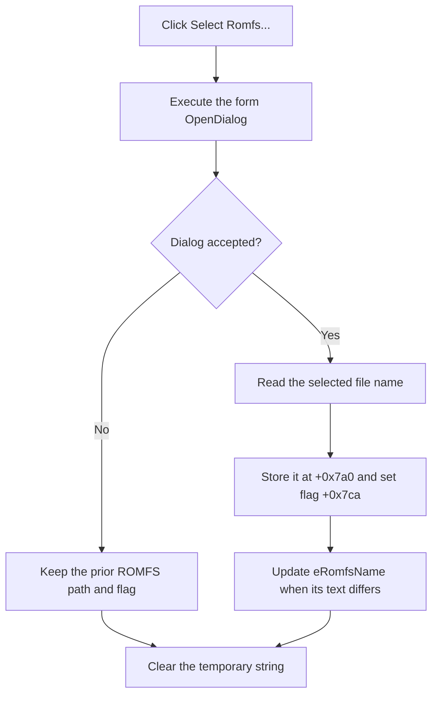

# Select the ROM file-system image

> Analysis status: Reviewed from the recovered handler, file-dialog helper, edit setter, form resource, and OK validation path.

## Control

| Property | Recovered value |
| --- | --- |
| Form | MCUKernelImageProperties |
| Component path | MCUKernelImageProperties.bSelectRomfs |
| Control class | TButton |
| Caption | Select Romfs... |
| Handler name | bSelectRomfsClick |
| Handler address | 01414c40 |
| Graph node | `resource:dfm:MCUKernelImageProperties/MCUKernelImageProperties.bSelectRomfs` |
| Handler node | `function:01414c40` |
| Graph layer | UI |

## What happens when clicked

`TMCUKernelImageProperties.bSelectRomfsClick` executes the form's `TOpenDialog`. An accepted dialog copies the selected name to string field `+0x7a0`, sets ROMFS-selection flag `+0x7ca`, and displays the name in `eRomfsName` at `+0x700`.

The handler does not inspect the image. The edit setter sends its change path only if the displayed text is different. The OK handler later requires flag `+0x7ca` before it starts its configuration-processing path.

If the user cancels the open dialog, the handler preserves the prior path, flag, and edit text. It clears its temporary Unicode string and returns without a message or local recovery action.

## Click flow

## Handler evidence

- [FUN_01414c40](../../../DecompiledSources/Tina16/functions/0000000001414C40__FUN_01414c40.c) contains the dialog decision and accepted-path writes.
- [FUN_00724270](../../../DecompiledSources/Tina16/functions/0000000000724270__FUN_00724270.c) reads the selected name.
- [FUN_0064de00](../../../DecompiledSources/Tina16/functions/000000000064DE00__FUN_0064de00.c) updates the edit only after a text difference.
- [FUN_01415220](../../../DecompiledSources/Tina16/functions/0000000001415220__FUN_01415220.c) reports `Romfs not selected!` when flag `+0x7ca` is clear during the validated OK path.

## Resource evidence

- The recovered form contains one `TOpenDialog`, `bSelectRomfs`, and `eRomfsName`.
- The button has no hint, action, image, or extracted glyph.
- Frame-buffer labels are only distant layout candidates.

## Analysis limits

- The source does not validate the selected image's contents in this handler.
- The exact dialog filter and options are not recovered in the graph fields.

