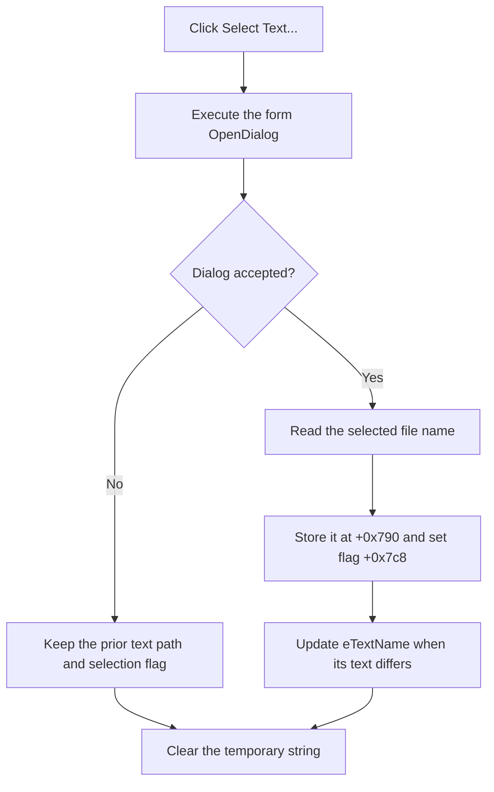

# Select the text-segment file

> Analysis status: Reviewed from the recovered handler, file-dialog helper, edit setter, form resource, and OK validation path.

## Control

| Property | Recovered value |
| --- | --- |
| Form | MCUKernelImageProperties |
| Component path | MCUKernelImageProperties.bSelectText |
| Control class | TButton |
| Caption | Select Text... |
| Handler name | bSelectTextClick |
| Handler address | 01414ae0 |
| Graph node | `resource:dfm:MCUKernelImageProperties/MCUKernelImageProperties.bSelectText` |
| Handler node | `function:01414ae0` |
| Graph layer | UI |

## What happens when clicked

`TMCUKernelImageProperties.bSelectTextClick` executes the form's `TOpenDialog`. If the user accepts the dialog, the handler copies the selected file name to form string field `+0x790`, sets text-selection flag `+0x7c8`, and writes the same name to `eTextName` at `+0x6e0`.

The text setter compares the requested value with the current edit text. It sends the VCL text-change path only when the values differ. The handler does not read the file or check its contents. The later OK path uses flag `+0x7c8` to decide whether the required text-segment input is present.

If the user cancels the open dialog, the handler does not change the stored name, flag, or edit text. It only clears its temporary Unicode string before return. There is no message, rollback, or local exception handler.

## Click flow

## Handler evidence

- [FUN_01414ae0](../../../DecompiledSources/Tina16/functions/0000000001414AE0__FUN_01414ae0.c) contains the dialog decision and all three accepted-path writes.
- [FUN_00724270](../../../DecompiledSources/Tina16/functions/0000000000724270__FUN_00724270.c) reads the selected name from the dialog object.
- [FUN_0064de00](../../../DecompiledSources/Tina16/functions/000000000064DE00__FUN_0064de00.c) updates the edit only when its current text differs.
- [FUN_01415220](../../../DecompiledSources/Tina16/functions/0000000001415220__FUN_01415220.c) reports `Text segment file not selected!` when flag `+0x7c8` is clear during the validated OK path.
- The DuckDB call neighborhood contains four direct calls: the dialog-name reader, UnicodeString assignment and cleanup, and the VCL text setter.

## Resource evidence

- The recovered form contains one `TOpenDialog`, `bSelectText`, and the matching `eTextName` edit.
- The button has no hint, action, image, or extracted glyph.
- Nearby labels concern the frame-buffer section. They do not identify this file selector.

## Analysis limits

- The dialog filter, validation options, and initial file name are not present in the recovered graph fields.
- The source proves selection and staging only. It does not prove that the selected file is valid until the later processing path uses it.

