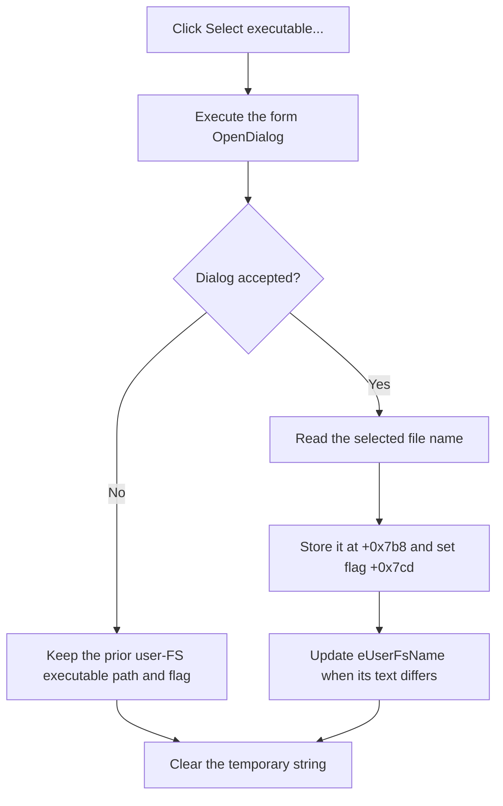

# Select the user file-system executable

> Analysis status: Reviewed from the recovered handler, file-dialog helper, edit setter, form resource, and paired-input validation.

## Control

| Property | Recovered value |
| --- | --- |
| Form | MCUKernelImageProperties |
| Component path | MCUKernelImageProperties.bSelectUserFs |
| Control class | TButton |
| Caption | Select executable... |
| Handler name | bSelectUserFsClick |
| Handler address | 01414da0 |
| Graph node | `resource:dfm:MCUKernelImageProperties/MCUKernelImageProperties.bSelectUserFs` |
| Handler node | `function:01414da0` |
| Graph layer | UI |

## What happens when clicked

`TMCUKernelImageProperties.bSelectUserFsClick` executes the form's `TOpenDialog`. If accepted, it stores the selected file name at `+0x7b8`, sets user-FS executable flag `+0x7cd`, and displays the name in `eUserFsName` at `+0x738`.

The click does not open or parse the executable. The OK handler compares flag `+0x7cd` with user-FS configuration flag `+0x7ce`. It accepts only the paired state: both inputs selected or neither selected. A one-sided selection produces `Userfs or userfs config not selected!` and blocks that close request.

Canceling the open dialog is a no-op for persistent form state. The temporary string is cleared. The handler has no message, rollback, or local exception handler.

## Click flow

## Handler evidence

- [FUN_01414da0](../../../DecompiledSources/Tina16/functions/0000000001414DA0__FUN_01414da0.c) contains the dialog decision and accepted-path writes.
- [FUN_00724270](../../../DecompiledSources/Tina16/functions/0000000000724270__FUN_00724270.c) reads the selected name.
- [FUN_0064de00](../../../DecompiledSources/Tina16/functions/000000000064DE00__FUN_0064de00.c) updates the matching edit only when required.
- [FUN_01415220](../../../DecompiledSources/Tina16/functions/0000000001415220__FUN_01415220.c) compares the two user-FS selection flags and reports an unpaired selection.

## Resource evidence

- The caption identifies an executable, and the form pairs this button with `eUserFsName`.
- The optional-section label is near the two user-FS controls. The OK flag comparison, not proximity alone, proves that both inputs form an optional pair.
- The button has no hint, action, image, or extracted glyph.

## Analysis limits

- The selected executable's format and use are not recovered in this click path.
- The dialog filter and validation options are not present in the graph fields.

