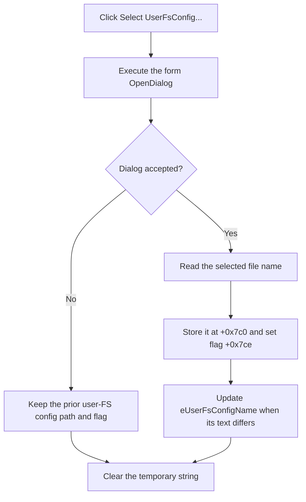

# Select the user file-system configuration

> Analysis status: Reviewed from the recovered handler, file-dialog helper, edit setter, form resource, and paired-input validation.

## Control

| Property | Recovered value |
| --- | --- |
| Form | MCUKernelImageProperties |
| Component path | MCUKernelImageProperties.bSelectUserFsConfig |
| Control class | TButton |
| Caption | Select UserFsConfig... |
| Handler name | bSelectUserFsConfigClick |
| Handler address | 01414cf0 |
| Graph node | `resource:dfm:MCUKernelImageProperties/MCUKernelImageProperties.bSelectUserFsConfig` |
| Handler node | `function:01414cf0` |
| Graph layer | UI |

## What happens when clicked

`TMCUKernelImageProperties.bSelectUserFsConfigClick` executes the form's `TOpenDialog`. If accepted, it stores the selected file name at `+0x7c0`, sets user-FS configuration flag `+0x7ce`, and displays the name in `eUserFsConfigName` at `+0x728`.

The handler does not read the selected file. The OK handler compares flag `+0x7ce` with executable flag `+0x7cd`. Both inputs must be selected together, or both can be absent. A one-sided pair sets the form error flag, reports `Userfs or userfs config not selected!`, and prevents that close request.

If the user cancels the open dialog, the stored name, selection flag, and edit text do not change. The handler clears its temporary Unicode string and returns without a message or local recovery action.

## Click flow

## Handler evidence

- [FUN_01414cf0](../../../DecompiledSources/Tina16/functions/0000000001414CF0__FUN_01414cf0.c) contains the dialog decision and accepted-path writes.
- [FUN_00724270](../../../DecompiledSources/Tina16/functions/0000000000724270__FUN_00724270.c) reads the selected name.
- [FUN_0064de00](../../../DecompiledSources/Tina16/functions/000000000064DE00__FUN_0064de00.c) performs the change-suppressed edit update.
- [FUN_01415220](../../../DecompiledSources/Tina16/functions/0000000001415220__FUN_01415220.c) enforces equal selected and unselected states for the two optional user-FS inputs.

## Resource evidence

- The form pairs `bSelectUserFsConfig` with `eUserFsConfigName`.
- The nearby `Optional` label is consistent with the recovered pair rule, but the source comparison is the deciding evidence.
- The button has no hint, action, image, or extracted glyph.

## Analysis limits

- The handler does not parse or validate the configuration file.
- The dialog filter and options are not present in the graph fields.
