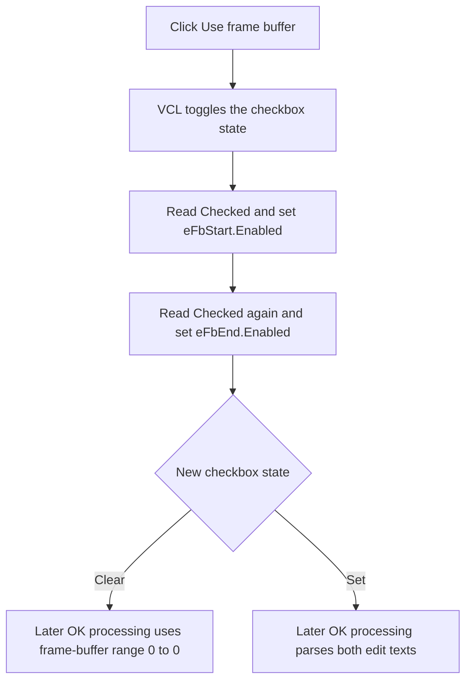

# Enable or disable the frame-buffer editors

> Analysis status: Reviewed from the recovered handler, form resource, form initialization, and OK processing path.

## Control

| Property | Recovered value |
| --- | --- |
| Form | MCUKernelImageProperties |
| Component path | MCUKernelImageProperties.cbUseFb |
| Control class | TCheckBox |
| Caption | Use frame buffer |
| Handler name | cbUseFbClick |
| Handler address | 014168a0 |
| Graph node | `resource:dfm:MCUKernelImageProperties/MCUKernelImageProperties.cbUseFb` |
| Handler node | `function:014168a0` |
| Graph layer | UI |

## What happens when clicked

The VCL changes the checkbox state before it invokes `TMCUKernelImageProperties.cbUseFbClick`. The handler reads that state and applies it as the enabled state of both frame-buffer edits:

- `eFbStart` at form field `+0x758`;
- `eFbEnd` at form field `+0x760`.

The handler reads the checkbox once for each edit. It does not change either edit's text, parse either value, or clear an invalid value. When the checkbox is clear, the OK processing path uses zero for both frame-buffer output values. When it is set, that path reads and parses the current text from both edits.

Form initialization sets the checkbox and both edits to enabled use. It also places initial text in the two edits. Later clicks only change whether the user can edit those existing values.

## Click flow

## Handler evidence

- [FUN_014168a0](../../../DecompiledSources/Tina16/functions/00000000014168A0__FUN_014168a0.c) performs the two checked-state reads and two enabled-state writes.
- [FUN_01414fc0](../../../DecompiledSources/Tina16/functions/0000000001414FC0__FUN_01414fc0.c) initializes the checkbox and frame-buffer edit text.
- [FUN_01415c80](../../../DecompiledSources/Tina16/functions/0000000001415C80__FUN_01415c80.c) reads both edit texts only when the checkbox is set and otherwise emits a zero range.
- The DuckDB graph has no statically resolved outgoing calls because this handler uses four virtual control calls.

## Resource evidence

- The checkbox caption is `Use frame buffer`.
- `Frame buffer start:` is nearest to `eFbStart`, and `Frame buffer end` is nearest to `eFbEnd`. The handler offsets and OK data flow confirm the pairing.
- The checkbox has no hint, action, image, initial checked property, or extracted glyph in the recovered resource.

## Error and no-op behavior

- Reapplying an already matching enabled state is an effective no-op for each edit.
- Disabling the edits preserves their text. Re-enabling them exposes the same values.
- The handler has no validation, message, rollback, or local exception handling.

## Analysis limits

- The recovered resource does not provide the intended unit or allowed range for the two frame-buffer values.
- The processor's numeric conversion establishes use of the text, but this handler does not define its parse-error behavior.
