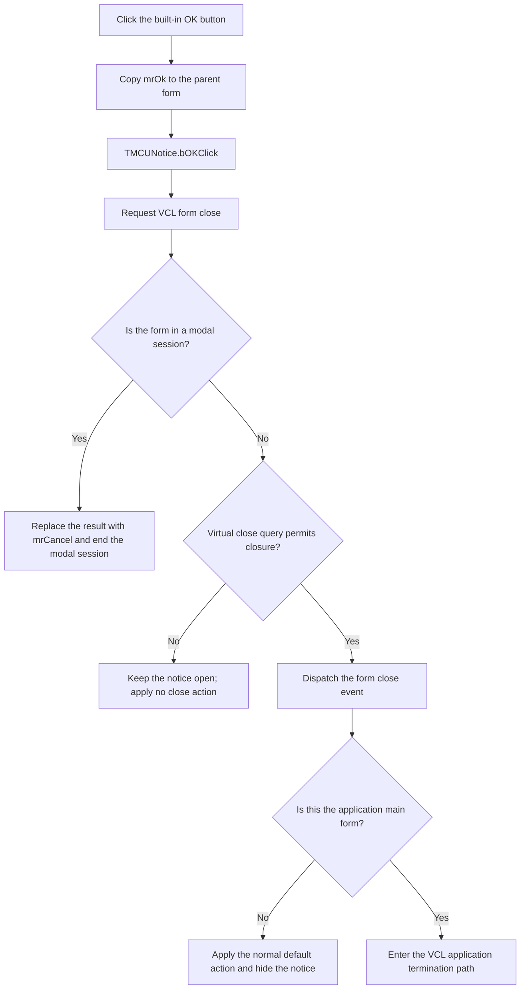

# Close the C Compiler Notice

> Analysis status: Recovered control, built-in button dispatch, handler, and VCL close path reviewed.

## Control

| Property | Recovered value |
| --- | --- |
| Form | MCUNotice |
| Form caption | C Compiler Notice |
| Component path | MCUNotice.bOK |
| Control class | TBitBtn |
| Explicit caption | Not present in the recovered resource. |
| Kind | bkOK |
| Glyph count | 2, supplied by the built-in button kind; no embedded custom glyph was recovered. |
| Handler name | bOKClick |
| Handler address | 0106dd90 |
| Graph node | `resource:dfm:MCUNotice/MCUNotice.bOK` |
| Handler node | `function:0106dd90` |
| Graph layer | UI |

## What happens when clicked

The built-in `bkOK` configuration supplies the standard OK presentation. It
also gives the button modal result `1`, the Delphi `mrOk` value, and makes the
button the form's default button. The shared VCL button-click dispatcher copies
this value to the parent form before it dispatches `bOKClick`.

[`FUN_0106dd90`](../../../DecompiledSources/Tina16/functions/000000000106DD90__FUN_0106dd90.c)
then performs one operation. It calls the shared VCL form-close routine. The
missing explicit form argument is a decompiler artifact. The callee requires a
form instance, and the event binding identifies that instance as `MCUNotice`.
The handler does not read or change the read-only Memo contents.

The close routine has two possible paths:

- If the notice is modal, the close routine writes modal result `2`, the
  Delphi `mrCancel` value. This write replaces the `mrOk` value that the
  built-in button dispatcher wrote first, and it ends the modal session.
- If the notice is modeless, the close routine calls the virtual close-query
  method. A false result keeps the form open. A true result dispatches the
  close event and applies the selected close action. The recovered form has no
  DFM `OnClose` or `OnCloseQuery` binding and no nondefault form style. The
  normal VCL default for a non-main form is therefore to hide the form. If the
  instance is the application main form, the common routine uses the
  application termination path instead. A class-specific virtual close-query
  override and the application's main-form assignment are not resolved.

The recovered graph and resources do not identify an opener for `MCUNotice`.
They do not establish whether the observed use is modal or modeless. Both
outcomes above come from the exact framework branch that the handler enters.

## State, output, and error behavior

- The click input is the parent `MCUNotice` form. The handler does not use the
  `Sender` object or inspect control state.
- The button path writes a modal-result field before the handler runs. The
  common close routine can replace that value on its modal branch.
- For an ordinary modeless instance, the accepted-close path hides the form.
  It does not release or destroy it through the default action.
- A rejected modeless close query is the proven no-close branch. It performs
  no hide, minimize, release, or application-termination action.
- The handler does not save, validate, copy, clear, or persist the notice
  text. It does not allocate or free an object.
- The handler and the recovered close path have no local error message, retry,
  or exception-recovery branch.

## Click flow

## Handler evidence

- Button handler: [FUN_0106dd90](../../../DecompiledSources/Tina16/functions/000000000106DD90__FUN_0106dd90.c)
- Common VCL close path: [FUN_00805200](../../../DecompiledSources/Tina16/functions/0000000000805200__FUN_00805200.c)
- VCL button click dispatcher: [FUN_00687f30](../../../DecompiledSources/Tina16/functions/0000000000687F30__FUN_00687f30.c)
- Built-in TBitBtn kind configuration: [FUN_0082bc30](../../../DecompiledSources/Tina16/functions/000000000082BC30__FUN_0082bc30.c)
- VCL hide wrapper: [FUN_00805990](../../../DecompiledSources/Tina16/functions/0000000000805990__FUN_00805990.c)
- Recovered form evidence: [ui-evidence.json](../../../DecompiledSources/Tina16/resources/dfm/ui-evidence.json)
- Recovered role: Requests closure of the C Compiler Notice form.
- Complexity: simple
- Distinct outgoing calls: 1

## Direct call

- `function:00805200` - Runs the VCL form close-query and close-action pipeline.

## Resource evidence

- `MCUNotice` is a `TMCUNotice` form with caption `C Compiler Notice`.
- Its read-only `Memo` fills the top part of the form. The Memo has no
  recovered event binding.
- `bOK` is a `TBitBtn` with `Kind = bkOK`, `NumGlyphs = 2`, and
  `TabOrder = 1`.
- The button has no explicit DFM caption, hint, text, action, modal result,
  image reference, or embedded glyph.
- No same-parent label candidate is available. No label evidence is needed for
  the recovered close request.

## Analysis limits

- No recovered caller proves whether this form is shown with `Show` or
  `ShowModal`. The article keeps the framework branches separate.
- The DFM has no `OnCloseQuery` binding. A class can still override the virtual
  close-query method, but the recovered graph does not resolve such an
  override for `TMCUNotice`.
- The default form style does not select the minimize or release actions. Main
  form identity comes from application state, not from the DFM. No recovered
  opener resolves that identity, so the click flow keeps the main-form branch
  explicit.
