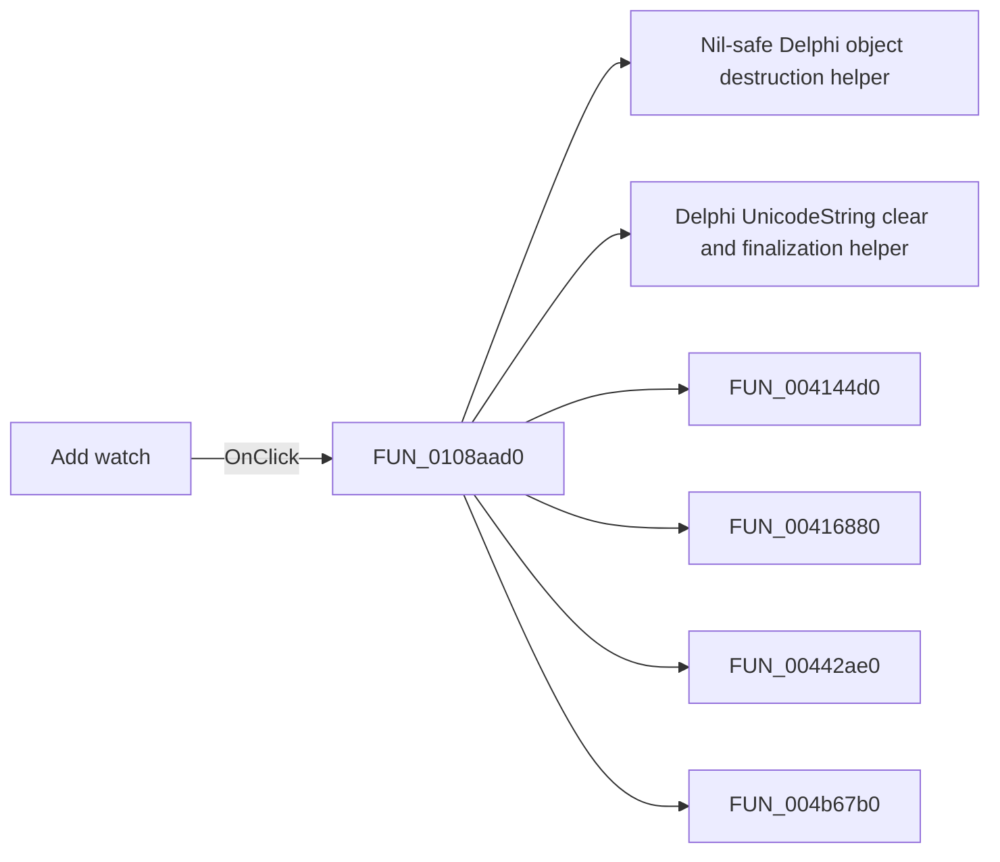

# Add watch

> Analysis status: Pending individual source review.

## Control

| Property | Recovered value |
| --- | --- |
| Form | MCUProjectForm |
| Component path | MCUProjectForm.mnPopupRegisters.Addwatch1 |
| Control class | TMenuItem |
| Caption | Add watch |
| Hint | Not present in the recovered resource. |
| Text | Not present in the recovered resource. |
| Handler name | Addwatch1Click |
| Handler address | 0108aad0 |
| Graph node | `resource:dfm:MCUProjectForm/MCUProjectForm.mnPopupRegisters.Addwatch1` |
| Handler node | `function:0108aad0` |
| Graph layer | UI |

## What happens when clicked

Pending individual analysis. An agent must read the recovered handler source and its relevant callees before it replaces this text.

## Click flow

## Handler evidence

- Source: [DecompiledSources/Tina16/functions/000000000108AAD0__FUN_0108aad0.c](../../../DecompiledSources/Tina16/functions/000000000108AAD0__FUN_0108aad0.c)
- Recovered role: Not present in the recovered resource.
- Current graph summary: Handles 1 Delphi UI event: MCUProjectForm.mnPopupRegisters.Addwatch1.OnClick.
- Current graph behavior: Not present in the recovered resource.
- Current graph evidence: Not present in the recovered resource.
- Complexity: complex
- Distinct outgoing calls: 11

## Direct calls

- `function:00410f20` — Nil-safe Delphi object destruction helper
- `function:00414480` — Delphi UnicodeString clear and finalization helper
- `function:004144d0` — FUN_004144d0
- `function:00416880` — FUN_00416880
- `function:00442ae0` — FUN_00442ae0
- `function:004b67b0` — FUN_004b67b0
- `function:004b6930` — FUN_004b6930
- `function:007fc180` — FUN_007fc180
- `function:00e02a00` — Calls the VHDL_DLL2.DLL export _get_mcu_register_count.
- `function:00e02a20` — Calls the VHDL_DLL2.DLL export _get_mcu_register_name.
- `function:010892f0` — FUN_010892f0

## Resource evidence

- Kind: Not present in the recovered resource.
- Modal result: Not present in the recovered resource.
- Checked state: Not present in the recovered resource.
- List items: Not present in the recovered resource.
- Image reference: Not present in the recovered resource.
- Extracted glyph: None.

## Nearby label candidates

Nearby labels are layout candidates only. They are not proof of behavior.

- No same-parent label candidate is available.

## Analysis limits

- Do not infer behavior from the control class, caption, hint, glyph, or nearby label alone.
- Do not replace the pending status until the handler source and relevant call path provide enough evidence.
