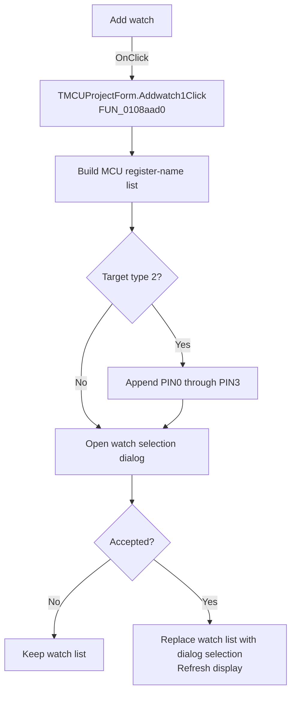

# Add watch

> Analysis status: Recovered handler and relevant call path reviewed for Addwatch1Click.

## Control

| Property | Recovered value |
| --- | --- |
| Form | MCUProjectForm |
| Component path | MCUProjectForm.mnPopupRegisters.Addwatch1 |
| Control class | TMenuItem |
| Caption | Add watch |
| Hint | Not present in the recovered resource. |
| Text | Not present in the recovered resource. |
| Handler name | Addwatch1Click |
| Handler address | 0108aad0 |
| Graph node | `resource:dfm:MCUProjectForm/MCUProjectForm.mnPopupRegisters.Addwatch1` |
| Handler node | `function:0108aad0` |
| Graph layer | UI |

## What happens when clicked

The handler builds a selectable list from every register name reported by the MCU backend. For target type 2 it also appends `PIN0` through `PIN3`. It opens the watch-selection dialog with the current watch list. Canceling preserves the list. On acceptance it clears the current watch list, copies the dialog selection into it, refreshes the watch display, and frees both temporary objects.

## Click flow

## Handler evidence

- Source: [DecompiledSources/Tina16/functions/000000000108AAD0__FUN_0108aad0.c](../../../DecompiledSources/Tina16/functions/000000000108AAD0__FUN_0108aad0.c)
- Recovered role: Not present in the recovered resource.
- Current graph summary: Handles 1 Delphi UI event: MCUProjectForm.mnPopupRegisters.Addwatch1.OnClick.
- Current graph behavior: Not present in the recovered resource.
- Current graph evidence: Not present in the recovered resource.
- Complexity: complex
- Distinct outgoing calls: 11

## Direct calls

- `function:00410f20` — Nil-safe Delphi object destruction helper
- `function:00414480` — Delphi UnicodeString clear and finalization helper
- `function:004144d0` — FUN_004144d0
- `function:00416880` — FUN_00416880
- `function:00442ae0` — FUN_00442ae0
- `function:004b67b0` — FUN_004b67b0
- `function:004b6930` — FUN_004b6930
- `function:007fc180` — FUN_007fc180
- `function:00e02a00` — Calls the VHDL_DLL2.DLL export _get_mcu_register_count.
- `function:00e02a20` — Calls the VHDL_DLL2.DLL export _get_mcu_register_name.
- `function:010892f0` — FUN_010892f0

## Resource evidence

- Kind: Not present in the recovered resource.
- Modal result: Not present in the recovered resource.
- Checked state: Not present in the recovered resource.
- List items: Not present in the recovered resource.
- Image reference: Not present in the recovered resource.
- Extracted glyph: None.

## Nearby label candidates

Nearby labels are layout candidates only. They are not proof of behavior.

- No same-parent label candidate is available.

## Reviewed boundaries

- The explanation comes from the recovered handler and the named call path. The caption, hint, and glyph are supporting UI evidence only.
- Unnamed virtual calls are described only by the values passed at this call site and by the state that this handler reads or writes.
- The handler has no local exception recovery unless the behavior section states otherwise.
