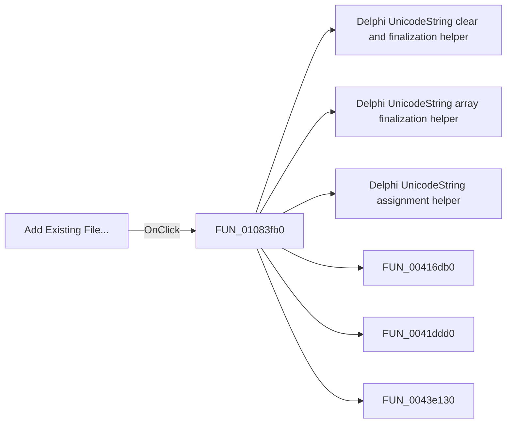

# Add Existing File...

> Analysis status: Pending individual source review.

## Control

| Property | Recovered value |
| --- | --- |
| Form | MCUProjectForm |
| Component path | MCUProjectForm.pmAddToProject.mnAdd |
| Control class | TMenuItem |
| Caption | Add Existing File... |
| Hint | Not present in the recovered resource. |
| Text | Not present in the recovered resource. |
| Handler name | mnAddClick |
| Handler address | 01083fb0 |
| Graph node | `resource:dfm:MCUProjectForm/MCUProjectForm.pmAddToProject.mnAdd` |
| Handler node | `function:01083fb0` |
| Graph layer | UI |

## What happens when clicked

Pending individual analysis. An agent must read the recovered handler source and its relevant callees before it replaces this text.

## Click flow

## Handler evidence

- Source: [DecompiledSources/Tina16/functions/0000000001083FB0__FUN_01083fb0.c](../../../DecompiledSources/Tina16/functions/0000000001083FB0__FUN_01083fb0.c)
- Recovered role: Not present in the recovered resource.
- Current graph summary: Handles 2 Delphi UI events: MCUProjectForm.pnToolbar.sbAddToProject.OnClick, MCUProjectForm.pmAddToProject.mnAdd.OnClick.
- Current graph behavior: Not present in the recovered resource.
- Current graph evidence: Not present in the recovered resource.
- Complexity: complex
- Distinct outgoing calls: 15

## Direct calls

- `function:00414480` — Delphi UnicodeString clear and finalization helper
- `function:00414560` — Delphi UnicodeString array finalization helper
- `function:00414ad0` — Delphi UnicodeString assignment helper
- `function:00416db0` — FUN_00416db0
- `function:0041ddd0` — FUN_0041ddd0
- `function:0043e130` — FUN_0043e130
- `function:00441920` — FUN_00441920
- `function:00441a10` — FUN_00441a10
- `function:00724270` — FUN_00724270
- `function:00b89270` — FUN_00b89270
- `function:00b8e650` — FUN_00b8e650
- `function:01055690` — FUN_01055690
- `function:0107a440` — FUN_0107a440
- `function:010b3a20` — FUN_010b3a20
- `function:016fd940` — FUN_016fd940

## Resource evidence

- Kind: Not present in the recovered resource.
- Modal result: Not present in the recovered resource.
- Checked state: Not present in the recovered resource.
- List items: Not present in the recovered resource.
- Image reference: Not present in the recovered resource.
- Extracted glyph: None.

## Nearby label candidates

Nearby labels are layout candidates only. They are not proof of behavior.

- No same-parent label candidate is available.

## Analysis limits

- Do not infer behavior from the control class, caption, hint, glyph, or nearby label alone.
- Do not replace the pending status until the handler source and relevant call path provide enough evidence.
