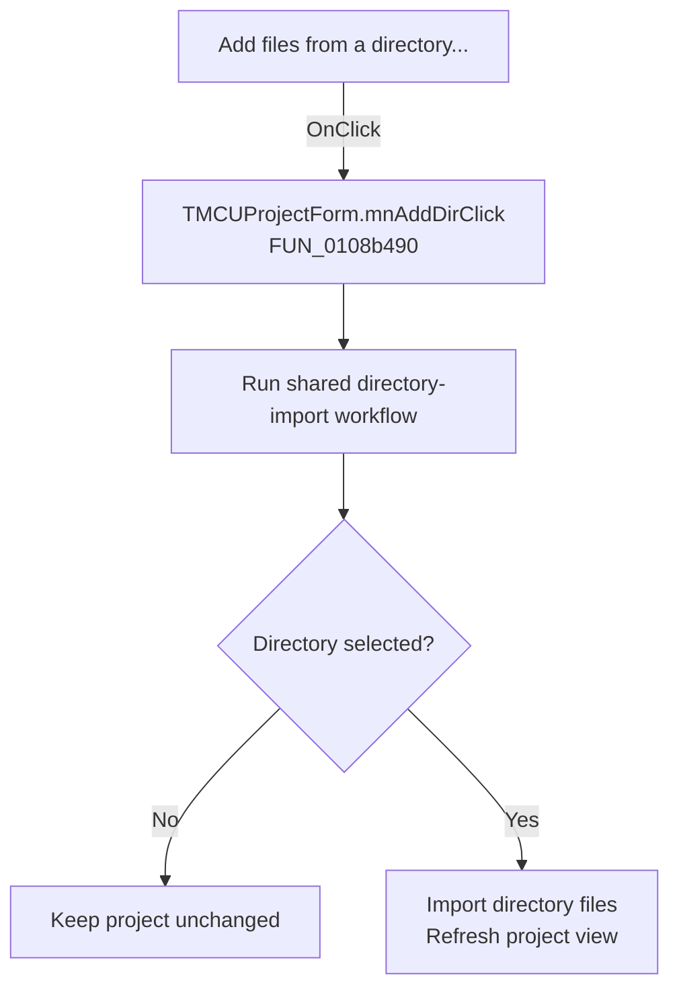

# Add files from a directory...

> Analysis status: Recovered handler and relevant call path reviewed for mnAddDirClick.

## Control

| Property | Recovered value |
| --- | --- |
| Form | MCUProjectForm |
| Component path | MCUProjectForm.pmAddToProject.mnAddDir |
| Control class | TMenuItem |
| Caption | Add files from a directory... |
| Hint | Not present in the recovered resource. |
| Text | Not present in the recovered resource. |
| Handler name | mnAddDirClick |
| Handler address | 0108b490 |
| Graph node | `resource:dfm:MCUProjectForm/MCUProjectForm.pmAddToProject.mnAddDir` |
| Handler node | `function:0108b490` |
| Graph layer | UI |

## What happens when clicked

The popup handler is a one-call wrapper around the shared directory-import workflow. It does not inspect `Sender`. The shared routine asks for a directory, returns without change on cancellation, and on acceptance imports matching files, refreshes the project, and selects the active item when one is available.

## Click flow

## Handler evidence

- Source: [DecompiledSources/Tina16/functions/000000000108B490__FUN_0108b490.c](../../../DecompiledSources/Tina16/functions/000000000108B490__FUN_0108b490.c)
- Recovered role: Not present in the recovered resource.
- Current graph summary: Handles 1 Delphi UI event: MCUProjectForm.pmAddToProject.mnAddDir.OnClick.
- Current graph behavior: Not present in the recovered resource.
- Current graph evidence: Not present in the recovered resource.
- Complexity: simple
- Distinct outgoing calls: 1

## Direct calls

- `function:0108aff0` — FUN_0108aff0

## Resource evidence

- Kind: Not present in the recovered resource.
- Modal result: Not present in the recovered resource.
- Checked state: Not present in the recovered resource.
- List items: Not present in the recovered resource.
- Image reference: Not present in the recovered resource.
- Extracted glyph: None.

## Nearby label candidates

Nearby labels are layout candidates only. They are not proof of behavior.

- No same-parent label candidate is available.

## Reviewed boundaries

- The explanation comes from the recovered handler and the named call path. The caption, hint, and glyph are supporting UI evidence only.
- Unnamed virtual calls are described only by the values passed at this call site and by the state that this handler reads or writes.
- The handler has no local exception recovery unless the behavior section states otherwise.
