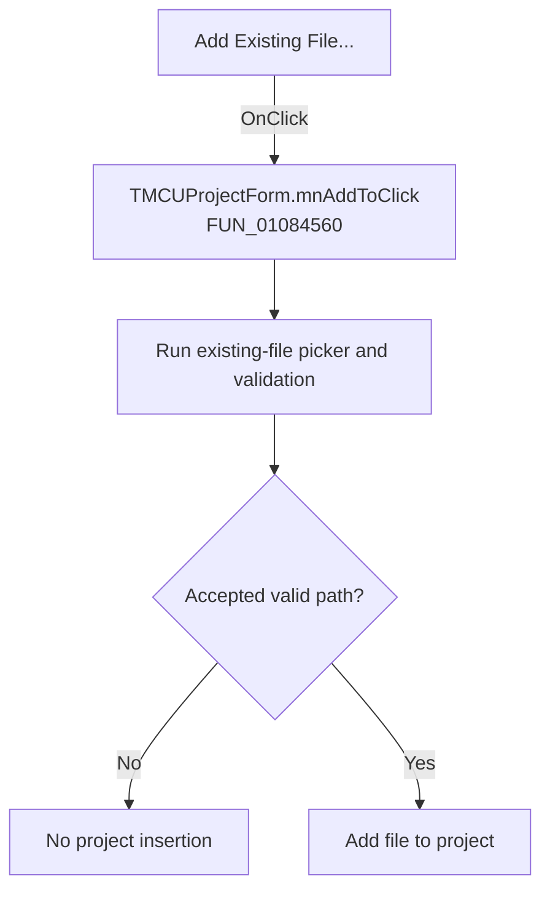

# Add Existing File...

> Analysis status: Recovered handler and relevant call path reviewed for mnAddToClick.

## Control

| Property | Recovered value |
| --- | --- |
| Form | MCUProjectForm |
| Component path | MCUProjectForm.pmProjectProperties.mnAddTo |
| Control class | TMenuItem |
| Caption | Add Existing File... |
| Hint | Not present in the recovered resource. |
| Text | Not present in the recovered resource. |
| Handler name | mnAddToClick |
| Handler address | 01084560 |
| Graph node | `resource:dfm:MCUProjectForm/MCUProjectForm.pmProjectProperties.mnAddTo` |
| Handler node | `function:01084560` |
| Graph layer | UI |

## What happens when clicked

The handler is a one-call wrapper around the same existing-file workflow used by the toolbar and Add-to-Project menu. It does not inspect `Sender` or add a separate branch. The wrapped routine opens the target-specific file picker, validates an accepted path, and adds it only when valid; cancellation and validation failure leave the project unchanged.

## Click flow

## Handler evidence

- Source: [DecompiledSources/Tina16/functions/0000000001084560__FUN_01084560.c](../../../DecompiledSources/Tina16/functions/0000000001084560__FUN_01084560.c)
- Recovered role: Not present in the recovered resource.
- Current graph summary: Handles 1 Delphi UI event: MCUProjectForm.pmProjectProperties.mnAddTo.OnClick.
- Current graph behavior: Not present in the recovered resource.
- Current graph evidence: Not present in the recovered resource.
- Complexity: simple
- Distinct outgoing calls: 1

## Direct calls

- `function:01083fb0` — Handles 2 Delphi UI events: MCUProjectForm.pnToolbar.sbAddToProject.OnClick, MCUProjectForm.pmAddToProject.mnAdd.OnClick.

## Resource evidence

- Kind: Not present in the recovered resource.
- Modal result: Not present in the recovered resource.
- Checked state: Not present in the recovered resource.
- List items: Not present in the recovered resource.
- Image reference: Not present in the recovered resource.
- Extracted glyph: None.

## Nearby label candidates

Nearby labels are layout candidates only. They are not proof of behavior.

- No same-parent label candidate is available.

## Reviewed boundaries

- The explanation comes from the recovered handler and the named call path. The caption, hint, and glyph are supporting UI evidence only.
- Unnamed virtual calls are described only by the values passed at this call site and by the state that this handler reads or writes.
- The handler has no local exception recovery unless the behavior section states otherwise.
