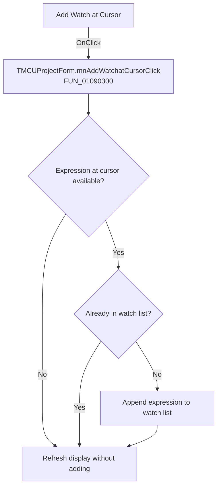

# Add Watch at Cursor

> Analysis status: Recovered handler and relevant call path reviewed for mnAddWatchatCursorClick.

## Control

| Property | Recovered value |
| --- | --- |
| Form | MCUProjectForm |
| Component path | MCUProjectForm.pmEditor.mnAddWatchatCursor |
| Control class | TMenuItem |
| Caption | Add Watch at Cursor |
| Hint | Not present in the recovered resource. |
| Text | Not present in the recovered resource. |
| Handler name | mnAddWatchatCursorClick |
| Handler address | 01090300 |
| Graph node | `resource:dfm:MCUProjectForm/MCUProjectForm.pmEditor.mnAddWatchatCursor` |
| Handler node | `function:01090300` |
| Graph layer | UI |

## What happens when clicked

The handler uses the expression or token pointer stored at form field `+0xB48`. When it is null, it adds nothing and only refreshes the display. For a nonnull value it asks the watch list whether the expression already exists and appends it only when the returned index is -1. It then refreshes the active messages display in all paths.

## Click flow

## Handler evidence

- Source: [DecompiledSources/Tina16/functions/0000000001090300__FUN_01090300.c](../../../DecompiledSources/Tina16/functions/0000000001090300__FUN_01090300.c)
- Recovered role: Not present in the recovered resource.
- Current graph summary: Handles 1 Delphi UI event: MCUProjectForm.pmEditor.mnAddWatchatCursor.OnClick.
- Current graph behavior: Not present in the recovered resource.
- Current graph evidence: Not present in the recovered resource.
- Complexity: simple
- Distinct outgoing calls: 1

## Direct calls

- `function:010892f0` — FUN_010892f0

## Resource evidence

- Kind: Not present in the recovered resource.
- Modal result: Not present in the recovered resource.
- Checked state: Not present in the recovered resource.
- List items: Not present in the recovered resource.
- Image reference: Not present in the recovered resource.
- Extracted glyph: None.

## Nearby label candidates

Nearby labels are layout candidates only. They are not proof of behavior.

- No same-parent label candidate is available.

## Reviewed boundaries

- The explanation comes from the recovered handler and the named call path. The caption, hint, and glyph are supporting UI evidence only.
- Unnamed virtual calls are described only by the values passed at this call site and by the state that this handler reads or writes.
- The handler has no local exception recovery unless the behavior section states otherwise.
