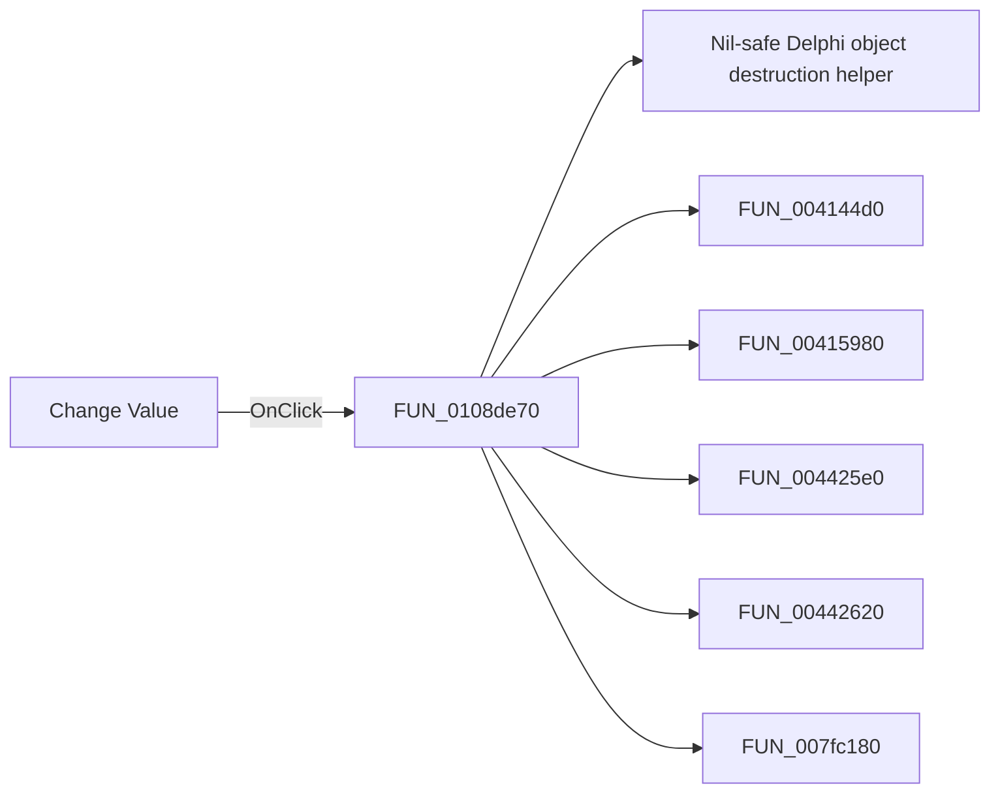

# Change Value

> Analysis status: Pending individual source review.

## Control

| Property | Recovered value |
| --- | --- |
| Form | MCUProjectForm |
| Component path | MCUProjectForm.pmPeriph.mnChangePeriphValue |
| Control class | TMenuItem |
| Caption | Change Value |
| Hint | Not present in the recovered resource. |
| Text | Not present in the recovered resource. |
| Handler name | mnChangePeriphValueClick |
| Handler address | 0108de70 |
| Graph node | `resource:dfm:MCUProjectForm/MCUProjectForm.pmPeriph.mnChangePeriphValue` |
| Handler node | `function:0108de70` |
| Graph layer | UI |

## What happens when clicked

Pending individual analysis. An agent must read the recovered handler source and its relevant callees before it replaces this text.

## Click flow

## Handler evidence

- Source: [DecompiledSources/Tina16/functions/000000000108DE70__FUN_0108de70.c](../../../DecompiledSources/Tina16/functions/000000000108DE70__FUN_0108de70.c)
- Recovered role: Not present in the recovered resource.
- Current graph summary: Handles 1 Delphi UI event: MCUProjectForm.pmPeriph.mnChangePeriphValue.OnClick.
- Current graph behavior: Not present in the recovered resource.
- Current graph evidence: Not present in the recovered resource.
- Complexity: complex
- Distinct outgoing calls: 13

## Direct calls

- `function:00410f20` — Nil-safe Delphi object destruction helper
- `function:004144d0` — FUN_004144d0
- `function:00415980` — FUN_00415980
- `function:004425e0` — FUN_004425e0
- `function:00442620` — FUN_00442620
- `function:007fc180` — FUN_007fc180
- `function:00e03d80` — Calls the VHDL_DLL2.DLL export _Dbg_XMC_SetPeriphValue.
- `function:00e03da0` — Calls the VHDL_DLL2.DLL export _Dbg_XMC_GetPeriphValue.
- `function:010729f0` — FUN_010729f0
- `function:01072a00` — FUN_01072a00
- `function:01072a40` — FUN_01072a40
- `function:01072a80` — FUN_01072a80
- `function:010892f0` — FUN_010892f0

## Resource evidence

- Kind: Not present in the recovered resource.
- Modal result: Not present in the recovered resource.
- Checked state: Not present in the recovered resource.
- List items: Not present in the recovered resource.
- Image reference: Not present in the recovered resource.
- Extracted glyph: None.

## Nearby label candidates

Nearby labels are layout candidates only. They are not proof of behavior.

- No same-parent label candidate is available.

## Analysis limits

- Do not infer behavior from the control class, caption, hint, glyph, or nearby label alone.
- Do not replace the pending status until the handler source and relevant call path provide enough evidence.
