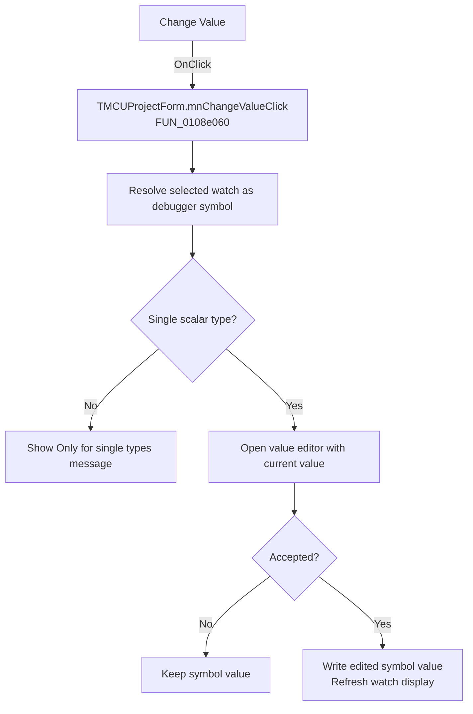

# Change Value

> Analysis status: Recovered handler and relevant call path reviewed for mnChangeValueClick.

## Control

| Property | Recovered value |
| --- | --- |
| Form | MCUProjectForm |
| Component path | MCUProjectForm.pmWatches.mnChangeValue |
| Control class | TMenuItem |
| Caption | Change Value |
| Hint | Not present in the recovered resource. |
| Text | Not present in the recovered resource. |
| Handler name | mnChangeValueClick |
| Handler address | 0108e060 |
| Graph node | `resource:dfm:MCUProjectForm/MCUProjectForm.pmWatches.mnChangeValue` |
| Handler node | `function:0108e060` |
| Graph layer | UI |

## What happens when clicked

The handler opens a value editor with the selected watch expression. It resolves the current source line and asks the debugger for a symbol pointer, size, and type. If resolution fails, it shows `Only for single types!` and performs no write. Otherwise it initializes the dialog from the resolved value. Canceling preserves the symbol. On acceptance it calls `_Debug_SetSymbolValue` with the edited value and refreshes the watch display.

## Click flow

## Handler evidence

- Source: [DecompiledSources/Tina16/functions/000000000108E060__FUN_0108e060.c](../../../DecompiledSources/Tina16/functions/000000000108E060__FUN_0108e060.c)
- Recovered role: Not present in the recovered resource.
- Current graph summary: Handles 1 Delphi UI event: MCUProjectForm.pmWatches.mnChangeValue.OnClick.
- Current graph behavior: Not present in the recovered resource.
- Current graph evidence: Not present in the recovered resource.
- Complexity: complex
- Distinct outgoing calls: 13

## Direct calls

- `function:00410f20` — Nil-safe Delphi object destruction helper
- `function:004425e0` — FUN_004425e0
- `function:0072d440` — FUN_0072d440
- `function:007fc180` — FUN_007fc180
- `function:00e02ec0` — Calls the VHDL_DLL2.DLL export _Debug_SetSymbolValue.
- `function:00e02ee0` — Calls the VHDL_DLL2.DLL export _Debug_GetSymbolPtr.
- `function:010729f0` — FUN_010729f0
- `function:01072a00` — FUN_01072a00
- `function:01072a10` — FUN_01072a10
- `function:01072a50` — FUN_01072a50
- `function:01072a80` — FUN_01072a80
- `function:010892f0` — FUN_010892f0
- `function:0108bb30` — FUN_0108bb30

## Resource evidence

- Kind: Not present in the recovered resource.
- Modal result: Not present in the recovered resource.
- Checked state: Not present in the recovered resource.
- List items: Not present in the recovered resource.
- Image reference: Not present in the recovered resource.
- Extracted glyph: None.

## Nearby label candidates

Nearby labels are layout candidates only. They are not proof of behavior.

- No same-parent label candidate is available.

## Reviewed boundaries

- The explanation comes from the recovered handler and the named call path. The caption, hint, and glyph are supporting UI evidence only.
- Unnamed virtual calls are described only by the values passed at this call site and by the state that this handler reads or writes.
- The handler has no local exception recovery unless the behavior section states otherwise.
