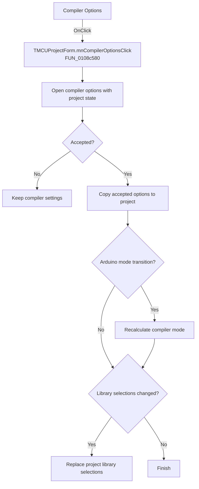

# Compiler Options

> Analysis status: Recovered handler and relevant call path reviewed for mnCompilerOptionsClick.

## Control

| Property | Recovered value |
| --- | --- |
| Form | MCUProjectForm |
| Component path | MCUProjectForm.MainMenu.mnProject.mnCompilerOptions |
| Control class | TMenuItem |
| Caption | Compiler Options |
| Hint | Not present in the recovered resource. |
| Text | Not present in the recovered resource. |
| Handler name | mnCompilerOptionsClick |
| Handler address | 0108c580 |
| Graph node | `resource:dfm:MCUProjectForm/MCUProjectForm.MainMenu.mnProject.mnCompilerOptions` |
| Handler node | `function:0108c580` |
| Graph layer | UI |

## What happens when clicked

The handler creates the compiler-options dialog and initializes it from the current project, target type, output and source settings, and compiler state. Canceling frees the dialog without changing project fields. On acceptance it copies the returned option record into the project. For the recovered Arduino transition it recalculates the compiler mode and refreshes dependent state. If the accepted working object marks library data as changed, it replaces the project's Arduino library selections.

## Click flow

## Handler evidence

- Source: [DecompiledSources/Tina16/functions/000000000108C580__FUN_0108c580.c](../../../DecompiledSources/Tina16/functions/000000000108C580__FUN_0108c580.c)
- Recovered role: Not present in the recovered resource.
- Current graph summary: Handles 1 Delphi UI event: MCUProjectForm.MainMenu.mnProject.mnCompilerOptions.OnClick.
- Current graph behavior: Not present in the recovered resource.
- Current graph evidence: Not present in the recovered resource.
- Complexity: complex
- Distinct outgoing calls: 10

## Direct calls

- `function:00410f20` — Nil-safe Delphi object destruction helper
- `function:00414480` — Delphi UnicodeString clear and finalization helper
- `function:0043e1a0` — FUN_0043e1a0
- `function:007fc180` — FUN_007fc180
- `function:010715c0` — FUN_010715c0
- `function:010716b0` — FUN_010716b0
- `function:0108c0f0` — FUN_0108c0f0
- `function:0108c4a0` — FUN_0108c4a0
- `function:010b3a20` — FUN_010b3a20
- `function:0160e060` — FUN_0160e060

## Resource evidence

- Kind: Not present in the recovered resource.
- Modal result: Not present in the recovered resource.
- Checked state: Not present in the recovered resource.
- List items: Not present in the recovered resource.
- Image reference: Not present in the recovered resource.
- Extracted glyph: None.

## Nearby label candidates

Nearby labels are layout candidates only. They are not proof of behavior.

- No same-parent label candidate is available.

## Reviewed boundaries

- The explanation comes from the recovered handler and the named call path. The caption, hint, and glyph are supporting UI evidence only.
- Unnamed virtual calls are described only by the values passed at this call site and by the state that this handler reads or writes.
- The handler has no local exception recovery unless the behavior section states otherwise.
